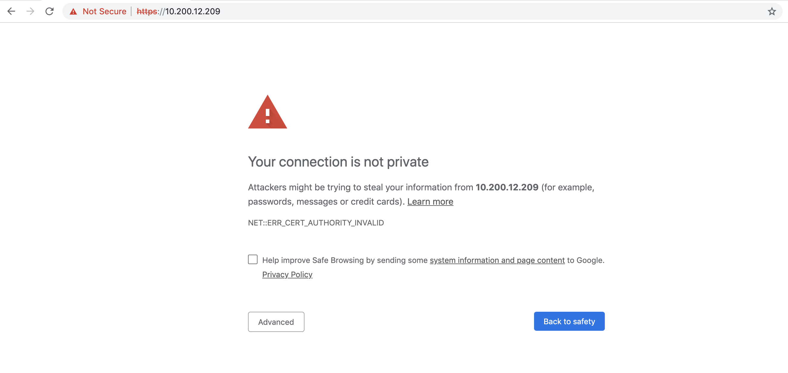
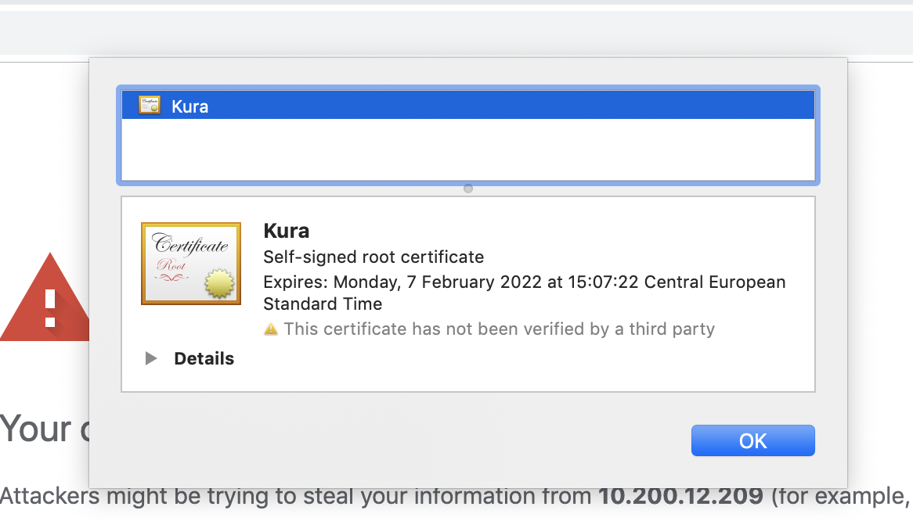
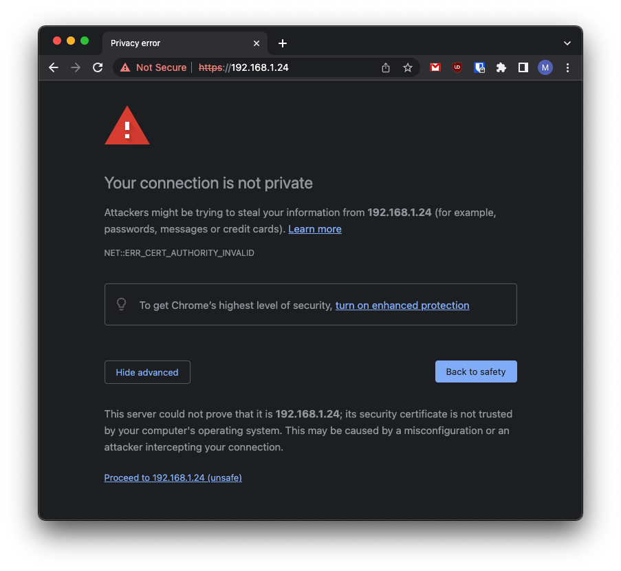

# Raspberry Pi - Raspbian Quick Start

## Overview

This section provides Eclipse Kura&trade; quick installation procedures for the
Raspberry Pi and the Kura development environment.

!!! warn ""
    This quickstart will install the version of Kura with the administrative web UI and network  configuration support but not CAN support. For more information on this please visit the [Eclipse Kura download page](https://www.eclipse.org/kura/downloads.php)

This quickstart has been tested using the following image:

```
2021-10-30-raspios-bullseye-armhf.zip
```

downloaded from

```
https://downloads.raspberrypi.org/raspios_armhf/images/raspios_armhf-2021-11-08/2021-10-30-raspios-bullseye-armhf.zip
```

## Enable SSH Access

The ssh server is disabled by default on Raspbian images released after November 2016,
in order to enable it to follow the instructions available at the following URL:

```
https://www.raspberrypi.org/documentation/remote-access/ssh/
```

## Eclipse Kura&trade; Installation

!!! warn ""
    The last Raspbian Stretch adopts the new [Consistent Network Device Naming](https://www.freedesktop.org/wiki/Software/systemd/PredictableNetworkInterfaceNames/). To correctly run Eclipse Kura on the Raspberry Pi, it should be disabled adding the `net.ifnames=0` parameter at the end of the `/boot/cmdline.txt` file.

To install Eclipse Kura with its dependencies on the Raspberry Pi, perform the
following steps:

1. Boot the Raspberry Pi with the latest Raspbian image (starting from release 5.1.0 Kura is tested with Raspbian 11).

2. Make sure your device is connected to internet. By default, `eth0` lan network interface is configured in DHCP mode.

3. Upgrade the system:
   
   ```
   sudo apt update
   sudo apt upgrade
   ```
   
4. Download the Kura package with:

    ```
    http://download.eclipse.org/kura/releases/&lt;version&gt;/kura_&lt;version&gt;_raspberry-pi_installer.deb
    ```

    Note: replace `<version>` in the URL above with the version number of the latest release (e.g. 5.1.0).

5. Install Kura with: 

    ```
    sudo apt-get install ./kura_<version>_raspberry-pi_installer.deb
    ```

6. It could happen that `wlan` interface is "soft blocked" by default and needs to be enabled. To see if it is blocked run:

    ```
    rfkill list
    ```

    and unblock it with:

    ```
    sudo rfkill unblock wlan
    ```

7. Set the right Wi-Fi regulatory domain based on your current world region following the instructions [here](https://www.raspberrypi.org/documentation/computers/configuration.html#using-the-desktop). In case of problems, you could try to edit the `/etc/default/crda` adding the [ISO 3166-1 alpha-2](https://it.wikipedia.org/wiki/ISO_3166-1_alpha-2) code of your region

8. Reboot the Raspberry Pi with:

    ```
    sudo reboot
    ```

    Kura starts on the target platform after reboot.

9. Kura setups a local web ui that is available using a browser via:

    ```
    https://<device-ip>
    ```

    The browser will prompt the user to accept the connection to an endpoint with an untrusted certificate:

    

    

    

    Once trusted the source, the user will be redirected to a login page where the default **username** is:

    ```
    admin
    ```

    and the default **password** is:

    ```
    admin
    ```

