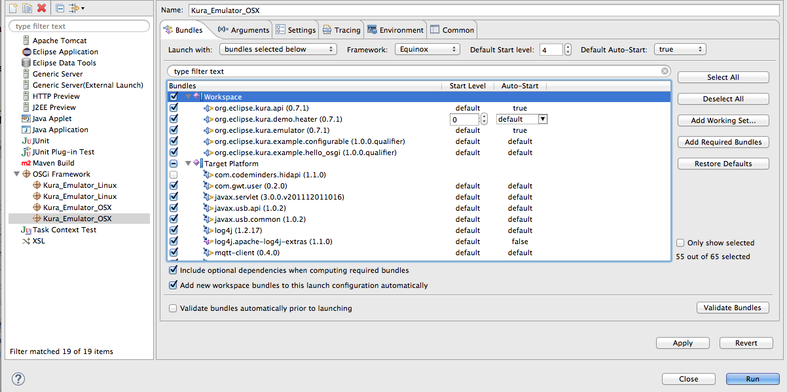
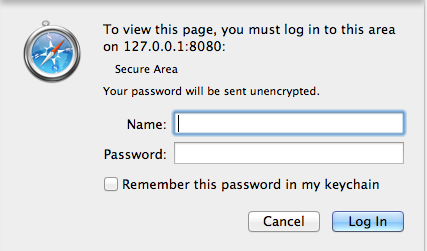
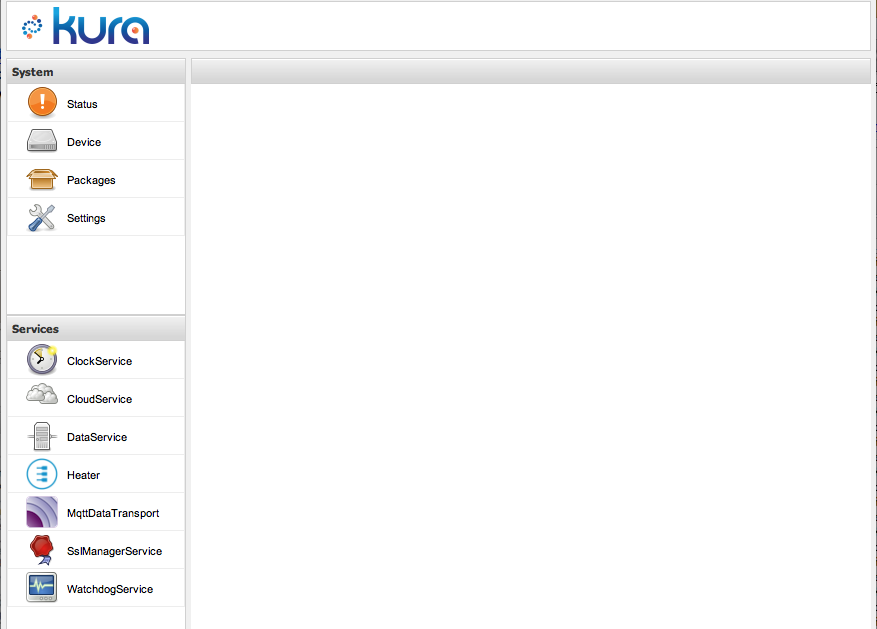
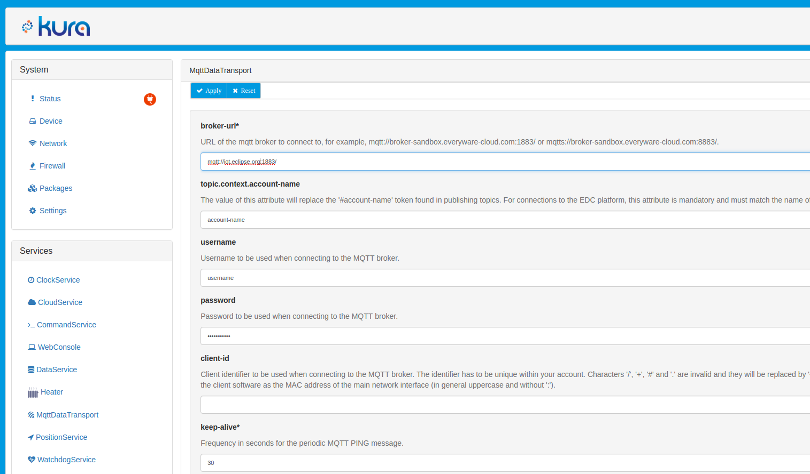
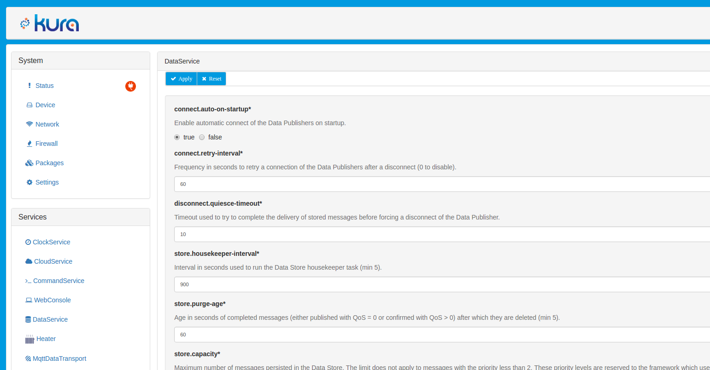
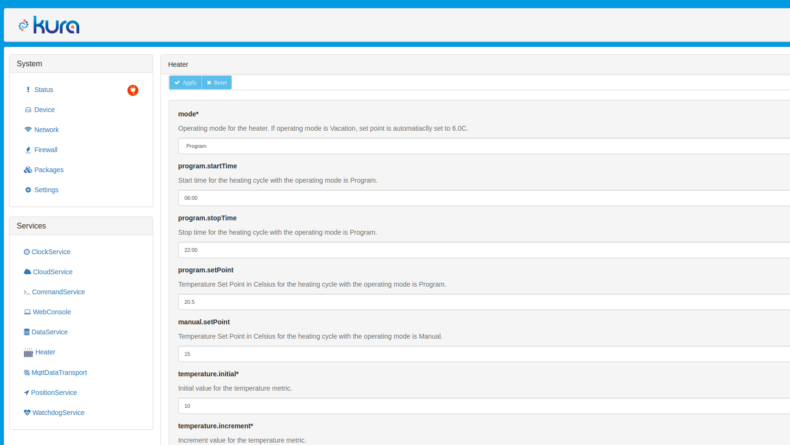

# Connected Application

## Overview

This section describes the prepackaged heater demo bundle that comes
with the Kura development environment and demonstrates how to perform
the following functions:

* Run the Kura Emulator

* Connect to the Cloud

* Gain an understanding of ConfigurableComponents in Kura

* Modify configurations of custom bundles

### Prerequisites

* [Setting up Kura Development Environment](/java-application-development/development-environment-setup/)

* Using the Kura web UI

## Heater Demo Introduction

The org.eclipse.kura.demo.heater bundle is a simple OSGi bundle that
represents a thermostat and heater combination. The application utilizes
the Kura ConfigurableComponent interface to be able to receive
configuration updates through the local Kura web UI. In addition, this
bundle utilizes OSGi declarative services and the Kura
CloudClientListener. This tutorial demonstrates how to modify
configurations of custom bundles and shows how those configuration
changes can dynamically impact the behavior of the bundle through the
Kura web UI.

## Code Walkthrough

The following sections will highlight three important API layers when creating an application that will publish to the cloud. These layers are:

* DataTransportService
  * Available for standard MQTT messaging. Allows consumers of the service to connect to brokers, publish messages, and receive messages on subscribed topics
* DataService
  * Delegates data transport to the DataTransportService
  * Provides extended features for managing broker connections, buffering of published messages, and priority based delivery of messages
* CloudService
  * Further extends the functionality of DataService
  * Provides means for more complex flows (i.e. request/response)
  * Manages single broker connection across multiple applications
  * Provides payload data model with encoding/decoding serializers
  * Publishes life cycle manages for devices and applications

## Acquiring CloudClient

The CloudService can manage multiple applications over a shared MQTT connection by treating each application as a client. The example code uses the "setCloudService" and "unsetCloudService" methods for referencing and releasing the CloudService. In the bundles activate method, the service reference in conjunction with a unique application ID can then be used to obtain a CloudClient. The relevant code is shown below (ommitted sections are denoted by ==OMMITTED==):

```java
==OMMITTED==
// Cloud Application identifier
private static final String APP_ID = "heater";

==OMMITTED==

public void setCloudService(CloudService cloudService) {
	m_cloudService = cloudService;
}

public void unsetCloudService(CloudService cloudService) {
	m_cloudService = null;
}

==OMMITTED==

// Acquire a Cloud Application Client for this Application
s_logger.info("Getting CloudClient for {}...", APP_ID);
m_cloudClient = m_cloudService.newCloudClient(APP_ID);
```

## Publishing/Subscribing

The private "doPublish" method is used to publish messages at a fixed rate. The method demonstrates how to use the CloudClient and KuraPayload to publish MQTT messages.

```java
==OMMITTED==

// Allocate a new payload
KuraPayload payload = new KuraPayload();

// Timestamp the message
payload.setTimestamp(new Date());

// Add the temperature as a metric to the payload
payload.addMetric("temperatureInternal", m_temperature);
payload.addMetric("temperatureExternal", 5.0F);
payload.addMetric("temperatureExhaust",  30.0F);

int code = m_random.nextInt();
if ((m_random.nextInt() % 5) == 0) {
	payload.addMetric("errorCode", code);
}
else {
	payload.addMetric("errorCode", 0);
}

// Publish the message
try {
	m_cloudClient.publish(topic, payload, qos, retain);
	s_logger.info("Published to {} message: {}", topic, payload);
}
catch (Exception e) {
	s_logger.error("Cannot publish topic: "+topic, e);
}
```

Similarly, the CloudClient can be used to subscribe to MQTT topics. Although not shown in the example code, the following snippet could be added to subscribe to all published messages:

```java
m_cloudClient.subscribe(topic, qos);
```

### Callback Methods

The example class implements CloudClientListener, which provides methods for several common callback methods. The below snippet shows the relevant code for creating the listeners for the demo application.

```java
==OMMITTED==

public class Heater implements ConfigurableComponent, CloudClientListener

==OMMITTED==

m_cloudClient.addCloudClientListener(this);

```

The available methods for implementation are:

* onControlMessageArrived: Method called when a control message is received from the broker.
* onMessageArrived: Method called when a data message is received from the broker.
* onConnectionLost: Method called when the client has lost connection with the broker.
* onConnectionEstablished: Method called when the client establishes a connection with the broker.
* onMessageConfirmed: Method called when a published message has been fully acknowledged by the broker (not applicable for qos 0 messages).
* onMessagePublished: Method called when a message has been transfered from the publishing queue to the DataTransportService.

For more information on the various Kura APIs, please review the [Kura APIs](/references/javadoc/)

## Run the Bundle

By default, the heater demo bundle does not run automatically. To run
the bundle and Kura in the Emulator, locate the
**org.eclipse.kura.emulator** project. Expand it to show the
src/main/resources folder.

Right-click the correct **Kura_Emulator_*[OS]*.launch** file,
depending on which operating system you are running. In the context
menu, select the **Run As** option, and click on **Run Configurations**.

Under OSGi Framework (Run Configurations window shown below), click on
the **Kura_Emulator_[OS]** entry. In the Bundles tab under Workspace,
enable the **org.eclipse.kura.demo.heater** checkbox to enable it as
shown below:



Click the **Apply** and **Run** buttons to start the Kura Emulator. Once
this setting has been made, you only need to right-click on the launch
file and select **Run As** and the **Kura_Emulator_[OS]** option to
run with the same settings.

This will start Kura running locally and will display a Console window
in Eclipse. The Console window will show the OSGi diagnostics as various
bundles start and execute.

## Configure the MQTT Client

With the heater demo bundle running, open a browser window on the same
computer as the Eclipse development environment and browse to the Kura
web UI at <http://127.0.0.1:8080>. Once connected to the Kura web UI, a
log in window appears prompting you to enter the Name and Password as
shown below:



Enter the appropriate name and password (default is admin/admin) and
click **Log in**. The Kura Admin web UI appears as shown below:



From the Kura web UI, click on **MqttDataTransport** in the Services
pane on the lower left of the browser window. You will see a menu
similar to the one shown in the following screen capture:



Fill in the following fields then click the **Apply** button:

Field                      | Value
---------------------------|------------------------------------------
broker-url:                | The url for the MQTT broker (this example shows the MQTT broker-url **mqtt://iot.eclipse.org:1883/** hosted by the Eclipse Foundation)
topic.context.account-name:| Your [account_name]
username:                  | Typically [account_name]_broker
password:                  | The password for your user
client-id                  | The client identifier to be used when connecting to the MQTT broker (optional)

<br>
Now that the account credentials are set in the MqttDataTransport
service, the DataService needs to be configured to connect by default.
To do so, click **DataService** in the Services area on the left of the
browser window. For the ‘connect.auto-on-startup’ parameter, select
**true** as shown below:



<span id="_View_and_Modify" class="anchor"><span
id="_Modify_Configuration_and" class="anchor"></span></span>

## Modify Bundle Configuration in Local Web UI

Bundles changes may be made directly in the emulator web UI. Since you
are running an emulated device in Eclipse, you can do this by browsing
to <http://127.0.0.1:8080> (same URL where the MQTT client was
configured in the previous section of this tutorial). If the bundle was
running on a real device and you had network access to it, you would
browse to
[http://[ip_address_of_device]](http://ip_address_of_device/).

From the Kura web UI, select the Heater bundle from the configurable
services on the left and modify the parameters as needed (shown in the
screen capture below). By default, the heater demo is configured
according to the following characteristics and assumptions about its
operational environment:

*  Start operation is at 6:00am (06:00).

*  End operation is at 10:00pm (22:00).

*  It is colder outside than inside the heated chamber (hard-coded to 5
    degrees in the application).

*  Output of the heater is constant at 30 degrees (hard-coded).

*  When in operational mode, the temperature will drop inside if the
    heater is off.

*  The heater turns off when it is about to exceed the setPoint defined
    in the configuration.

*  After the temperature drops to four times the increment point (a
    made-up value to show dropping temperature, hard-coded in the
    application), the heater turns back on, and the temperature starts
    increment at the rate of the ‘temperature.increment’ rate.



Click **Apply** for changes to take affect. The updated() method is
called after settings are applied for the new configuration.

After completing this tutorial, it is highly recommended that you review
the heater demo source code in Eclipse to see how it is put together.
Kura automatically generates the user configuration interface through
implementation of the ConfigurableComponent interface and some small
additions to the component.xml file (called heater.xml). This powerful
feature provides both a local and remote configuration user interface
with no additional development requirements.
