# Development Environment Setup

In this document we'll cover the required steps to setup the Development Environment for contributing to the Eclipse Kura project. If, instead, you want to develop applications or bundles running on Eclipse Kura refer to the [Eclipse Kura Workspace setup guide](./kura-workspace-setup.md).

The Eclipse Kura development environment may be installed on Windows, Linux, or Mac OS. The setup instructions will be the same across each OS though each system may have unique characteristics.

!!! info
    The local emulation of Eclipse Kura code is only supported in Linux and Mac, not in Windows.

This document will cover the use of Eclipse Oomph installer which is the easiest way to install and configure the Eclipse IDE to start contributing to Eclipse Kura.

The setup requires three basic steps:

1. Requirements installation
2. Eclipse Oomph setup
3. Eclipse Kura maven build

## Requirements

Before building Eclipse Kura, you need to have the following programs installed in your system:

- JDK 1.8 (or JDK 17)
- Maven 3.5.x (or greater)

Recommended additional software:

- Git

#### Installing Prerequisites in Mac OS 

To install Java 8, download the JDK tar archive from the [Adoptium Project Repository](https://adoptium.net/releases.html?variant=openjdk8&jvmVariant=hotspot).

Once downloaded, copy the tar archive in `/Library/Java/JavaVirtualMachines/` and cd into it. Unpack the archive with the following command:
```bash
sudo tar -xzf <archive-name>.tar.gz
```
The tar archive can be deleted afterwards.

Depending on which terminal you are using, edit the profiles (.zshrc, .profile, .bash_profile) to contain:
```bash
# Adoptium JDK 8
export JAVA_8_HOME=/Library/Java/JavaVirtualMachines/<archive-name>/Contents/Home
alias java8='export JAVA_HOME=$JAVA_8_HOME'
java8 
```
Reload the terminal and run `java -version` to make sure it is installed correctly.

Using [Brew](https://brew.sh/) you can easily install Maven from the command line:
```bash
brew install maven@3.5
```
Run `mvn -version` to ensure that Maven has been added to the PATH. If Maven cannot be found, try running `brew link maven@3.5 --force` or manually add it to your path with:
```bash
export PATH="/usr/local/opt/maven@3.5/bin:$PATH"
```

#### Installing Prerequisites in Linux

For Java
```bash
sudo apt install openjdk-8-jdk
```

For Maven   

You can follow the tutorial from the official [Maven](http://maven.apache.org/install.html) site. Remember that you need to install 3.5.x version or greater.

### Eclipse Oomph setup

Download the latest Eclipse Installer appropriate for your platform from the [Eclipse Downloads page](https://www.eclipse.org/downloads/packages/installer) and start it.

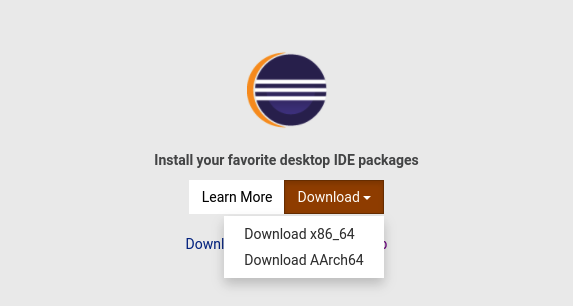

Switch to "Advanced Mode" (top right hamburger menu) and select "Eclipse IDE for Eclipse Committers" and configure the "Product Version" to be the version 2023-03 or newer.

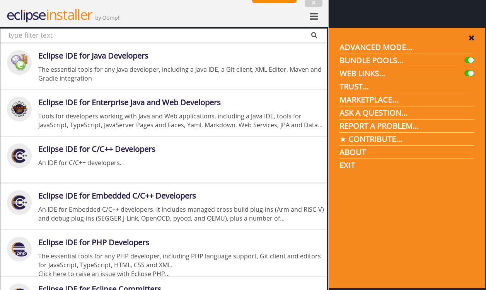

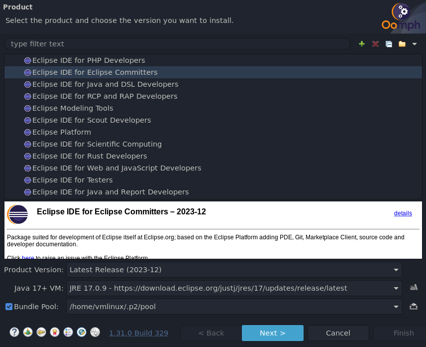

Select the Eclipse Kura installer from the list. If this is not available, add a new installer from [https://raw.githubusercontent.com/eclipse/kura/develop/kura/setups/kura.setup](https://raw.githubusercontent.com/eclipse/kura/develop/kura/setups/kura.setup), then check and press the "Next" button.

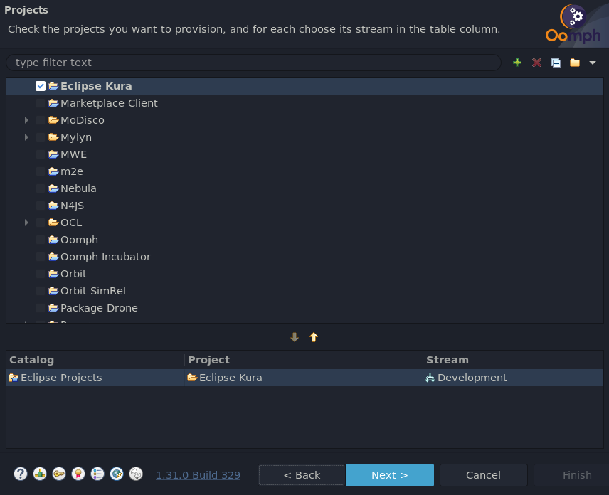

**Variables setup**

- Select the "Developer Type":
    - **"User"**: if you want to develop applications or bundles running on Eclipse Kura, select this option. It will install only the APIs and the examples.
    - **"Developer"**: if you are a framework developer, select this option. It will download and configure the Eclipse Kura framework (for the purpose of this document we'll use this option)
- Set the `JRE 1.8 location` value to the installed local jdk-8 VM
- Update Eclipse Kura Git repository username (prefer the anonymous HTTPS option, link to your fork) and customize further settings if you like (e.g. Root install folder, Installation folder name). To show these options, make sure that the "Show all variables" checkbox is enabled.

If you plan to contribute to Eclipse Kura you might want to [create a fork](https://docs.github.com/en/get-started/quickstart/fork-a-repo), see our [contributing guide](https://github.com/eclipse/kura/blob/develop/CONTRIBUTING.md) for further informations. For the purpose of this tutorial we'll work with a fictional fork for the username `user`. To clone the repo use the link appropriate for your fork, in our case it will be: `https://github.com/user/kura.git`

Keep in mind that the "Root install folder" is where the Eclipse executable will be installed and the Eclipse Kura sources will be downloaded (in the `git` subfolder).

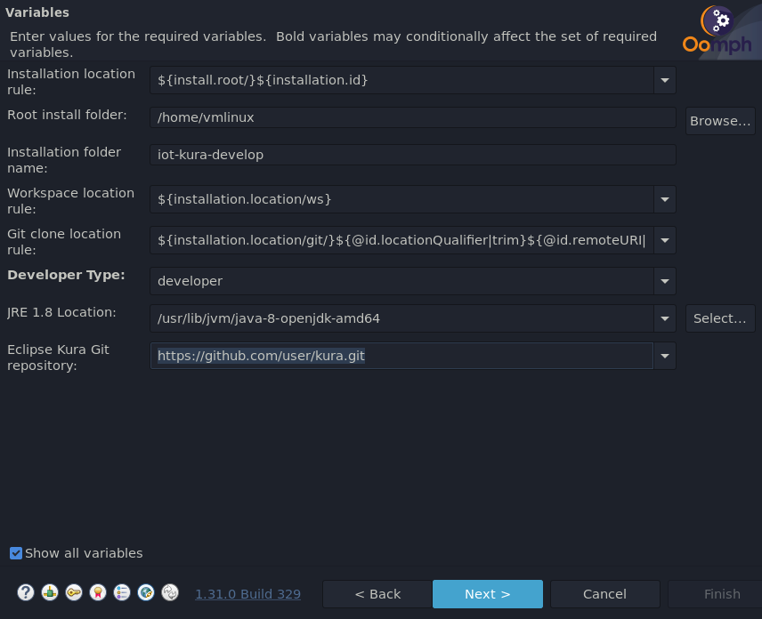

Press Next, leave all Bootstrap Tasks selected and press the Finish button

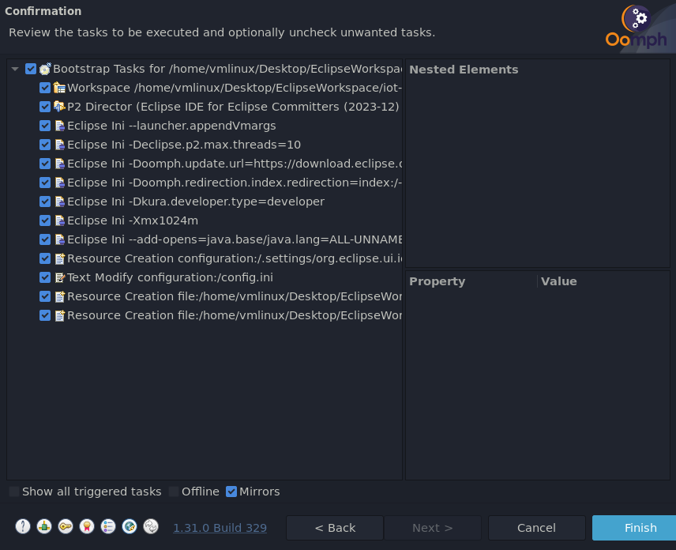

Accept all the licenses and wait for the installation to finish. 

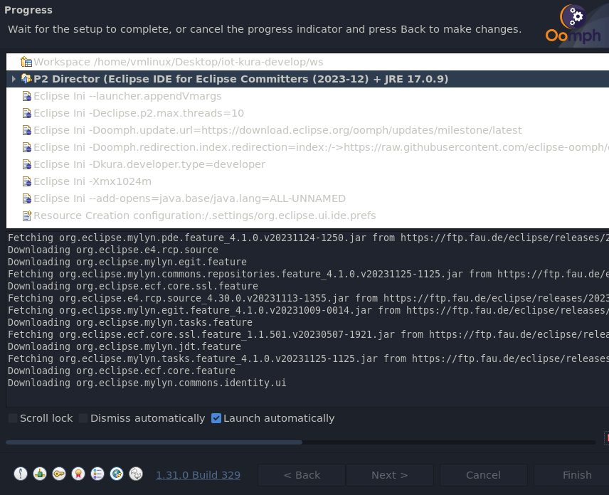

At first startup Eclipse IDE will checkout the code, perform a full build and configure a few Working Sets

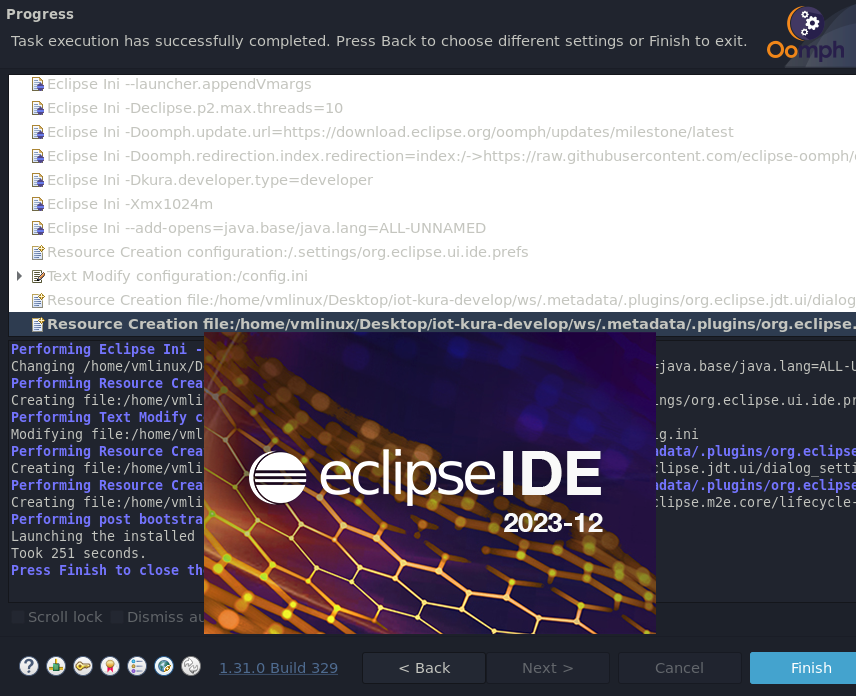

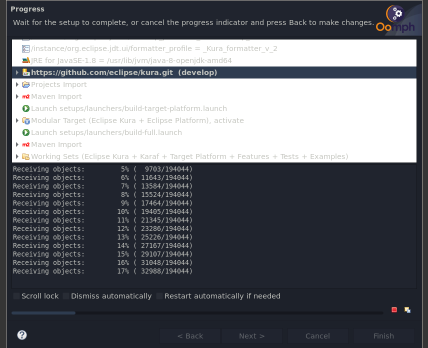

When the tasks are completed go to into the Package Explorer and Target Platform > Target-Definition > Kura Target Platform Equinox 3.16.0, and press "Set as Target Platform" located at the top right of the window:

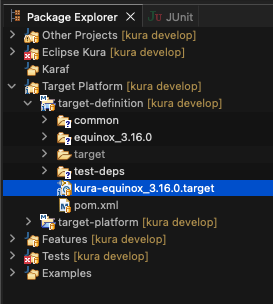

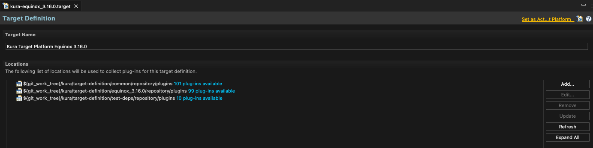

### Eclipse Kura maven build

Navigate to the `git` folder created within the Eclipse workspace (`~/iot-kura-workspace` in the example above) and build the target platform:

```bash
mvn -f target-platform/pom.xml clean install
```

Then build the core components:

```bash
mvn -f kura/pom.xml clean install
```

Build the examples (optional):

```bash
mvn -f kura/examples/pom.xml clean install
```

Build the target profiles:

```bash
mvn -f kura/distrib/pom.xml clean install -DbuildAll
```

!!! Note
    You can skip tests by adding `-Dmaven.test.skip=true` in the commands above and you can compile a specific target by specifying the profile (e.g. `-Praspberry-pi-armhf`).

#### Build scripts

Alternatively you can use the build scripts available in the root directory.

```bash
./build-all.sh
```

or

```bash
./build-menu.sh
```

and select the profiles you want to build.
