# Development Environment Setup

In this document we'll cover the required steps to setup the Development Environment for contributing to the Eclipse Kura project. If, instead, you want to develop applications or bundles running on Eclipse Kura refer to the [Eclipse Kura Addon Archetype setup guide](./kura-addon-archetype.md).

The Eclipse Kura development environment may be installed on Windows, Linux, or Mac OS. The setup instructions will be the same across each OS though each system may have unique characteristics.

!!! info
    The local emulation of Eclipse Kura code is only supported in Linux and Mac, not in Windows.

Currently two development environments are supported: **Eclipse IDE** and **Visual Studio Code**. The Eclipse IDE is a fully-featured environment for developing Eclipse Kura, while Visual Studio Code is a lightweight alternative that can be used for development and debugging of Eclipse Kura bundles.

The choice of the IDE is up to the developer, but we recommend using Eclipse IDE for a full-featured development experience, Visual Studio Code for newcomers since the installation is easier and the IDE is more lightweight.

Independently from the IDE you choose, the following steps are required to set up the development environment:

1. Requirements installation
2. IDE setup

## Requirements

Before building Eclipse Kura, you need to have the following programs installed in your system:

- JDK 17 
- Maven 3.9.x

Recommended additional software:

- Git

#### Installing Prerequisites in Mac OS 

To install Java 17, download the JDK tar archive from the [Adoptium Project Repository](https://adoptium.net/en-GB/temurin/releases/?variant=openjdk17&jvmVariant=hotspot&version=17).
Once downloaded, copy the tar archive in `/Library/Java/JavaVirtualMachines/` and cd into it. Unpack the archive with the following command:

```bash
sudo tar -xzf <archive-name>.tar.gz
```
The tar archive can be deleted afterwards.

Depending on which terminal you are using, edit the profiles (.zshrc, .profile, .bash_profile) to contain:

```bash
export JAVA_HOME=/Library/Java/JavaVirtualMachines/<archive-name>/Contents/Home
```

Reload the terminal and run `java -version` to make sure it is installed correctly.

Using [Brew](https://brew.sh/) you can easily install Maven from the command line:

```bash
brew install maven@3.9
```
Run `mvn -version` to ensure that Maven has been added to the PATH. If Maven cannot be found, try running `brew link maven@3.9 --force` or manually add it to your path with:

```bash
export PATH="/usr/local/opt/maven@3.9/bin:$PATH"
```

#### Installing Prerequisites in Linux

For Java

```bash
sudo apt install openjdk-17-jdk
```
For Maven   

You can follow the tutorial from the official [Maven](http://maven.apache.org/install.html) site. Remember that you need to install the 3.9.x version.


## IDE setup: Visual Studio Code

### Requirements

**VSCode extensions**: the following extensions will be automatically installed during the setup

- [Eclipse PDE support for VS Code](https://marketplace.visualstudio.com/items?itemName=yaozheng.vscode-pde)
- [Language Support for Java by Red Hat](https://marketplace.visualstudio.com/items?itemName=redhat.java)
- [Debugger for Java](https://marketplace.visualstudio.com/items?itemName=vscjava.vscode-java-debug)
- [Java Test Runner](https://marketplace.visualstudio.com/items?itemName=vscjava.vscode-java-test)

[**Kura metadata generator**](https://github.com/eclipse-kura/metadata-generator): this tool is used to generate the metadata required by VSCode to correctly load the Kura project. It is a Python tool that can be installed via `pip` with the following command:

```
pip3 install https://github.com/eclipse-kura/metadata-generator/releases/download/0.2.0/metadata_generator-0.2.0-py3-none-any.whl
```

The metadata generator needs to be run only once after cloning the Kura repository.

### Instructions

#### 1. Clone the Kura repository in a new folder (Eclipse IDE gets angry if it shares the sources with VSCode)

```bash
git clone git@github.com:eclipse/kura.git vscode-kura && cd vscode-kura
```

!!! note
    The remainder of the commands in these instructions need to be run from the `vscode-kura` folder

#### 2. Build the code [following the README](https://github.com/eclipse/kura#build-eclipse-kura) or with:

```bash
mvn -f target-platform/pom.xml clean install -B
```
```bash
mvn -f kura/pom.xml clean install -Dmaven.test.skip=true
```

#### 3. Run the Kura metadata generator tool

Change the current working directory to the `kura` folder

```bash
cd kura/
```

and then run the tool with the following command

```bash
kura-gen --patch-target-platform -t target-definition/kura-equinox.target
```

#### 4. Open VSCode in the `kura` directory

```bash
code .
```

#### 5. Follow the on-screen instructions 

VS Code prompts the user to install the recommended extensions when a workspace is opened for the first time. The list of recommended extensions can be reviewed with the `Extensions: Show Recommended Extensions` command. 

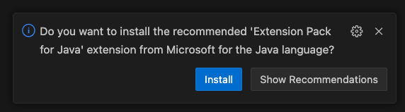

After all the recommended extensions are installed, the project will start building


Finally, once the build completes, the workspace will be ready to use.

### Troubleshooting

#### LSP Out of memory error:

Looks like the JVM running the LSP server requires some additional RAM to parse through Kura. Add a `.vscode/settings.json` file in the root workspace directory containing the following:

```json
{
    "java.jdt.ls.vmargs": "-XX:+UseParallelGC -XX:GCTimeRatio=4 -XX:AdaptiveSizePolicyWeight=90 -Dsun.zip.disableMemoryMapping=true -Xmx8G -Xms500m -Xlog:disable"
}
```

#### VSCode build gets stuck:

To fix this press: <kbd>Ctrl</kbd> + <kbd>Shift</kbd> + <kbd>P</kbd> (<kbd>Cmd</kbd> + <kbd>Shift</kbd> + <kbd>P</kbd> for Mac users) and run the _"Developer: Reload Window"_ command. If the issue is bad enough you'll also need to clean the LSP workspace cache with _"Java: Clean Java Language Server Workspace"_ and re-run the maven build.

#### Maven build fails when VSCode is open in the same folder

It looks like the VSCode LSP is interfering(?) with the Maven build when they're running on the same repo. I suggest to close VSCode when running the whole Kura build. If you build a single bundle (which is usually the use-case) it should be fine.

## IDE setup: Eclipse Oomph Installer

Download the latest Eclipse Installer appropriate for your platform from the [Eclipse Downloads page](https://www.eclipse.org/downloads/packages/installer) and start it.

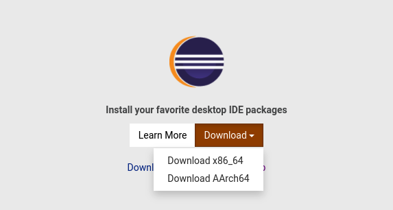

Switch to "Advanced Mode" (top right hamburger menu) and select "Eclipse IDE for Eclipse Committers" and configure the "Product Version" to be the version 2023-03 or newer.

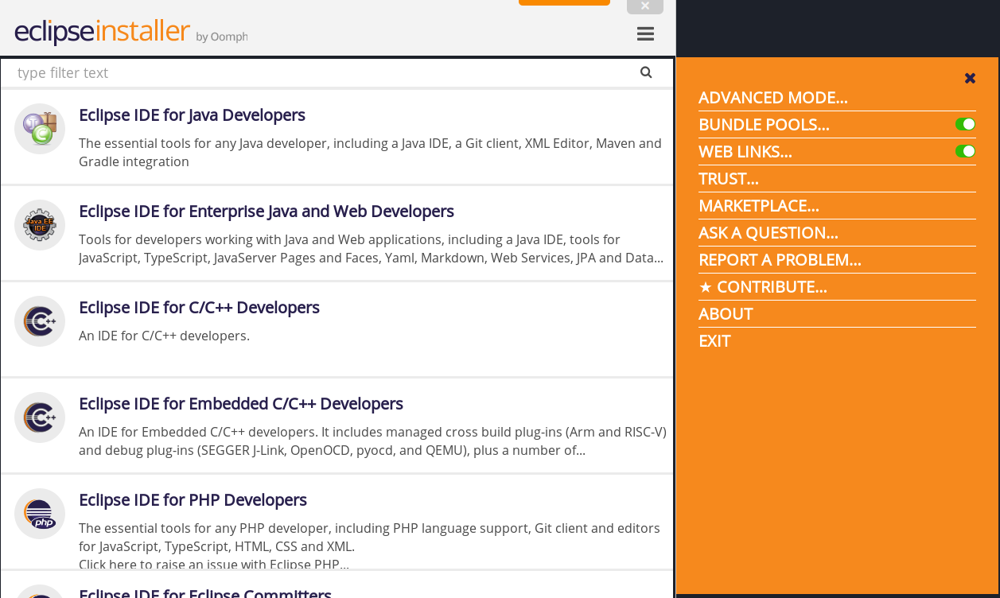

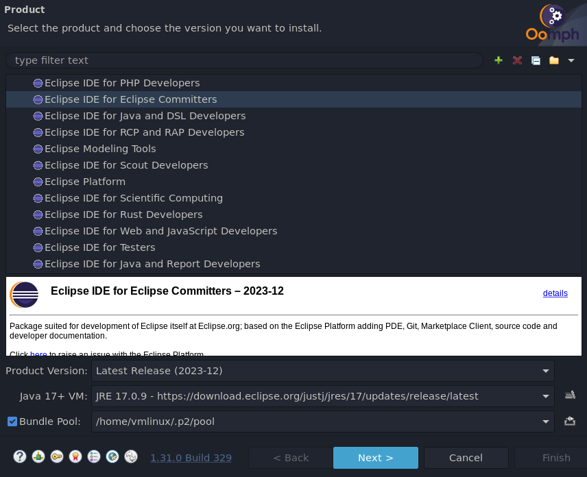

Select the Eclipse Kura installer from the list. If this is not available, add a new installer from [https://raw.githubusercontent.com/eclipse/kura/develop/kura/setups/kura.setup](https://raw.githubusercontent.com/eclipse/kura/develop/kura/setups/kura.setup), then check and press the "Next" button.

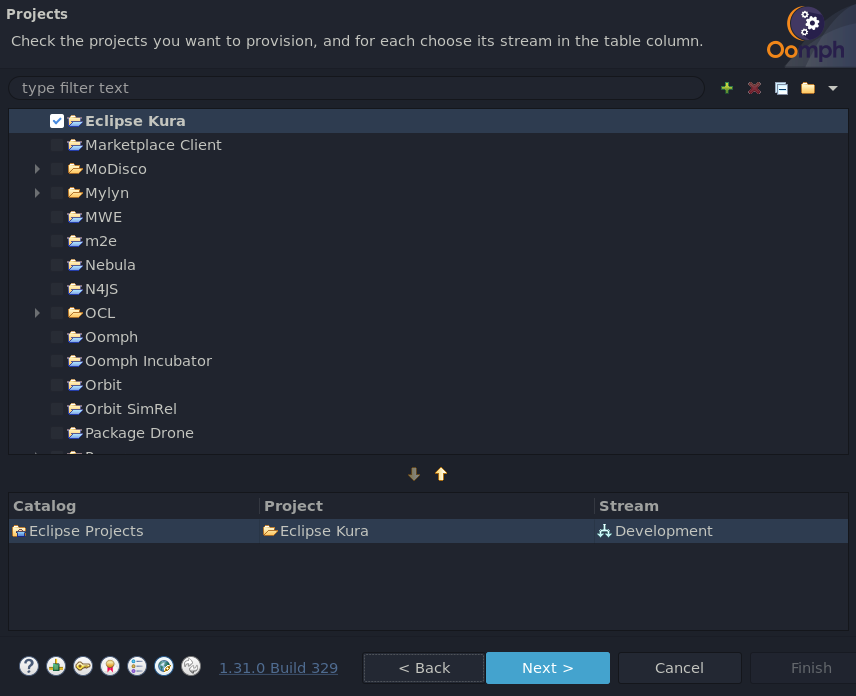

**Variables setup**

- Select the "Developer Type":
    - **"User"**: if you want to develop applications or bundles running on Eclipse Kura, select this option. It will install only the APIs and the examples.
    - **"Developer"**: if you are a framework developer, select this option. It will download and configure the Eclipse Kura framework (for the purpose of this document we'll use this option)
- Set the `JRE 1.8 location` value to the installed local jdk-8 VM
- Update Eclipse Kura Git repository username (prefer the anonymous HTTPS option, link to your fork) and customize further settings if you like (e.g. Root install folder, Installation folder name). To show these options, make sure that the "Show all variables" checkbox is enabled.

If you plan to contribute to Eclipse Kura you might want to [create a fork](https://docs.github.com/en/get-started/quickstart/fork-a-repo), see our [contributing guide](https://github.com/eclipse/kura/blob/develop/CONTRIBUTING.md) for further informations. For the purpose of this tutorial we'll work with a fictional fork for the username `user`. To clone the repo use the link appropriate for your fork, in our case it will be: `https://github.com/user/kura.git`

Keep in mind that the "Root install folder" is where the Eclipse executable will be installed and the Eclipse Kura sources will be downloaded (in the `git` subfolder).

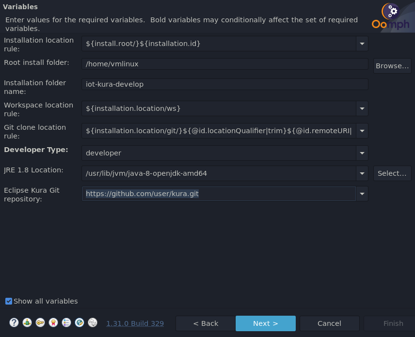

Press Next, leave all Bootstrap Tasks selected and press the Finish button

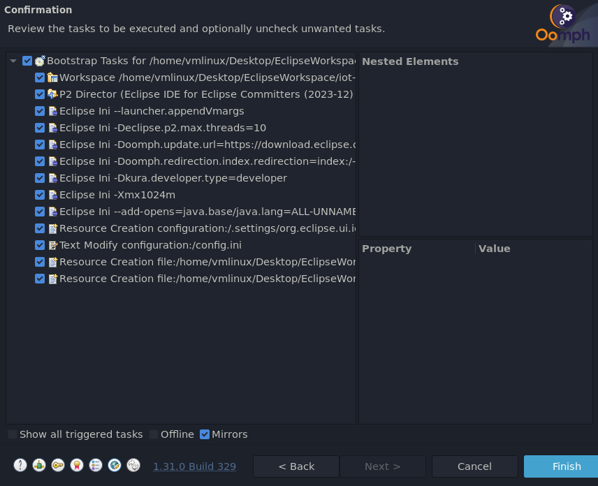

Accept all the licenses and wait for the installation to finish. 

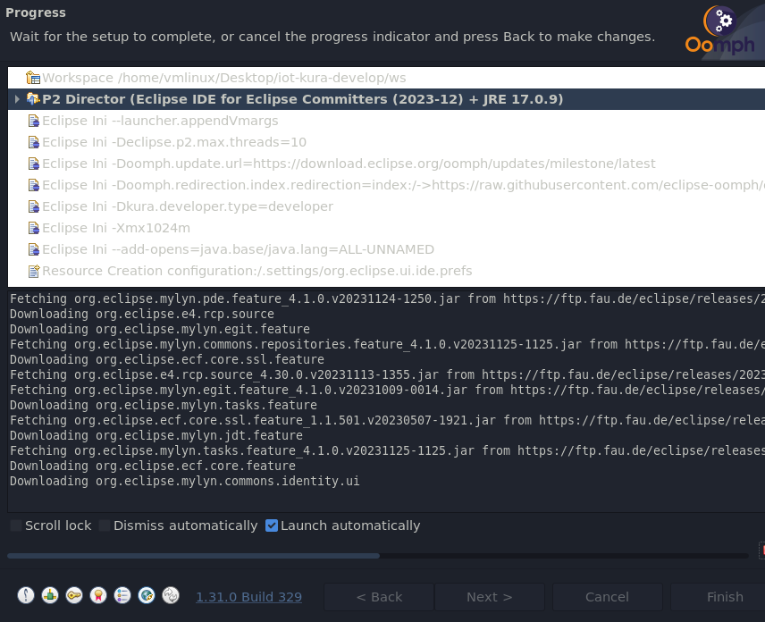

At first startup Eclipse IDE will checkout the code, perform a full build and configure a few Working Sets

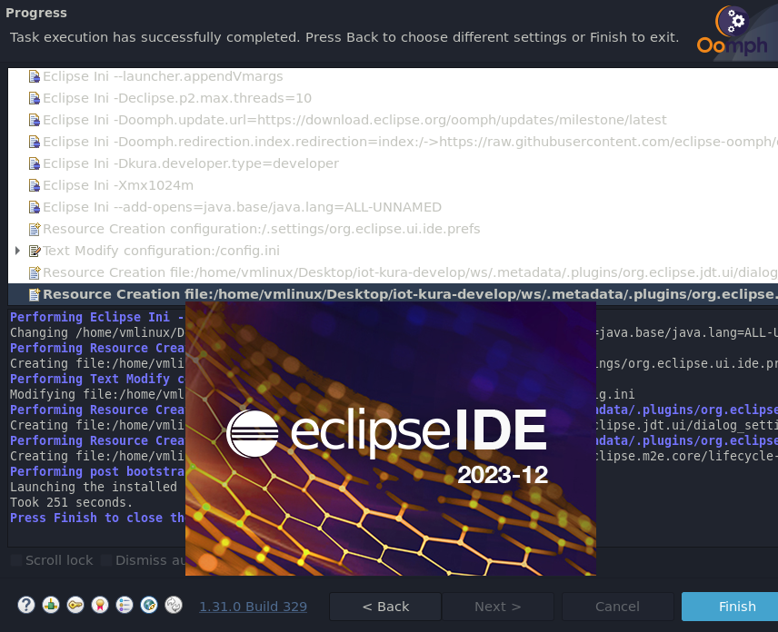

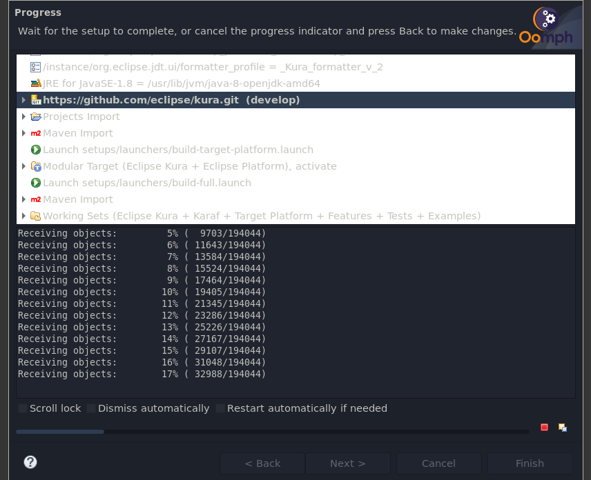

When the tasks are completed, go to into the Package Explorer and Target Platform > Target-Definition > Kura Target Platform Equinox 3.16.0, and press "Set as Target Platform" located at the top right of the window:

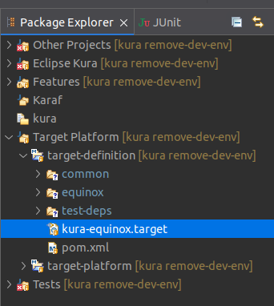

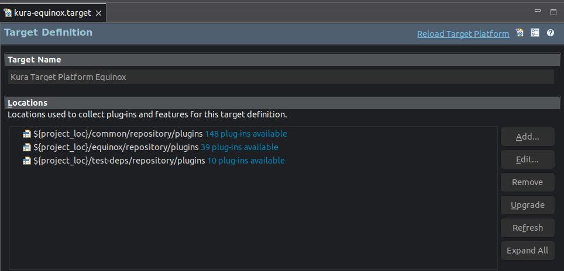

!!! info
    Additional workspace configuration:

    - In the Eclipse workspace modify the lifecycle mapping by adding these XML lines to the `lifecycle-mapping-metadata.xml` in Eclipse Kura workspace.
      You can find the file in the Windows -> Preferences -> Maven -> Lifecycle Mappings -> Open workspace lifecycle mappings metadata.
      After editing the file, reload it by pressing the "Reload workspace lifecycle mappings metadata" button.
      ```xml
      <?xml version="1.0" encoding="UTF-8"?>
      <lifecycleMappingMetadata>
          <lifecycleMappingFilters>
              <lifecycleMappingFilter>
                  <symbolicName>org.eclipse.m2e.pde.connector</symbolicName>
                  <versionRange>[2.1.2,)</versionRange>
                  <packagingTypes>
                      <packagingType>eclipse-test-plugin</packagingType>
                      <packagingType>eclipse-plugin</packagingType>
                      <packagingType>eclipse-feature</packagingType>
                  </packagingTypes>
              </lifecycleMappingFilter>
          </lifecycleMappingFilters>
      </lifecycleMappingMetadata>
      ```
    - Install the `eclipse-tycho` plugin by following these steps:
        1. Menu Help -> Install new software... -> Paste the [m2eclipse-tycho repository URL](https://github.com/tesla/m2eclipse-tycho/releases/download/latest/) in the `Work with:` text field -> expand the category and select the `Tycho Project Configurators Feature` and proceed with the installation.
        2. Then restart Eclipse. 

## Kura examples

To get inspirations and become familiar with the development in Eclipse Kura, some example bundles are available on the [kura-apps repository](https://github.com/eclipse-kura/kura-apps).
