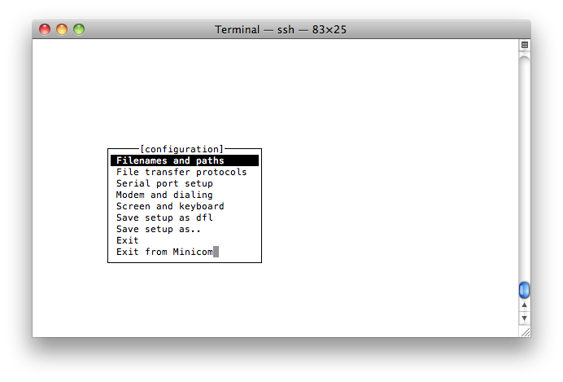
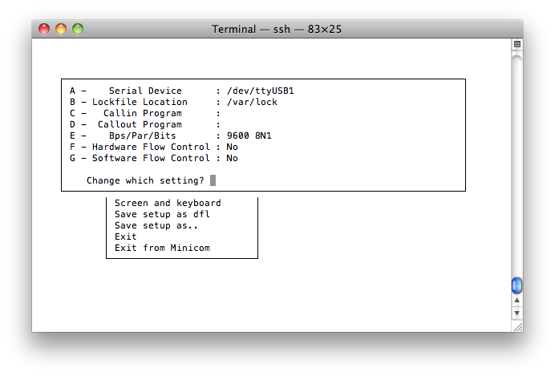

# How to Use Serial Ports

## Overview

This section provides an example of how to create a Kura bundle that
will communicate with a serial device. In this example, you will
communicate with a simple terminal emulator to demonstrate both
transmitting and receiving data. You will learn how to perform the
following functions:

*  Create a plugin that communicates to serial devices

*  Build the bundle and its installer

*  Install the bundle on the remote device

*  Test the communication with minicom where, minicom is acting as an
    attached serial device such as an NFC reader, GPS device, or some
    other ASCII-based communication device

### Prerequisites

*  [Kura Addon Archetype](./kura-addon-archetype.md): JDK 21, Maven 3.9.9+ and git

*  [Hello World Application](./hello-world-application.md)

*  Hardware

    *  Use an embedded device running Kura with two available serial
        ports.
        (If the device does not have a serial port, USB to serial
        adapters can be used.)

    *  Ensure minicom is installed on the embedded device.

## Serial Communication with Kura

This section of the tutorial covers setting up the hardware, determining
serial port device nodes, implementing the basic serial communication
bundle, deploying the bundle, and validating its functionality. After
completing this section, you should be able to communicate with any
ASCII-based serial device attached to a Kura-enabled embedded gateway.
In this example, we are using ASCII for clarity, but these same
techniques can be used to communicate with serial devices that
communicate using binary protocols.

### Hardware Setup

Your setup requirements will depend on your hardware platform. At a
minimum, you will need two serial ports with a null modem serial,
crossover cable connecting them.

*  If your platform has integrated serial ports, you only need to
    connect them using a null modem serial cable.

*  If you do not have integrated serial ports on your platform, you
    will need to purchase USB-to-Serial adapters. It is recommended to
    use a USB-to-Serial adapter with either the PL2303 or FTDI chipset,
    but others may work depending on your hardware platform and
    underlying Linux support. Once you have attached these adapters to
    your device, you can attach the null modem serial cable between the
    two ports.

### Determine Serial Device Nodes

This step is hardware specific. If your hardware device has integrated
serial ports, contact your hardware device manufacturer or review the
documentation to find out how the ports are named in the operating
system. The device identifiers should be similar to the following:

```
/dev/ttyS*xx*
/dev/ttyUSB*xx*
/dev/ttyACM*xx*
```

If you are using USB-to-Serial adapters, Linux usually allocates the
associated device nodes dynamically at the time of insertion. In order
to determine what they are, run the following command at a terminal on
the embedded gateway:

```
tail -f /var/log/syslog
```

!!! warning
    Depending on your specific Linux implementation, other possible log files may be: /var/log/kern.log, /var/log/kernel, or /var/log/dmesg.

With the above command running, insert your USB-to-Serial adapter. You
should see output similar to the following:

```
root@localhost:/root> tail -f /var/log/syslog
Aug 15 18:43:47 localhost kernel: usb 3-2: new full speed USB device using uhci_hcd and address 3
Aug 15 18:43:47 localhost kernel: pl2303 3-2:1.0: pl2303 converter detected
Aug 15 18:43:47 localhost kernel: usb 3-2: pl2303 converter now attached to ttyUSB10
```

In this example, our device is a PL2303-compatible device and is
allocated a device node of “/dev/ttyUSB10”. While your results may
differ, the key is to identify the “tty” device that was allocated. For
the rest of this tutorial, this device will be referred to as
[device_node_1], which in this example is /dev/ttyUSB10. During
development, it is also important to keep in mind that these values are
dynamic; therefore, from one boot to the next and one insertion to the
next, these values may change. To stop ‘tail’ from running in your
console, escape with ‘<CTRL> c’.

If you are using two USB-to-Serial adapters, repeat the above procedure
for the second serial port. The resulting device node will be referred
to as [device_node_2].


### Implement the Bundle

Now that you have two serial ports connected to each other, you are ready to develop the serial bundle as follows:

!!! info
    For more detailed information about bundle development (the project generation, the annotations and the build), please refer to the [Hello World Application](./hello-world-application.md) and to the [Configurable Application](./configurable-application.md).

* Generate a project with the [Kura Addon Archetype](./kura-addon-archetype.md) using `org.eclipse.kura.example` as groupId, `kura-serial` as artifactId and `org.eclipse.kura.example.serial` as package, and remove the generated example classes.

* Add the `org.osgi.service.io` dependency to the bundle `pom.xml`, next to the ones the archetype already declares (`org.eclipse.kura.api`, `slf4j-api` and the Declarative Services and Metatype annotations). The version is managed by the Kura bill of materials:

```xml
<dependency>
    <groupId>org.osgi</groupId>
    <artifactId>org.osgi.service.io</artifactId>
</dependency>
```

The following files need to be implemented in order to write the source code:

* **org.eclipse.kura.example.serial.SerialExampleOCD.java** - configuration description of the bundle and its parameters, types, and defaults, written with the Metatype annotations.

* **org.eclipse.kura.example.serial.SerialExample.java** - main implementation class, declared as a Declarative Services component with the `@Component` annotation.

bnd generates the manifest, the `OSGI-INF` component descriptor and the metatype file from these two classes at build time; the `Import-Package` header is computed from the code (`org.eclipse.kura.comm`, `org.eclipse.kura.configuration`, `org.osgi.service.component`, `org.osgi.service.io`, `org.slf4j`).

#### org.eclipse.kura.example.serial.SerialExampleOCD.java File

```java
package org.eclipse.kura.example.serial;

import org.osgi.service.metatype.annotations.AttributeDefinition;
import org.osgi.service.metatype.annotations.AttributeType;
import org.osgi.service.metatype.annotations.ObjectClassDefinition;
import org.osgi.service.metatype.annotations.Option;

@ObjectClassDefinition(id = "org.eclipse.kura.example.serial.SerialExample", name = "SerialExample",
        description = "Example of a Configuring Kura Application echoing data read from the serial port.")
public @interface SerialExampleOCD {

    @AttributeDefinition(name = "serial.device", type = AttributeType.STRING, required = false,
            description = "Name of the serial device (e.g. /dev/ttyS0, /dev/ttyACM0, /dev/ttyUSB0).")
    String serial_device();

    @AttributeDefinition(name = "serial.baudrate", type = AttributeType.STRING, required = true, description = "Baudrate.",
            options = { @Option(label = "9600", value = "9600"), @Option(label = "19200", value = "19200"),
                    @Option(label = "38400", value = "38400"), @Option(label = "57600", value = "57600"),
                    @Option(label = "115200", value = "115200") })
    String serial_baudrate() default "9600";

    @AttributeDefinition(name = "serial.data-bits", type = AttributeType.STRING, required = true, description = "Data bits.",
            options = { @Option(label = "7", value = "7"), @Option(label = "8", value = "8") })
    String serial_data$_$bits() default "8";

    @AttributeDefinition(name = "serial.parity", type = AttributeType.STRING, required = true, description = "Parity.",
            options = { @Option(label = "none", value = "none"), @Option(label = "even", value = "even"),
                    @Option(label = "odd", value = "odd") })
    String serial_parity() default "none";

    @AttributeDefinition(name = "serial.stop-bits", type = AttributeType.STRING, required = true, description = "Stop bits.",
            options = { @Option(label = "1", value = "1"), @Option(label = "2", value = "2") })
    String serial_stop$_$bits() default "1";
}
```

The method names become the property ids: `_` maps to `.` and `$_$` maps to `-`, so `serial_data$_$bits` is the property `serial.data-bits` read by the component.

#### org.eclipse.kura.example.serial.SerialExample.java File

The org.eclipse.kura.example.serial.SerialExample.java file should look as follows when complete.

```java
package org.eclipse.kura.example.serial;

import java.io.IOException;
import java.io.InputStream;
import java.io.OutputStream;
import java.util.HashMap;
import java.util.Map;
import java.util.concurrent.Future;
import java.util.concurrent.ScheduledThreadPoolExecutor;

import org.osgi.service.component.ComponentContext;
import org.osgi.service.component.annotations.Activate;
import org.osgi.service.component.annotations.Component;
import org.osgi.service.component.annotations.ConfigurationPolicy;
import org.osgi.service.component.annotations.Deactivate;
import org.osgi.service.component.annotations.Modified;
import org.osgi.service.component.annotations.Reference;
import org.osgi.service.io.ConnectionFactory;
import org.osgi.service.metatype.annotations.Designate;
import org.slf4j.Logger;
import org.slf4j.LoggerFactory;

import org.eclipse.kura.comm.CommConnection;
import org.eclipse.kura.comm.CommURI;
import org.eclipse.kura.configuration.ConfigurableComponent;

@Designate(ocd = SerialExampleOCD.class)
@Component(name = "org.eclipse.kura.example.serial.SerialExample", immediate = true,
        configurationPolicy = ConfigurationPolicy.REQUIRE, service = ConfigurableComponent.class)
public class SerialExample implements ConfigurableComponent {

  private static final Logger s_logger = LoggerFactory.getLogger(SerialExample.class);

  private static final String   SERIAL_DEVICE_PROP_NAME= "serial.device";
  private static final String   SERIAL_BAUDRATE_PROP_NAME= "serial.baudrate";
  private static final String   SERIAL_DATA_BITS_PROP_NAME= "serial.data-bits";
  private static final String   SERIAL_PARITY_PROP_NAME= "serial.parity";
  private static final String   SERIAL_STOP_BITS_PROP_NAME= "serial.stop-bits";

  private ConnectionFactory m_connectionFactory;
  private CommConnection m_commConnection;
  private InputStream m_commIs;
  private OutputStream m_commOs;

     private ScheduledThreadPoolExecutor m_worker;
     private Future<?>           m_handle;

  private Map<String, Object> m_properties;

  // ----------------------------------------------------------------
  //
  //   Dependencies
  //
  // ----------------------------------------------------------------

  @Reference
  public void setConnectionFactory(ConnectionFactory connectionFactory) {
    this.m_connectionFactory = connectionFactory;
  }

  public void unsetConnectionFactory(ConnectionFactory connectionFactory) {
    this.m_connectionFactory = null;
  }


  // ----------------------------------------------------------------
  //
  //   Activation APIs
  //
  // ----------------------------------------------------------------

  @Activate
  protected void activate(ComponentContext componentContext, Map<String,Object> properties) {
    s_logger.info("Activating SerialExample...");
    m_worker = new ScheduledThreadPoolExecutor(1);
    m_properties = new HashMap<String, Object>();
    doUpdate(properties);
    s_logger.info("Activating SerialExample... Done.");
  }

  @Deactivate
  protected void deactivate(ComponentContext componentContext) {
    s_logger.info("Deactivating SerialExample...");

        // shutting down the worker and cleaning up the properties
        m_handle.cancel(true);
        m_worker.shutdownNow();

        //close the serial port
    closePort();
    s_logger.info("Deactivating SerialExample... Done.");
  }

  @Modified
  public void updated(Map<String,Object> properties) {
    s_logger.info("Updated SerialExample...");
    doUpdate(properties);
    s_logger.info("Updated SerialExample... Done.");  
  }

  // ----------------------------------------------------------------
  //
  //   Private Methods
  //
  // ----------------------------------------------------------------

  /**
   * Called after a new set of properties has been configured on the service
   */
  private void doUpdate(Map<String, Object> properties) {
    try {
      for (String s : properties.keySet()) {
        s_logger.info("Update - "+s+": "+properties.get(s));
      }

            // cancel a current worker handle if one if active
            if (m_handle != null) {
                    m_handle.cancel(true);
            }

            //close the serial port so it can be reconfigured
      closePort();

      //store the properties
      m_properties.clear();
      m_properties.putAll(properties);

      //reopen the port with the new configuration
      openPort();

      //start the worker thread
      m_handle = m_worker.submit(new Runnable() {
        @Override
        public void run() {
          doSerial();
        }
      });
    } catch (Throwable t) {
      s_logger.error("Unexpected Throwable", t);
    }
  }

  private void openPort() {
    String port = (String) m_properties.get(SERIAL_DEVICE_PROP_NAME);

    if (port == null) {
      s_logger.info("Port name not configured");
      return;
    }

    int baudRate = Integer.valueOf((String) m_properties.get(SERIAL_BAUDRATE_PROP_NAME));
    int dataBits = Integer.valueOf((String) m_properties.get(SERIAL_DATA_BITS_PROP_NAME));
    int stopBits = Integer.valueOf((String) m_properties.get(SERIAL_STOP_BITS_PROP_NAME));

    String sParity = (String) m_properties.get(SERIAL_PARITY_PROP_NAME);

    int parity = CommURI.PARITY_NONE;
    if (sParity.equals("none")) {
      parity = CommURI.PARITY_NONE;
    } else if (sParity.equals("odd")) {
      parity = CommURI.PARITY_ODD;
    } else if (sParity.equals("even")) {
      parity = CommURI.PARITY_EVEN;
    }

    String uri = new CommURI.Builder(port)
    .withBaudRate(baudRate)
    .withDataBits(dataBits)
    .withStopBits(stopBits)
    .withParity(parity)
    .withTimeout(1000)
    .build().toString();

    try {
      m_commConnection = (CommConnection) m_connectionFactory.createConnection(uri, 1, false);
      m_commIs = m_commConnection.openInputStream();
      m_commOs = m_commConnection.openOutputStream();

      s_logger.info(port+" open");
    } catch (IOException e) {
      s_logger.error("Failed to open port " + port, e);
      cleanupPort();
    }
  }

  private void cleanupPort() {
    if (m_commIs != null) {
      try {
        s_logger.info("Closing port input stream...");
        m_commIs.close();
        s_logger.info("Closed port input stream");
      } catch (IOException e) {
        s_logger.error("Cannot close port input stream", e);
      }
      m_commIs = null;
    }
    if (m_commOs != null) {
      try {
        s_logger.info("Closing port output stream...");
        m_commOs.close();
        s_logger.info("Closed port output stream");
      } catch (IOException e) {
        s_logger.error("Cannot close port output stream", e);
      }
      m_commOs = null;
    }
    if (m_commConnection != null) {
      try {
        s_logger.info("Closing port...");
        m_commConnection.close();
        s_logger.info("Closed port");
      } catch (IOException e) {
        s_logger.error("Cannot close port", e);
      }
      m_commConnection = null;
    }
  }

  private void closePort() {
    cleanupPort();
  }

  private void doSerial() {
    if (m_commIs != null) {
      try {
        int c = -1;
        StringBuilder sb = new StringBuilder();

        while (m_commIs != null) {
          if (m_commIs.available() != 0) {
            c = m_commIs.read();
          } else {
            try {
              Thread.sleep(100);
              continue;
            } catch (InterruptedException e) {
              return;
            }
          }

          // on reception of CR, publish the received sentence
          if (c==13) {
            s_logger.debug("Received serial input, echoing to output: " + sb.toString());
            sb.append("\r\n");
            String dataRead = sb.toString();

            //echo the data to the output stream
            m_commOs.write(dataRead.getBytes());

            //reset the buffer
            sb = new StringBuilder();
          } else if (c!=10) {
            sb.append((char) c);
          }
        }
      } catch (IOException e) {
        s_logger.error("Cannot read port", e);
      } finally {
        try {
          m_commIs.close();
        } catch (IOException e) {
          s_logger.error("Cannot close buffered reader", e);
        }
      }
    }
  }
}
```

The `ConnectionFactory` service, provided by the Kura runtime, creates the `CommConnection` from the `comm:` URI built with `CommURI.Builder`; the `@Reference` annotation injects it. The component registers itself as a `ConfigurableComponent`, so the serial parameters can be changed from the Kura web UI and applied by the `@Modified` method.

### Build the Bundle

Build the project as in the [Hello World Application](./hello-world-application.md): after the first `mvn clean install -Presolve-integration-tests`, a plain `mvn clean install` produces the bundle `org.eclipse.kura.example.serial/target/org.eclipse.kura.example.serial-1.0.0-SNAPSHOT.jar` and the Debian installer under `distrib/target/deb`.

### Deploy the Bundle

Copy the installer to the embedded gateway that is running Kura, install it and restart Kura as described in [Install and run the generated packages](./kura-addon-archetype.md#install-and-run-the-generated-packages).

Once the installation successfully completes, you should see messages in the `/var/log/kura.log` file indicating that the bundle was activated and configured. Then open the Kura web UI, select **SerialExample** in the Services area and set `serial.device` to [device_node_1]: the `updated()` method opens the port and the log shows `[device_node_1] open`. Make sure that the `kurad` user, which runs Kura, has permission to access the serial device in `/dev` (on most distributions it is enough to add it to the `dialout` group).

### Validate the Bundle

Next, you need to test that your bundle does indeed echo characters back by opening minicom and configuring it to use [device_node_2] that was previously determined.

Open minicom using the following command at a Linux terminal on the remote gateway device:

```
minicom -s
```

This command opens a view similar to the following screen capture:



Scroll down to Serial port setup and press <ENTER>. A new dialog window opens as shown below:



Use the minicom menu options on the left (i.e., A, B, C, etc.) to change desired fields. Set the fields to the same values as shown in the previous screen capture except the Serial Device should match the [device_node_2] on your target device. Once this is set, press \<ENTER\> to exit from this menu.

In the main configuration menu, select Exit (*do not* select the option Exit from Minicom). At this point, you have successfully started minicom on the second serial port attached to your null modem cable allowing minicom to act as a serial device that can send and receive commands to your Kura bundle. You can verify this operation by typing characters and pressing <ENTER>. The <ENTER> function (specifically a ‘\\n’ character) signals to the Kura application to echo the buffered characters back to the serial device (minicom in this case).

Upon startup, minicom sends an initialization string to the serial device. These characters are sent to the minicom terminal because they were echoed back by Kura listening on the port at the other end of the null modem cable.

When you are done, exit minicom by pressing ‘<CTRL> a’, then ‘q’, and finally ‘<ENTER>’. Doing so brings you back to the Linux command prompt.

This tutorial instructed you how to write and deploy a Kura bundle on your target device that listens for serial data (coming from the minicom terminal and being received on [device_node_1]). This tutorial also demonstrated that the application echoes data back to the same serial port that is received in minicom, which acts a serial device that sends and receives data. If supported by the device, Kura may send and receive binary data instead of ASCII.
