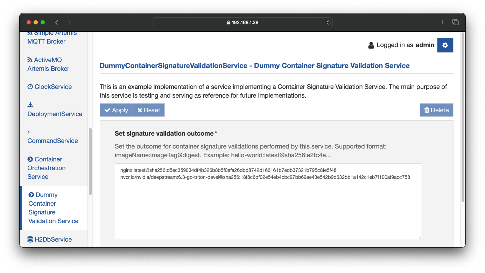

# How to use the Dummy Container Signature Validation Service

The Dummy Container Signature Validation Service is an example implementation of the [Container Signature Validation Service interface](https://github.com/eclipse/kura/blob/develop/kura/org.eclipse.kura.api/src/main/java/org/eclipse/kura/container/signature/ContainerSignatureValidationService.java) which mainly serves as a reference for future implementations and testing.

The purpose of this component is to have a service whose configuration dictates the signature verification outcome. In the main text area is possible to set the container image reference that the service will report as correctly signed.

The format accepted by the service is: `<imageName>:<imageTag>@<imageDigest>` where

- `<imageName>`: is the container image name. The value will need to be expressed in the form registryURL/imagename in case of a custom registry. Example: `nginx` or `nvcr.io/nvidia/deepstream`.
- `<imageTag>`: is the container image tag. Example: `latest` or `6.4-gc-triton-devel`.
- `<imageDigest>`: is the image digest in [the OCI specification format](https://github.com/opencontainers/image-spec/blob/main/descriptor.md#digests).

Each image should be separated by a newline. The service will report a successful signature validation for each image inside its configuration, returning the provided image digest as a result.

