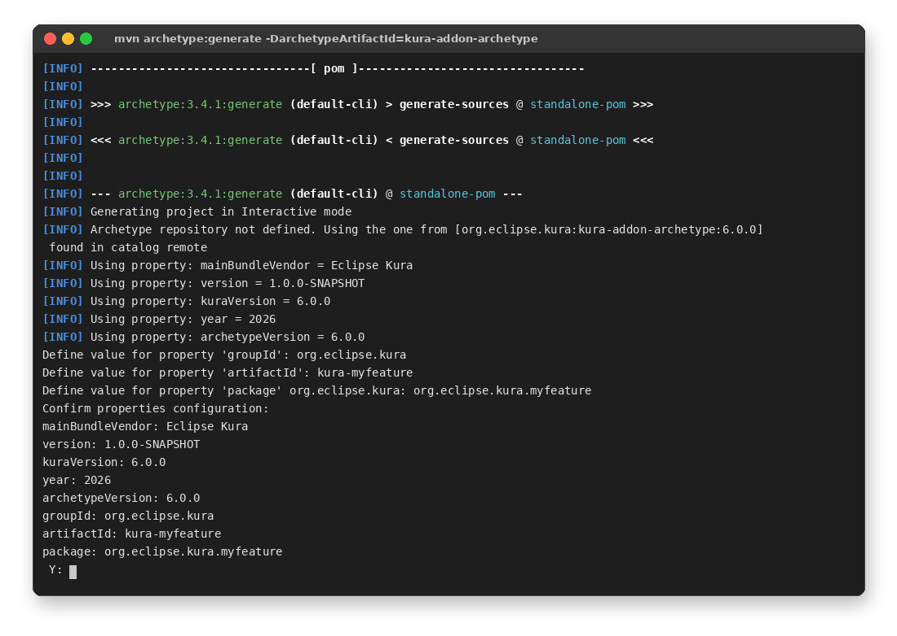

# Kura Addon Archetype

The Kura Addon Archetype is a [Maven Archetype](https://maven.apache.org/guides/introduction/introduction-to-archetypes.html) that bootstraps an Eclipse Kura add-on project. A generated project comes with:

- a Maven + [bnd](https://bnd.bndtools.org/) build targeting Java 21 and OSGi
- an example bundle using Declarative Services and Metatype annotations (a `ConfigurableComponent`, its OCD and its configuration options)
- a bill of materials (`-bom`) listing the bundles the project releases
- unit tests (JUnit 4 + Mockito) and [OSGi integration tests](https://bnd.bndtools.org/chapters/310-testing.html) run by bnd against an embedded Kura framework
- a template project producing a Debian (`.deb`) package

The archetype is developed in the [eclipse-kura/kura-archetype](https://github.com/eclipse-kura/kura-archetype) repository and is published on Maven Central as `org.eclipse.kura:kura-addon-archetype`, so no installation step is required: Maven downloads it on first use. It is available since Kura 6.0.0 and its version matches the Kura version it targets: use `6.0.0` to generate an add-on for Kura 6. All the Kura dependencies of the generated project are resolved through the Kura bill of materials, `org.eclipse.kura:kura-bom`, of the same version.

!!! note
    Snapshot builds of the archetype are published to the [Kura snapshots repository](https://repo.eclipse.org/content/repositories/kura-snapshots/). To generate a project with a `-SNAPSHOT` version of the archetype, declare that repository in your `~/.m2/settings.xml`.

## Requirements

- **JDK 21**: the generated project sets `maven.compiler.release=21`.
- **Maven 3.9.x**
- **git**: required to build a generated project, the `git-commit-id-maven-plugin` reads the commit hash that goes into the Debian package version.

## Generating a project

In interactive mode, Maven prompts for every property:

```shell
mvn archetype:generate \
  -DarchetypeGroupId=org.eclipse.kura \
  -DarchetypeArtifactId=kura-addon-archetype \
  -DarchetypeVersion=<kura-version>
```



The same result can be obtained in one shot:

```shell
mvn -B archetype:generate \
  -DarchetypeGroupId=org.eclipse.kura \
  -DarchetypeArtifactId=kura-addon-archetype \
  -DarchetypeVersion=<kura-version> \
  -DgroupId=org.eclipse.kura \
  -DartifactId=kura-myfeature \
  -Dpackage=org.eclipse.kura.myfeature \
  -Dversion=1.0.0-SNAPSHOT \
  -DmainBundleVendor="Eclipse Kura" \
  -DkuraVersion=<kura-version> \
  -Dyear=2026
```

| Property | Meaning | Default |
|---|---|---|
| `groupId` | Maven group id of every generated module | *prompted* |
| `artifactId` | artifact id of the root project and name of the top level folder | *prompted* |
| `package` | base Java package **and** artifact id / OSGi symbolic name of the main bundle | *prompted* |
| `version` | version of the generated project | `1.0.0-SNAPSHOT` |
| `mainBundleVendor` | vendor name of the add-on | `Eclipse Kura` |
| `kuraVersion` | version of the Kura bill of materials (`org.eclipse.kura:kura-bom`) used to resolve the dependencies | the archetype version |
| `year` | year written in the copyright headers of the generated files | the year the archetype was built |

In interactive mode the optional properties can be changed by answering `n` at the `Confirm properties configuration` prompt. The prompt also shows `archetypeVersion`, which never needs to be set: it defaults to the version of the archetype in use and is recorded as a comment in the generated root `pom.xml`, so a project always states what generated it.

The official Kura add-ons naming rule is:

- **groupId** = `org.eclipse.kura`
- **artifactId** = repository name: `kura-<feature>` (e.g. `kura-wires`)
- **package** = `org.eclipse.kura.<feature>` (e.g. `org.eclipse.kura.wires`)

**It is not allowed to generate a project with artifactId = package**: the root project and the main bundle are separate Maven modules.

The generated files carry the following copyright header, where `${year}` is the value of the `year` property:

```
Copyright (c) ${year} Eurotech and/or its affiliates and others

This program and the accompanying materials are made
available under the terms of the Eclipse Public License 2.0
which is available at https://www.eclipse.org/legal/epl-2.0/

SPDX-License-Identifier: EPL-2.0

Contributors:
 Eurotech
```

A `.gitignore` file is added with a default configuration that ignores, among others, the `OSGI-INF` folder and the flattened POMs, which are generated at build time.

### Add the generated sources to `git`

The project _requires_ source control management via `git` to correctly build. To add the project to `git` run the following:

```bash
git init
git add .
git commit -m "initial commit"
```

Once this steps are completed you can safely build the project.

## Project structure

At the end of the procedure, the generated project is organized as follows:

```
kura-myfeature
├── .gitignore
├── pom.xml
├── bom
│   └── pom.xml
├── org.eclipse.kura.myfeature
│   ├── pom.xml
│   ├── about.html
│   ├── about_files
│   └── src/main/java
├── distrib
│   ├── deb/control/control
│   └── pom.xml
└── tests
    ├── pom.xml
    ├── test-env
    └── org.eclipse.kura.myfeature.test
        ├── integration-test.bndrun
        ├── pom.xml
        ├── src/main/java   (OSGi integration tests)
        └── src/test/java   (unit tests)
```

- **pom.xml**: the root project. It imports the Kura bill of materials (`org.eclipse.kura:kura-bom:${kuraVersion}`) in its `dependencyManagement` and configures the bnd Maven plugins, the checkstyle validation with the Kura rules and the flatten plugin.

- **bom**: this project's bill of materials, listing all the bundles that this project deploys. It is intended to be consumed by other projects.

- **org.eclipse.kura.myfeature**: the OSGi bundle, built by `bnd-maven-plugin`. The manifest is generated by bnd from the `<bnd>` instructions in the `pom.xml` and from the Declarative Services and Metatype annotations in the sources, so there is no `MANIFEST.MF` nor `OSGI-INF` folder to maintain.

- **tests**: the tests aggregator. Its `pom.xml` declares the Kura runtime bundles indexed for the OSGi integration tests, `test-env` contains the Kura framework configuration used by the integration tests (`kura.properties`, `log4j.xml`, the initial snapshot) and the `.test` module contains unit tests, run by `maven-surefire-plugin`, and OSGi integration tests, run by `bnd-testing-maven-plugin`.

- **distrib**: a packaging project that builds a Debian (`.deb`) package. The package installs the JAR produced by the bundles into Kura's plugins directory at `/opt/eclipse/kura/plugins`. You should review and adjust this project to match your target architecture and packaging requirements; the source is annotated with comments indicating the main configuration points.

## Dependencies

The Kura bill of materials manages the versions of every Kura bundle and of every third-party library that is part of the Kura runtime (OSGi, Equinox, Jetty, Jersey, log4j, BouncyCastle, Netty, ...). A dependency on any of them is declared **without a version** in the bundle `pom.xml`:

```xml
<dependency>
    <groupId>org.eclipse.kura</groupId>
    <artifactId>org.eclipse.kura.api</artifactId>
</dependency>
```

Using the versions managed by `kura-bom` guarantees that the bundle is compiled against the same packages that are available in the Kura runtime it targets. When upgrading the add-on to a new Kura version it is enough to change the `kura-bom` version imported in the root `pom.xml`.

Dependencies that are not part of the Kura runtime must be added, with a version, to the `dependencyManagement` of the root `pom.xml`. Remember that such libraries also need to be installed in the Kura framework at runtime, for example by packaging them in the Debian package.

## Project build

The first build must run the `resolve-integration-tests` profile:

```bash
mvn clean install -Presolve-integration-tests
```

The `-runbundles` of the generated `integration-test.bndrun` are not populated: the profile enables the `bnd-resolver-maven-plugin`, which computes the set of bundles needed by the integration tests from the `-runrequires` of the `.bndrun` and writes it back in the file. After the first build a plain `mvn clean install` is enough.

Run the profile again whenever the `-runrequires` of the `.bndrun` or the imports of the bundles change. We suggest adding the resolved `.bndrun` files to the source control to have a clear history of the changes made to the test runtime.

The build will produce the following system packages in `distrib/target/deb`:

- DEB installer (`<package.name>_<version>-<revision>_<debian-architecture>.deb`)

Installer properties like the architecture, organization name, package dependencies, and others can be configured in the `distrib` project.

### Tests

Both kinds of tests run as part of `mvn verify` / `mvn install`:

- **Unit tests**: `maven-surefire-plugin` runs the classes in `src/test/java` of the `.test` module. Reports land in `tests/<package>.test/target/surefire-reports/`.
- **OSGi integration tests**: `bnd-testing-maven-plugin` starts an Equinox framework with the Kura emulator bundles listed in the `-runbundles` of `integration-test.bndrun`, installs the bundle under test and the test bundle, and runs the test classes selected by `Test-Cases: ${classes;CONCRETE;PUBLIC;NAMED;*Test}`. Test classes live in `src/main/java` of the `.test` module, since they are part of the test bundle. The framework works in a copy of `tests/test-env` created in `tests/<package>.test/target/test-env` before the run. Reports land in `tests/<package>.test/target/test-reports/integration-test/`.

JaCoCo writes an aggregate coverage report to `tests/<package>.test/target/site/jacoco-aggregate/`.

The bnd resolver only includes in the runtime the bundles that are required, directly or transitively, by the `.bndrun`. The generated `integration-test.bndrun` requires:

- the Kura emulator runtime (`-runrequires.emulator`): configuration, crypto, identity, inventory, status and system services, the emulator bundles, the H2 database, the cloud connection with the embedded Moquette broker, and the HTTP and REST stack
- the bundle under test and the test bundle itself (`-runrequires`). The symbolic name of the bundle under test comes from the `bundle.under.test` property of the `.test` module `pom.xml`.

To make another Kura bundle available to the integration tests, add it to `-runrequires` and run the `resolve-integration-tests` profile again. The bundles that the resolver can pick from are the dependencies of `tests/pom.xml`, which are indexed by `bnd-indexer-maven-plugin`: the generated list mirrors the full Kura runtime, so it normally does not need changes. A bundle that is not part of the Kura runtime must be added there too, with its version managed in the root `pom.xml`.

!!! note
    The example integration test, `ExampleComponentItTest`, is itself a Declarative Services component: it obtains the component under test through an `@Reference` filtered on its `kura.service.pid` and waits for it before running the tests. This is the recommended way to obtain Kura services in integration tests.

### Install and run the generated packages

Depending on the system, the packages can be installed with:

```shell
apt install ./<package.name>_<version>-<revision>_<debian-architecture>.deb
```

The package depends on `kura-core` version 6: the control file declares `Depends: kura-core (>= 6.0.0~), kura-core (<< 7.0.0~)`.

After having installed the package, restart Kura with:

```shell
systemctl restart kura
```

During startup Kura will scan the plugins folder to pick up the installed JARs and include them in the framework's runtime. The bundles are installed in the `6s` folder, i.e. at OSGi start level 6 and started automatically. See the comments in `distrib/pom.xml` to use other start levels.

It is possible to remove the installed plugins with:

```shell
apt purge <package.name> # or apt remove <package.name>
```

### Debug builds and Release builds

Two type of builds are supported:

- **Debug builds**: active by default, generate artifacts whose version is computed from the timestamp and the `git` commit hash. Versioning scheme: `X.X.X~git{timestamp}.{hash}-{revision}`
- **Release builds**: generate release-ready artifacts. This build _requires_ that no artifact/version is in "snapshot" mode. A "snapshot" version will result in a build failure. Versioning scheme: `X.X.X-{revision}`.

The build defaults to the `debugBuild` profile, if the `-DreleaseBuild` parameter is specified, the build selects the `releaseBuild` profile.

By default the `package.revision` is set to `1`. It can be overridden via CLI using the `-Dpackage.revision=N` parameters.

Example:

```bash
mvn clean install -Dpackage.revision=6 -DreleaseBuild
```

### Versions uptick

Using the following command it is possible to update the version of the project:

```bash
mvn versions:set -DnewVersion=<new-version> -DprocessAllModules=true
```

The BOM project and the bundles defined in the dependency management section are updated as well. The OSGi `Bundle-Version` is derived by bnd from the Maven version, so no manifest needs to be edited.

### Deploy artifacts

By default the root project, the `tests` and the `distrib` modules are not deployed (they are configured to skip the execution of the `maven-deploy-plugin`). Only the BOM (`bom/pom.xml`) and the OSGi bundles are meant to be deployed: the generated bundle re-enables the `maven-deploy-plugin`, use it as a reference for any bundle added to the project.

## IDE setup

No specific IDE configuration is required to work with the generated projects. The project can be imported in any IDE that supports Maven projects, such as Visual Studio Code, IntelliJ Idea and Eclipse IDE.

### Importing Projects in Visual Studio Code

To import the project in Visual Studio Code, open the root folder of the project. Refer to the [VSCode documentation](https://code.visualstudio.com/docs/java/java-project) for more details on how to work with Java projects in VSCode.

**Suggested extensions**:

- [Language Support for Java by Red Hat](https://marketplace.visualstudio.com/items?itemName=redhat.java)
- [Debugger for Java](https://marketplace.visualstudio.com/items?itemName=vscjava.vscode-java-debug)
- [Java Test Runner](https://marketplace.visualstudio.com/items?itemName=vscjava.vscode-java-test)

### Importing Projects in IntelliJ Idea

To import the project in IntelliJ Idea, open the root folder of the project and select the `pom.xml` file. Refer to the [IntelliJ documentation](https://www.jetbrains.com/help/idea/maven-support.html#maven_import_project_start) for more details on how to work with Maven projects in IntelliJ.

### Importing Projects in Eclipse IDE

In Eclipse IDE, create a new workspace (it is not necessary to have the workspace in the root of the project) and import the projects with _File | Import | Maven | Existing Maven Projects_.


Note that if the workspace resides in the root of the project the parent POM file cannot be selected.

#### (Optional) IDE errors resolution

In some cases it might be necessary to manually configure the build path. For the bundles and test projects, select _Properties_ and then _Project Natures_ and add the natures as in picture below.


Then, from the _Java Build Path_ configure the correct source folder as in picture below.


Finally, configure the external **Classpath** dependencies by selecting the plugin dependencies from the _Add Library_.


## Architecture-specific development

The Addon Archetype standard procedure allows to build generic Debian installers not dependant on the architecture on which the bundle will be installed.

However, it is possible to customise the files in the `distrib` folder to develop architecture-dependant installers: this might be necessary when a bundle contains native code (C/C++ libraries, jars that use JNI, etc.) or architecture-specific files (e.g. a systemd service file).

In the following sections we will see how this can be accomplished for the DEB packages. These steps assume that architecture-specific jars are built in the form of fragments of the architecture-agnostic java code. The architecture-specific jars will then be copied in the `distrib` folder and included in the package. For example, given the following bundles structure:

```
org.eclipse.kura.myartifact
org.eclipse.kura.myartifact.aarch64
org.eclipse.kura.myartifact.x86_64
....
```

The `org.eclipse.kura.myartifact.bundle` contains the agnostic code, while the `org.eclipse.kura.myartifact.aarch64` and `org.eclipse.kura.myartifact.x86_64` fragments contain the architecture-specific code.

The objective is to produce two debian packages, one for each of the supported architectures. It is possible to modify the `pom.xml` in `distrib` to produce the correct metadata for the installers (see section below). Each debian package will install the main bundle and the relative fragment that matches the target environment. For example, the *aarch64* deb package will install:

```
/opt/eclipse/kura/plugins/<start-level>s/org.eclipse.kura.myartifact-<version>.jar
/opt/eclipse/kura/plugins/<start-level>/org.eclipse.kura.myartifact.aarch64-<version>.jar
```

Note that the fragment `org.eclipse.kura.myartifact.aarch64-<version>.jar` is put in a plugins folder that is not ending with `s` since fragments can never be started as they don't have their own lifecycle.

### Create architecture dependant installers

The `/distrib/deb/control/control` file contains the DEB package metadata. The standard file is configured as follows:

```
Package: [[package.name]]
Version: [[package.version]]-[[package.revision]]
Section: admin
Priority: optional
Depends: kura-core (>= 6.0.0~), kura-core (<< 7.0.0~)
Architecture: [[deb.architecture]]
Maintainer: [[deb.maintainer]]
Description: [[summary]]
  [[long.description]]
Homepage: [[deb.docs]]
```

The Architecture field is the one responsible to specify the architecture of the package. The value is set in the `/distrib/pom.xml` file, by the property `<deb.architecture>all</deb.architecture>`. The value `all` means that the package can be installed on any architecture. This is the recommended value for packages that do not contain architecture-specific files.

To build a package that contains architecture-specific files, it is necessary to separate the control files of the different architectures (namely, `aarch64` and `amd64`). To do so, create two directories in the `distrib/deb/` folder with this structure:

```
distrib
├── deb
│   ├── amd64
│   ├── arm64
```
Each `control` file must be created in the `distrib/deb/<arch>/` folder. These folders can also contain the `postinst` and `postrm` files, used to execute commands after the installation and before the removal of the package. The content of these files is not relevant for this example, but they can be used to execute commands that are necessary for the correct installation of the package.

An example of `control` file for the `arm64` architecture is:

```
Package: [[package.name]]
Version: [[package.version]]-[[package.revision]]
Section: admin
Priority: optional
Depends: kura-core (>= 6.0.0~), kura-core (<< 7.0.0~)
Architecture: [[deb.arm64.architecture]]
Maintainer: [[deb.maintainer]]
Description: [[summary]]
  [[long.description]]
Homepage: [[deb.docs]]
```

The same file for the `amd64` architecture will just change the `Architecture` field to `[[deb.amd64.architecture]]`.

Finally, the plugin responsible of generating the DEB package is the `jdeb` plugin. To build the architecture-dependant installers, the execution must change to:

```xml
<execution>
    <id>generate-arm64-deb</id>
    <phase>package</phase>
    <goals>
        <goal>jdeb</goal>
    </goals>
    <configuration>
        <verbose>true</verbose>
        <deb>${basedir}/target/deb/${package.name}_${package.version}-${package.revision}_${deb.arm64.architecture}.deb</deb>
        <controlDir>${project.basedir}/deb/arm64</controlDir>
        <skipPOMs>false</skipPOMs>
        <dataSet>
            <data>
                <src>${basedir}/target/plugins/${jar.name}-${project.version}.jar</src>
                <dst>${jar.name}-${project.version}.jar</dst>
                <type>file</type>
                <mapper>
                    <type>perm</type>
                    <prefix>${addon.installation.dir}</prefix>
                    <user>kurad</user>
                    <group>kurad</group>
                    <filemode>600</filemode>
                </mapper>
            </data>
            <data>
                <src>${basedir}/target/plugins/${jar.aarch64.core}-${project.version}.jar</src>
                <dst>${jar.aarch64.core}-${project.version}.jar</dst>
                <type>file</type>
                <mapper>
                    <type>perm</type>
                    <prefix>${native.core.installation.dir}</prefix>
                    <user>kurad</user>
                    <group>kurad</group>
                    <filemode>600</filemode>
                </mapper>
            </data>
        </dataSet>
    </configuration>
</execution>
```

The `jar.name`, `jar.aarch64.core` and `native.core.installation.dir` properties used above are not part of the generated project: define them in the `distrib/pom.xml` properties to match your bundle names and installation folders. A similar execution can be used for the `amd64` architecture, just changing the `deb` and `controlDir` fields to point to the correct architecture (and change the execution `id` if they're present at the same time). Also in the `<dataSet>` section, the `src` and `dst` fields must be changed to point to the correct architecture-specific jars.

The final result will consist of two installers, one for each architecture. They will be found in the `distrib/target/deb/` folder with the following names:

```
<package.name>_<version>-<revision>_<deb.amd64.architecture>.deb
<package.name>_<version>-<revision>_<deb.arm64.architecture>.deb
```
