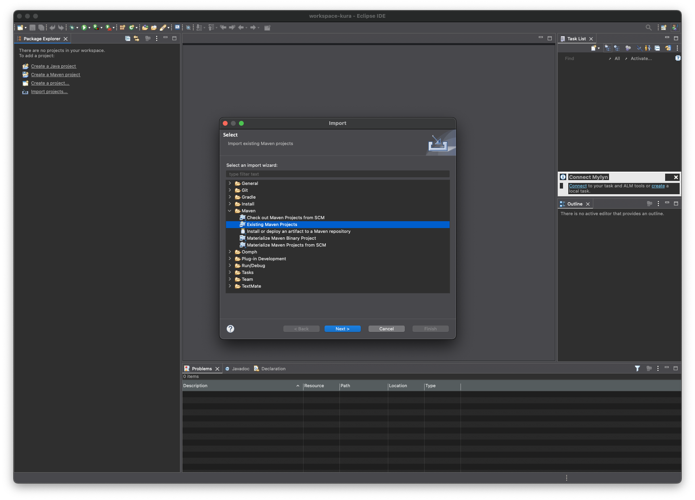
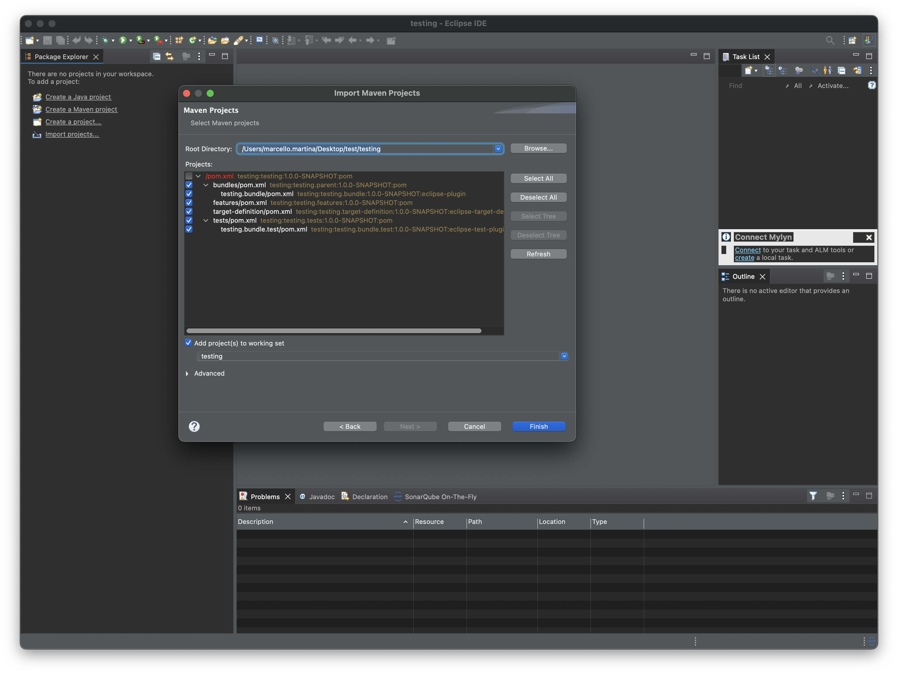
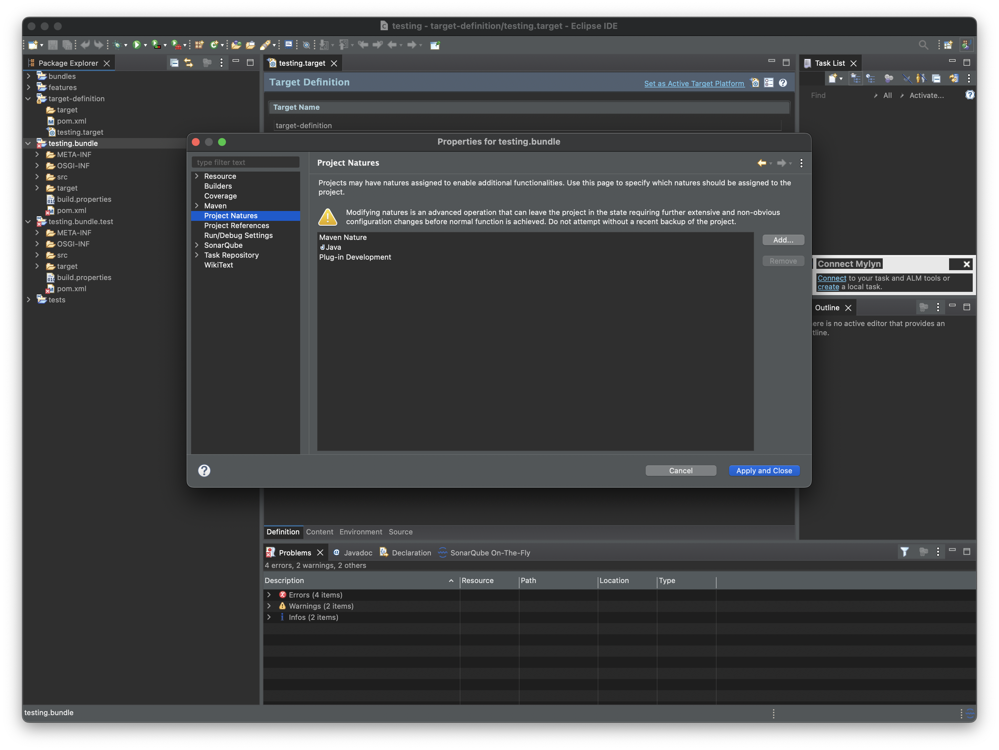
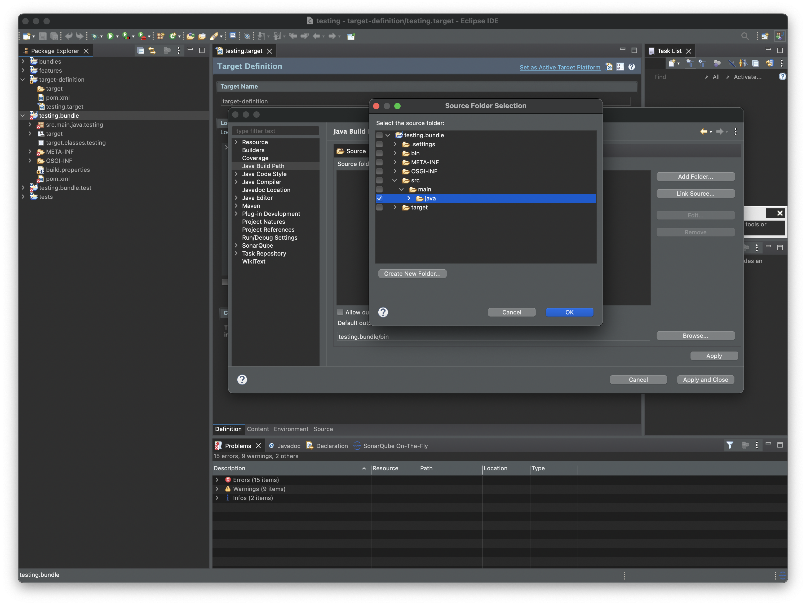
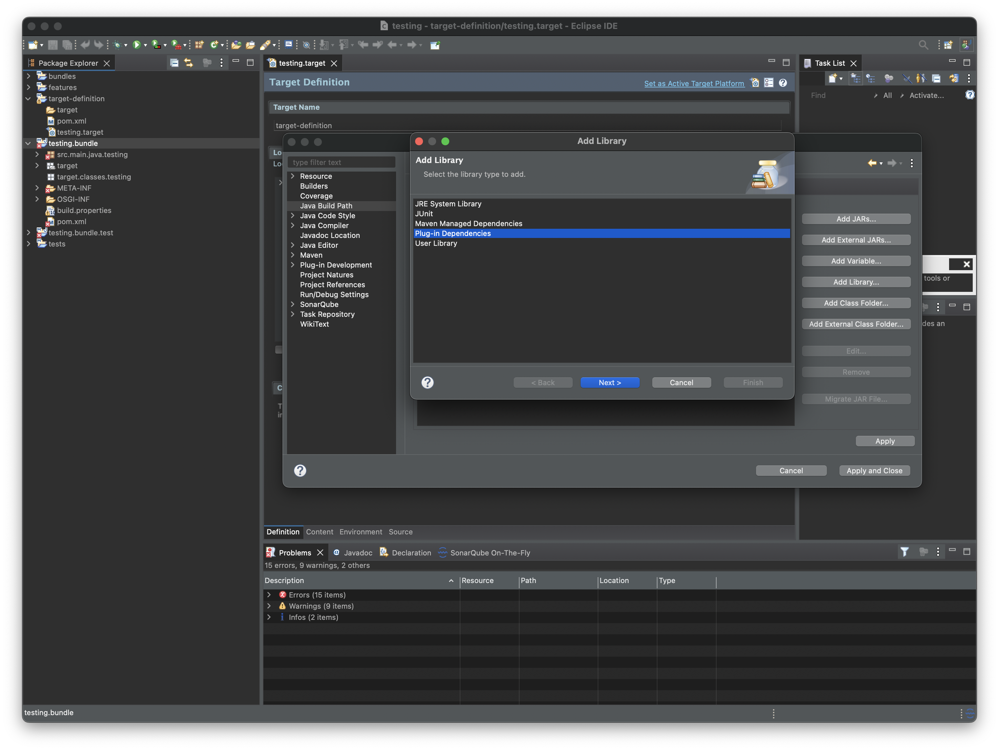

# Kura Addon Archetype

The Kura Addon Archetype is a [Maven Archetype](https://maven.apache.org/guides/introduction/introduction-to-archetypes.html) that allows to create a development environment with the following features:

- Maven-based build
- Template project for creating DEB packages
- Tycho-surefire based integration test template

The Kura Archetype JAR (`kura-addon-archetype-<kura-version>.jar`) is available in the released artifacts and can be installed in the local maven repository with the following command:

```shell
mvn install:install-file \
-Dfile=./kura-addon-archetype-<kura-version>.jar \
-DgroupId=org.eclipse.kura \
-DartifactId=kura-addon-archetype \
-Dversion="<kura-version>" \
-Dpackaging=jar \
-DgeneratePom=true
```

Valid `<kura-version>` values are `6.0.0-SNAPSHOT` and `6.0.0`. This archetype is available since Kura 6.0.0.

After that, it is possible to generate a project skeleton using the archetype with the following command:

```shell
mvn archetype:generate \
-DarchetypeArtifactId=kura-addon-archetype \
-DarchetypeGroupId=org.eclipse.kura \
-DarchetypeVersion="<kura-version>"
```

The command will start the generation of the archetype in interactive mode. Maven will ask for a few parameters on the command line:

- **groupId** : the Maven group id of the generated pom files, usually `org.eclipse.kura`
- **artifactId**: the Maven artifact id of the generated parent pom file and the name of the generated top level project folder, usually something like `org.eclipse.kura.myartifact`
- **package**: the Java package to be used for the main bundle, usually something like `org.eclipse.kura.myartifact`

The following optional parameters can be changed by answering `n` after the `Confirm properties configuration` prompt, which appears after editing the properties above:

- **version**: the generated project's version. Defaults to *1.0.0-SNAPSHOT*
- **mainBundleVendor**: the name of the vendor to use in the metadata. Defaults to *Eclipse Kura*
- **kuraVersion**: the version of the Kura bill-of-materials, used to resolve dependencies. Defaults to *6.0.0[-SNAPSHOT]*

A `.gitignore` file is automatically added with a default configuration. The `OSGI-INF` folder is omitted because it will be generated during tests at compile-time (this is necessary to make the PDE launcher work).

### Add the generated sources to `git`

The project _requires_ source control management via `git` to correctly build. To add the project to `git` run the following:

```bash
git init
```

```bash
git add .
```

```bash
git commit -m "initial commit"
```

Once this steps are completed you can safely build the project.

## Project structure

At the end of the procedure, the archetype will generate a subfolder in the working directory containing the following subfolders:

- **bundles**: the directory where developed bundles can be placed. After the first archetype execution, this directory contains a single project, named as `artifactId.bundle`

- **distrib**: contains a project that builds a DEB package that installs the JAR produced in `bundles` in Kura's plugins folder `/opt/eclipse/kura/plugins`. It is recommended to configure this project to customize the target package architecture and other parameters. The project code is commented with hints on the configurable options

- **target-definition**: The `.target` file contained in the project is the way to specify the project dependencies as maven artifacts, Tycho will then wrap them as bundles and make them available in the target platform. Since only released artifacts are published on Maven central, it is recommeded to perform a local Kura build to have the SNAPSHOT versions available

- **tests**: contains OSGi integration tests executed by the `tycho-surefire-plugin`

## Compile and run

The minimum supported Java version for compiling is Java 17. Compile the project with:

```shell
mvn clean install
```

The build will produce the following system packages in `distrib/target`:

- DEB installer (`<artifactId>_<version>_<debian-architecture>.deb`)

Installer properties like the architecture, organization name, package dependencies, and others can be configured in the `distrib` project.

Depending on the system, the packages can be installed with:

```shell
apt install <artifactId>_<version>_<debian-architecture>.deb
```

After having installed the package, restart kura with:

```shell
systemctl restart kura
```

During startup Kura will scan the plugins folder to pick up the installed JARs and include them in the framework's runtime.

It is possible to remove the installed plugins with:

```shell
apt purge <artifactId> # or apt remove <artifactId>
```

### Debug builds and Release builds

Since version 6.0.0 of the archetype, two type of builds are supported:

- **Debug builds**: active by default, generate artifacts whose version is computed from the timestamp and the `git` commit hash. Versioning scheme: `X.X.X~git{timestamp}.{hash}-{revision}`
- **Release builds**: generate release-ready artifacts. This build _requires_ that no artifact/version is in "snapshot" mode. A "snapshot" version will result in a build failure. Versioning scheme: `X.X.X-{revision}`.

The build defaults to the `debugBuild` profile, if the `-DreleaseBuild` parameter is specified, the build selects the `releaseBuild` profile.

By default the `package.revision` is set to `1`. It can be overridden via CLI using the `-Dpackage.revision=N` parameters.

Example:

```bash
mvn clean install -Dpackage.revision=6 -DreleaseBuild
```

## IDE setup

We officially support two IDEs for developing Kura Addons: **Eclipse IDE** and **Visual Studio Code**. The following sections describe how to set up the projects in these IDEs.

### Importing Projects in Visual Studio Code

#### Requirements

**VSCode extensions**: the following extensions will be automatically installed during the setup

- [Eclipse PDE support for VS Code](https://marketplace.visualstudio.com/items?itemName=yaozheng.vscode-pde)
- [Language Support for Java by Red Hat](https://marketplace.visualstudio.com/items?itemName=redhat.java)
- [Debugger for Java](https://marketplace.visualstudio.com/items?itemName=vscjava.vscode-java-debug)
- [Java Test Runner](https://marketplace.visualstudio.com/items?itemName=vscjava.vscode-java-test)

[**Kura metadata generator**](https://github.com/eclipse-kura/metadata-generator): this tool is used to generate the metadata required by VSCode to correctly load the Kura project. It is a Python tool that can be installed via `pip` with the following command:

```
pip3 install https://github.com/eclipse-kura/metadata-generator/releases/download/<version>/metadata_generator-<version>-py3-none-any.whl
```

See [latest release](https://github.com/eclipse-kura/metadata-generator/releases/latest) for updated installation instructions.

#### Instructions

#### 1. Run the Kura metadata generator tool

After building the project with maven as described in the previous section, the next step is to generate the metadata required by VSCode to correctly load the Kura project.

Change the current working directory to the root of the add on archetype project (the one containing the `pom.xml` file) and run the metadata generator tool with the following command:

```bash
kura-gen
```

#### 2. Open VSCode

```bash
code .
```

#### 3. Follow the on-screen instructions

VS Code prompts the user to install the recommended extensions when a workspace is opened for the first time. The list of recommended extensions can be reviewed with the `Extensions: Show Recommended Extensions` command.


After all the recommended extensions are installed, the project will start building


Finally, once the build completes, the workspace will be ready to use.

### Importing Projects in Eclipse IDE

In Eclipse IDE , create a new workspace (it is not necessary to have the workspace in the root of the project) and import the projects with _File | Import | Maven | Existing Maven Projects_.





Note that if the workspace resides in the root of the project the parent POM file cannot be selected.

#### Load target platform

Open the _.target_ file in the _target-definition_ project and click on _Set as Active Target Platform_. Note that this will download all the dependencies declared in the target platform it may take a while to complete.


Eclipse IDE should rebuild the workspace automatically and show no errors. If errors appear, see next section.

#### (Optional) IDE errors resolution

In some cases it might be necessary to manually configure the build path. For the bundles and test projects, select _Properties_ and then _Project Natures_ and add the natures as in picture below.



Then, from the _Java Build Path_ configure the correct source folder as in picture below.



Finally, configure the external **Classpath** dependencies by selecting the plugin dependencies from the _Add Library_.



On old Eclipse IDE installations it might be necessary to uninstall the Tycho configurator 0.1.0 plugin from _Help | Install new software... | What is already installed?_.

## Architecture-specific development

The Addon Archetype standard procedure allows to build generic Debian installers not dependant on the architecture on which the bundle will be installed.

However, it is possible to customise the files in the `distrib` folder to develop architecture-dependant installers: this might be necessary when a bundle contains native code (C/C++ libraries, jars that use JNI, etc.) or architecture-specific files (e.g. a systemd service file).

In the following sections we will see how this can be accomplished for the DEB packages. These steps assume that architecture-specific jars are built in the form of fragments of the architecture-agnostic java code. The architecture-specific jars will then be copied in the `distrib` folder and included in the package. For example, given the following bundles structure:

```
org.eclipse.kura.myartifact
├── bundles
│   ├── org.eclipse.kura.myartifact.bundle
│   ├── org.eclipse.kura.myartifact.bundle.aarch64
│   ├── org.eclipse.kura.myartifact.bundle.x86_64
....
```

The `org.eclipse.kura.myartifact.bundle` folder contains the agnostic code, while the `org.eclipse.kura.myartifact.bundle.aarch64` and `org.eclipse.kura.myartifact.bundle.x86_64` fragments contain the architecture-specific code.

The objective is to produce two debian packages, one for each of the supported architectures. It is possible to modify the `pom.xml` in `distrib` to produce the correct metadata for the installers (see section below). Each debian package will install the main bundle and the relative fragment that matches the target environment. For example, the *aarch64* deb package will install:

```
/opt/eclipse/kura/plugins/<start-level>s/org.eclipse.kura.myartifact.bundle-<version>.jar
/opt/eclipse/kura/plugins/<start-level>/org.eclipse.kura.myartifact.bundle.aarch64-<version>.jar
```

Note that the fragment `org.eclipse.kura.myartifact.bundle.aarch64-<version>.jar` is put in a plugins folder that is not ending with `s` since fragments can never be started as they don't have their own lifecycle.

### Create architecture dependant installers

The `/distrib/deb/control/control` file contains the DEB package metadata. The standard file is configured as follows:

```
Package: [[package.name]]
Version: [[project.version]]
Section: admin
Priority: optional
Depends: kura
Architecture: [[deb.architecture]]
Maintainer: Eclipse Kura Developers <kura-dev@eclipse.org>
Description: [[summary]]
  [[long.description]]
Homepage: https://eclipse-kura.github.io/kura/ (add correct link to documentation here)
```

The Architecture field is the one responsible to specify the architecture of the package. The value is set in the `/distrib/pom.xml` file, by the property `<deb.architecture>all</deb.architecture>`. The value `all` means that the package can be installed on any architecture. This is the recommended value for packages that do not contain architecture-specific files.

To build a package that contains architecture-specific files, it is necessary to separate the control files of the different architectures (namely, `aarch64` and `amd64`). To do so, create two directories in the `distrib/deb/` folder with this structure:

```
distrib
├── deb
│   ├── amd64
│   ├── arm64
```
Each `control` file must be created in the `distrib/deb/<arch>/` folder. These folders can also contain the `postinst` and `postrm` files, used to execute commands after the installation and before the removal of the package. The content of these files is not relevant for this example, but they can be used to execute commands that are necessary for the correct installation of the package.

An example of `control` file for the `arm64` architecture is:

```
Package: [[package.name]]
Version: [[project.version]]
Section: admin
Priority: optional
Depends: kura
Architecture: [[deb.arm64.architecture]]
Maintainer: Eclipse Kura Developers <kura-dev@eclipse.org>
Description: [[summary]]
  [[long.description]]
Homepage: https://eclipse-kura.github.io/kura/
```

The same file for the `amd64` architecture will just change the `Architecture` field to `[[deb.amd64.architecture]]`.

Finally, the plugin responsible of generating the DEB package is the `jdeb` plugin. To build the architecture-dependant installers, the execution must change to:

```xml
<execution>
    <id>generate-arm64-deb</id>
    <phase>package</phase>
    <goals>
        <goal>jdeb</goal>
    </goals>
    <configuration>
        <verbose>true</verbose>
        <deb>${basedir}/target/deb/${output.installer.name}_${project.version}_${deb.arm64.architecture}.deb</deb>
        <controlDir>${project.basedir}/deb/arm64</controlDir>
        <skipPOMs>false</skipPOMs>
        <dataSet>
            <data>
                <src>${basedir}/target/plugins/${jar.name}-${project.version}.jar</src>
                <dst>${jar.name}-${project.version}.jar</dst>
                <type>file</type>
                <mapper>
                    <type>perm</type>
                    <prefix>${addon.installation.dir}</prefix>
                    <user>kurad</user>
                    <group>kurad</group>
                    <filemode>600</filemode>
                </mapper>
            </data>
            <data>
                <src>${basedir}/target/plugins/${jar.aarch64.core}-${project.version}.jar</src>
                <dst>${jar.aarch64.core}-${project.version}.jar</dst>
                <type>file</type>
                <mapper>
                    <type>perm</type>
                    <prefix>${native.core.installation.dir}</prefix>
                    <user>kurad</user>
                    <group>kurad</group>
                    <filemode>600</filemode>
                </mapper>
            </data>
        </dataSet>
    </configuration>
</execution>
```

A similar execution can be used for the `amd64` architecture, just changing the `deb` and `controlDir` fields to point to the correct architecture (and change the execution `id` if they're present at the same time). Also in the `<dataSet>` section, the `src` and `dst` fields must be changed to point to the correct architecture-specific jars.

The final result will consist of two installers, one for each architecture. They will be found in the `distrib/target/deb/` folder with the following names:

```
<artifactId>_<version>_<deb.amd64.architecture>.deb
<artifactId>_<version>_<deb.arm64.architecture>.deb
```
