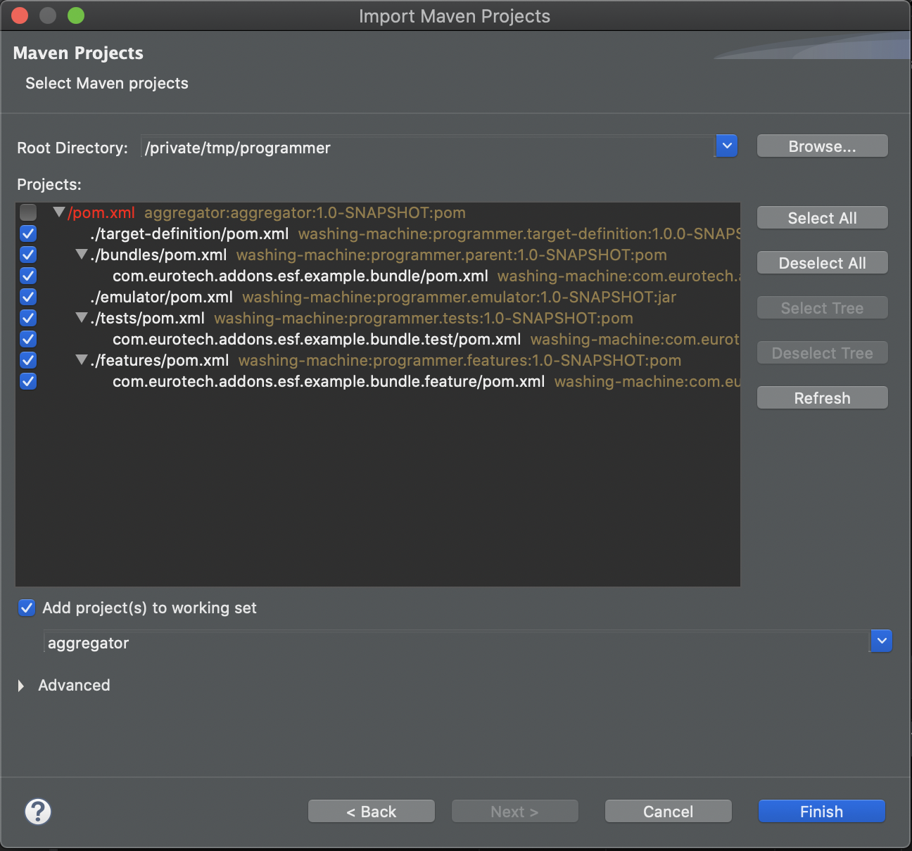
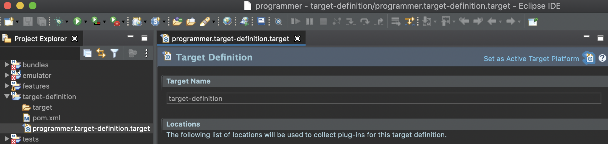

# Kura Addon Archetype

The Kura Addon Archetype is a [Maven Archetype](https://maven.apache.org/guides/introduction/introduction-to-archetypes.html) that allows to create a development environment with the following features:

- Maven-based build
- Template project for creating DEB/RPM packages
- Tycho-surefire based integration test template
- Uses a remote P2 repository for the target platform

The Kura Archetype JAR (`kura-addon-archetype-<kura-version>.jar`) is available in the released artifacts and can be installed in the local maven repository with the following command:

```shell
mvn install:install-file \
-Dfile=./kura-addon-archetype-<kura-version>.jar \
-DgroupId=org.eclipse.kura \
-DartifactId=kura-addon-archetype \
-Dversion="<kura-version>" \ 
-Dpackaging=jar \
-DgeneratePom=true
```

Valid `<kura-version>` values are `6.0.0-SNAPSHOT` and `6.0.0`. This archetype is available since Kura 6.0.0.

After that, it is possible to generate a project skeleton using the archetype with the following command:

```shell
mvn archetype:generate \
-DarchetypeArtifactId=kura-addon-archetype \
-DarchetypeGroupId=org.eclipse.kura \
-DarchetypeVersion="<kura-version>"
```

The command will start the generation of the archetype in interactive mode. Maven will ask for a few parameters on the command line:

- **groupId** : the Maven group id of the generated pom files, usually `org.eclipse.kura`
- **artifactId**: the Maven artifact id of the generated parent pom file and the name of the generated top level project folder, usually something like `org.eclipse.kura.myartifact`
- **package**: the Java package to be used for the main bundle, usually something like `org.eclipse.kura.myartifact`

Other parameters like **version** and **mainBundleVendor** can be changed by answering `n` after the `Confirm properties configuration` prompt, which appears after editing the properties above.

## Project structure

At the end of the procedure, the archetype will generate a subfolder in the working directory containing the following subfolders:

- **bundles**: the directory where developed bundles can be placed. After the first archetype execution, this directory contains a single project, named as `artifactId.bundle`

- **features**: contains a project that builds an RPM and a DEB package that installs the JAR produced in `bundles` in Kura's plugins folder `/opt/eclipse/kura/plugins`. It is recommended to configure this project to customize the target package architecture and other parameters. The project code is commented with hints on the configurable options

- **target-definition**: The `.target` file contained in the project is the way to specify the project dependencies as maven artifacts, Tycho will then wrap them as bundles and make them available in the target platform. Since only released artifacts are published on Maven central, it is recommeded to perform a local Kura build to have the SNAPSHOT versions available

- **tests**: contains OSGi integration tests executed by the `tycho-surefire-plugin`

## Compile and run

The minimum supported Java version for compiling is Java 17. Compile the project with:

```shell
mvn clean install
```

The build will produce the following system packages in `features/target`:

- DEB installer (`<artifactId>_<version>_<debian-architecture>.deb`)
- RPM installer (`<artifactId>-<version>.<rpm.architecture>.rpm`)

Installer properties like the architecture, organization name, package dependencies, and others can be configured in the `features` project.

Depending on the system, the packages can be installed with:

```shell
# debian
apt install <artifactId>_<version>_<debian-architecture>.deb

# fedora/redhat/centos/others
dnf install <artifactId>-<version>.<rpm.architecture>.rpm
```

On some systems that use RPM package manager only signed packages are allowed (see [`rpm-maven-plugin`](https://www.mojohaus.org/rpm-maven-plugin/adv-params.html#Signatures) documentation on how to sign a package). **During development**, it is possible to bypass this control using:

```shell
rpm --define '_pkgverify_level digest' -i <artifactId>-<version>.<rpm.architecture>.rpm
```

After having installed the package, restart kura with:

```shell
systemctl restart kura
```

During startup Kura will scan the plugins folder to pick up the installed JARs and include them in the framework's runtime.

It is possible to remove the installed plugins with:

```shell
# debian
apt purge <artifactId> # or apt remove <artifactId>

# fedora/redhat/centos/others
dnf remove <artifactId>
```

## IDE setup

### Importing Projects in Eclipse IDE

If the project is put under GIT version control, it is a good idea to add a `.gitignore` file to avoid committing files that are not necessary for the Maven build.

In Eclipse IDE import the projects with _File | Import | Maven | Existing Maven Projects_.



Note that the parent POM file cannot be selected. 

Open the _.target_ file in the _target-definition_ project and click on _Set as Active Target Platform_. Note that this will download the bundles from the Kura P2 repository and it may take a while to complete.



Eclipse IDE should rebuild the workspace automatically and show no errors.
