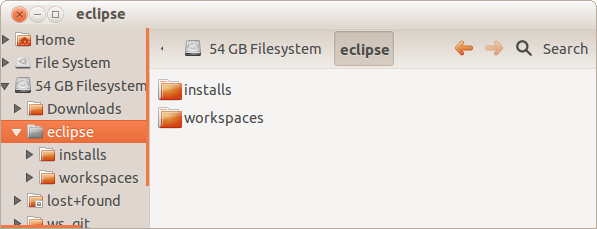
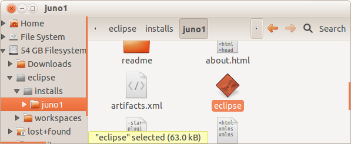
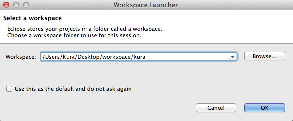
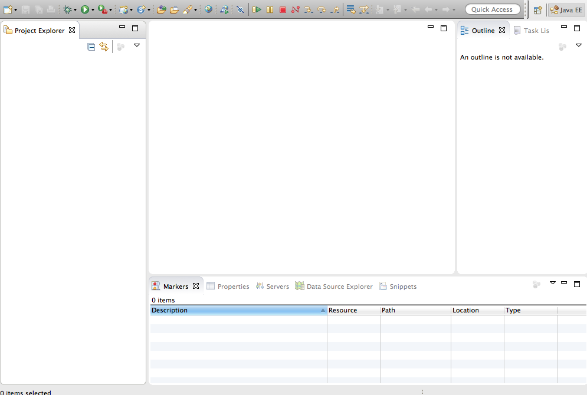
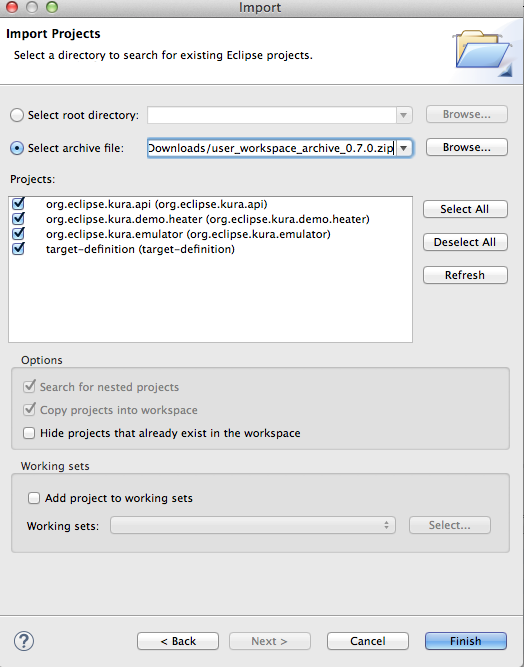
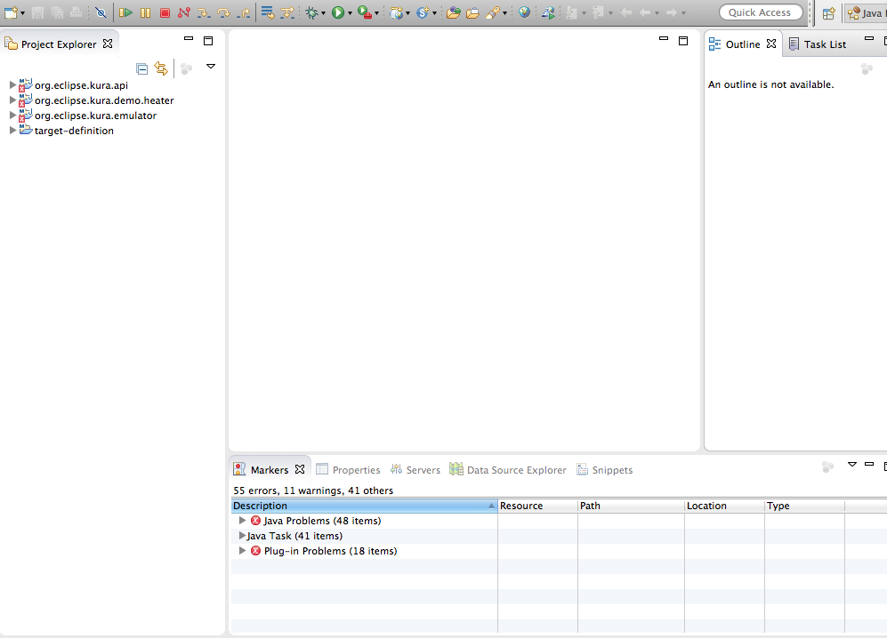
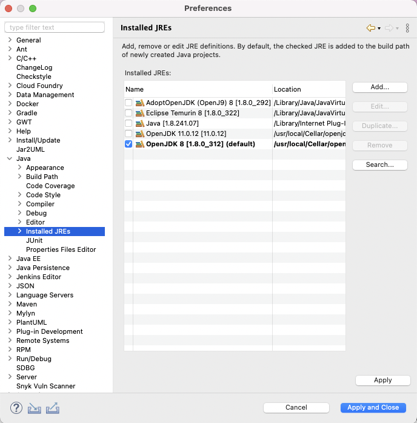
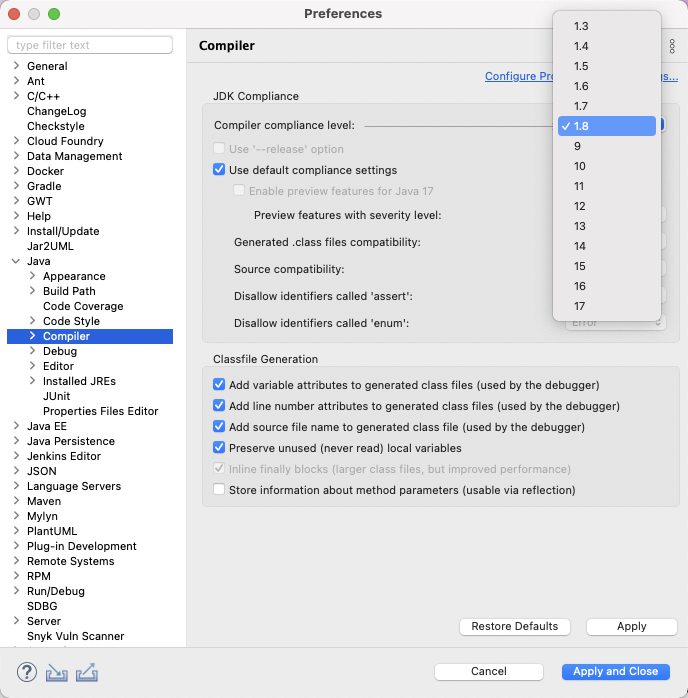
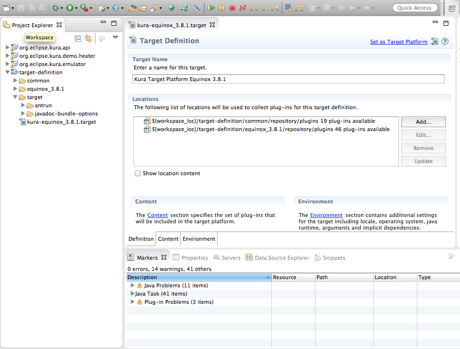
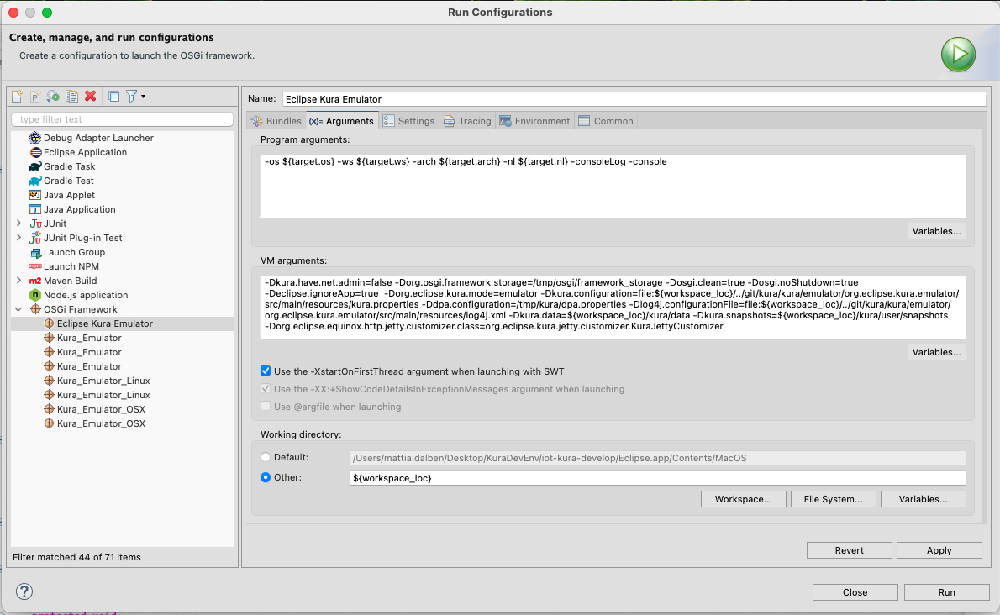

# Kura Workspace Setup

This document describes how to set up the Kura workspace development environment, which consists of the following components:

- JVM (Java JDK SE 8)
- Eclipse IDE
- Kura Workspace

**This setup will allow you to develop applications or bundles running on Kura. It will install only the APIs and the examples.** If you want to contribute to the Kura project follow [this guide](./development-environment-setup.md) instead.

The Kura development environment may be installed on Windows, Linux, or Mac OS. The setup instructions will be the same across each OS though each system may have unique characteristics.
!!! info
    The local emulation of Kura code is only supported in Linux and Mac, not in Windows.

## JVM Installation

Download and install JDK SE 8 from the following links as appropriate for your OS.

For Windows and Linux users, the JDK can be downloaded from the following link: [Java SE 8 Downloads](https://adoptium.net/temurin/releases/?version=8).  Use the latest version of Java SE Development Kit and download the version appropriate for your system.

For additional information regarding the installation of Java 8 on all supported operating systems, see [JDK 8 and JRE 8 Installation Guide](https://adoptium.net/installation).

### Installing Eclipse IDE

Before installing Eclipse, you should choose directory locations for the Eclipse install and its workspaces.

!!! info
    The following points should be kept in mind regarding Eclipse installs and workspaces:

    - The directory location of the Eclipse workspaces should be chosen carefully. 
      Once Eclipse is installed and workspaces are created, they should never be moved to another location in the file system. <br /> 
    - There may be multiple installs of Eclipse (of different or similar versions), and single instances of each install can be run simultaneously; but there should never be more that one instance of a specific install running at the same time (to avoid corruption to the Eclipse environment). <br /> 
    - Each workspace should be used with only one Eclipse install. You should avoid opening the workspace from more than one installation of Eclipse. <br /> 

Download the current distribution of Eclipse for your OS from [Eclipse official website](https://www.eclipse.org/downloads/packages/). Choose the **Eclipse IDE for Eclipse Committers**.

The zipped Eclipse file will be downloaded to the local file system and can be saved to a temporary location that can be deleted after Eclipse has been installed. After the file has been downloaded, it should be extracted to the Eclipse installs directory.  The following screen capture shows the installation in Linux using an **eclipse\installs** directory. The Eclipse executable will then be found in the **eclipse\installs\eclipse** directory.  
This installation will be different depending on the operating system.



Because there may potentially be future Eclipse installs extracted into this location, before doing anything else, rename the directory, such as **eclipse\installs\juno1\\**.
!!! warning
    Once you begin using this Eclipse install, it should NOT be moved or renamed.



## Workspaces

### Creating an Eclipse Workspace

Run Eclipse by clicking its executable in the install directory.

When Eclipse is run for the first time, a workspace needs to be created.  A single workspace will contain all the Java code/projects/bundles, Eclipse configuration parameters, and other relevant files for a specific business-level product.  If the **Use this as the default** option is selected, the designated workspace becomes the default each time you run Eclipse.

If a workspace has not already been defined, or if you are creating a different workspace for another development project, enter a new workspace name.  The workspace should be named appropriate to the project/product being developed.

!!! warning
    Once you begin using a particular workspace, it should NOT be moved or renamed at any time.

Otherwise, select an existing workspace and click **OK**.  After Eclipse is running, you can select the Eclipse menu **File | Switch Workspace | Other** to create or open a different workspace.



After the new workspace opens, click the Workbench icon to display the development environment.



!!! info
    Additional workspace configuration:
    
    - In the Eclipse workspace modify the lifecycle mapping by adding these XML lines to the `lifecycle-mapping-metadata.xml` in Kura workspace.
      You can find the file in the Windows -> Preferences -> Maven -> Lifecycle Mappings -> Open workspace lifecycle mappings metadata.
      After editing the file, reload it by pressing the "Reload workspace lifecycle mappings metadata" button.
      ```xml
      <?xml version="1.0" encoding="UTF-8"?>
      <lifecycleMappingMetadata>
          <lifecycleMappingFilters>
              <lifecycleMappingFilter>
                  <symbolicName>org.eclipse.m2e.pde.connector</symbolicName>
                  <versionRange>[2.1.2,)</versionRange>
                  <packagingTypes>
                      <packagingType>eclipse-test-plugin</packagingType>
                      <packagingType>eclipse-plugin</packagingType>
                      <packagingType>eclipse-feature</packagingType>
                  </packagingTypes>
              </lifecycleMappingFilter>
          </lifecycleMappingFilters>
      </lifecycleMappingMetadata>
      ```
    - Install the `eclipse-tycho` plugin following this steps:
        1. Menu Help -> Install new software... -> Paste the [m2eclipse-tycho repository URL](https://github.com/tesla/m2eclipse-tycho/releases/download/latest/) in the `Work with:` text field -> expand the category and select the `Tycho Project Configurators Feature` and proceed with the installation.
        2. Then restart Eclipse. 

### Importing the Kura User Workspace

To set up your Kura project workspace, you will need to download the Kura User Workspace archive from [Eclipse Kura Download Page](https://eclipse.dev/kura/downloads.php).

From the Eclipse File menu, select the **Import** option.  In the Import dialog box, expand the **General** heading, select **Existing Projects into Workspace**, and then click **Next**.

Now click the **Select archive file** option button and browse to the archive file, such as *user_workspace_archive_<version>.zip*.



Finally, click **Finish** to import the projects.  At this point, you should have four projects in your workspace.  The four projects are as follows:

* org.eclipse.kura.api – the core Kura API.

* org.eclipse.kura.demo.heater – an example project that you can use as a starting point for creating your own bundle.

* org.eclipse.kura.emulator – the emulator project for running Kura within Eclipse (Linux/Mac only).

* target-definition – a set of required bundles that are dependencies of the APIs and Kura.

    

Eclipse will also report some errors at this point.  See the next section to resolve those errors.

### Workspace Setup
This section will guide the users to configure the development workspace environment. 

#### JRE Configuration
The latest Eclipse IDEs require and configure, by default, a Java 11 environment.
In order to be able to leverage and develop using the new workspace for Kura, the user will be required to perform a one-time operation to specify to the IDE a Java 8 JDK.
Opening the Eclipse preferences and selecting the Installed JREs in the Java section, the user has to select an installed Java 8 instance. 



After applying the configuration change, the user will be prompted to align also the compiler options. To do so, selecting the Compiler entry in the Java section, the user has to select 1.8 from the list of available Java versions.



After applying the changes, the user will be prompted to recompile the environment.

#### Target Definition Setup
Click the arrow next to the **target-definition** project in the workspace and double-click **kura-equinox_<version>.target** to open it.



In the Target Definition window, click the link **Set as Target Platform**.  Doing so will reset the target platform, rebuild the Kura projects, and clear the errors that were reported.  At this point, you are ready to begin developing Kura-based applications for your target platform.

#### Run the Eclipse Kura Emulator

To start the Eclipse Kura emulator, select the "Eclipse Kura Emulator.launch" profile from "Other Projects" -> "setups" -> "launchers" and open it with "Run as" -> "Run Configurations...". Then click on the "Arguments" tab and update the "VM arguments" as follows to adapt the paths to the folder structure created by the Oomph installer:

``` shell
-Dkura.have.net.admin=false -Dorg.osgi.framework.storage=/tmp/osgi/framework_storage -Dosgi.clean=true -Dosgi.noShutdown=true -Declipse.ignoreApp=true -Dorg.eclipse.kura.mode=emulator -Dkura.configuration=file:${workspace_loc}/../git/kura/kura/emulator/org.eclipse.kura.emulator/src/main/resources/kura.properties -Ddpa.configuration=/tmp/kura/dpa.properties -Dlog4j.configurationFile=file:${workspace_loc}/../git/kura/kura/emulator/org.eclipse.kura.emulator/src/main/resources/log4j.xml -Dkura.data=${workspace_loc}/kura/data -Dkura.snapshots=${workspace_loc}/kura/user/snapshots -Dorg.eclipse.equinox.http.jetty.customizer.class=org.eclipse.kura.jetty.customizer.KuraJettyCustomizer
```



The Eclipse Kura Web UI will be available at the following URL: http://127.0.0.1:8080 with username and password **admin**.
