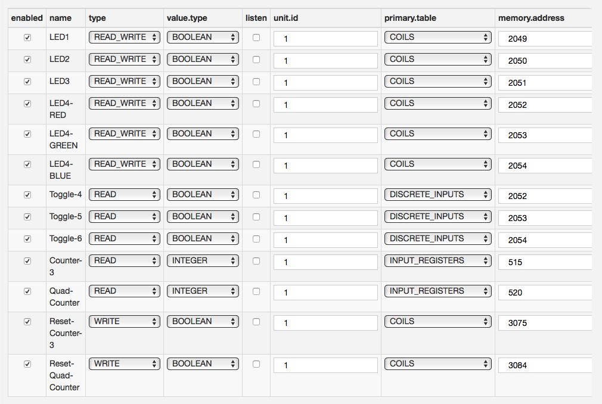

# Assets as Wire Components

An [Asset](../connect-field-devices/driver-and-assets.md) can be used inside a Wire Graph, in this case it is represented as node with two ports an input port and an output port. An Asset used in this way is called **WireAsset**.

## Read mode

Every time a WireAsset receives an envelope on its input port, it will read the values of all of its channels with `READ` or `READ_WRITE` type. The result is emitted as a WireEnvelope with a single WireRecord. The WireRecord contains the following properties:

* a property with key `assetName`, value type **STRING** and the emitting asset asset name as value
* a property with key `assetError`, value type **STRING** if **emit.errors** and **emit.conection.errors** is enabled and a general connection failure is returned by the Driver. See the description of the **emit.conection.errors** parameter for more details.
* a property with key `assetTimestamp`, value type **LONG**, reporting a timestamp in milliseconds since Unix epoch (midnight, January 1, 1970 UTC). This property may be present or not depending on the value of the **timestamp.mode** configuration parameter or in case of general connection exception reported by the Driver, see the configuration parameter description for more details.

For each channel in asset configuration with **READ** or **READ_WRITE** type named **name**:

* a property with key = **name**, value type = **value.type** in channel configuration and value = value obtained from read operation. This property will be present only if the read operation is successful.
* a property with key = `<name>_timestamp` value type = `LONG` reporting a timestamp in milliseconds since UNIX epoch. This property will be present only if the **timestamp.mode** Asset configuration property is set to `PER_CHANNEL`
* a property with key = `<name>_error`, value type = `STRING` reporting an error message. This property will be present only if read operation fails and the **emit.errors** Asset configuration property is set to true.

For example, if an Asset that has the channel configuration shown in the picture below receives a WireEnvelope on its input port, it can emit an envelope with the following content, assuming that the read operation for each channel succeed:

* **WireEnvelope**
    * **WireRecord[0]**
        * **assetName**: `modbusAsset` (type = `STRING`)
        * **LED1**: `true` (type = `BOOLEAN`)
        * **LED1_timestamp**: `1597925188` (type = `LONG`)
        * **LED2**: `false` (type = `BOOLEAN`)
        * **LED2_timestamp**: `1597925188` (type = `LONG`)
        * **LED3**: `true` (type = `BOOLEAN`)
        * **LED3_timestamp**: `1597925188` (type = `LONG`)
        * **LED4-RED**: `false` (type = `BOOLEAN`)
        * **LED4-RED_timestamp**: `1597925188` (type = `LONG`)
        * **LED4-GREEN**: `false` (type = `BOOLEAN`)
        * **LED4-GREEN_timestamp**: `1597925188` (type = `LONG`)
        * **LED4-BLUE**: `true` (type = `BOOLEAN`)
        * **LED4-BLUE_timestamp**: `1597925188` (type = `LONG`)
        * **Toggle-4**: `true` (type = `BOOLEAN`)
        * **Toggle-4_timestamp**: `1597925188` (type = `LONG`)
        * **Toggle-5**: `false` (type = `BOOLEAN`)
        * **Toggle-5_timestamp**: `1597925188` (type = `LONG`)
        * **Toggle-6**: `true` (type = `BOOLEAN`)
        * **Toggle-6_timestamp**: `1597925188` (type = `LONG`)
        * **Counter-3**: `123` (type = `INTEGER`)
        * **Counter-3_timestamp**: `1597925188` (type = `LONG`)
        * **Quad-Counter**: `11` (type = `INTEGER`)
        * **Quad-Counter_timestamp**: `1597925188` (type = `LONG`)
        * **Reset-Counter3**: `false` (type = `BOOLEAN`)
        * **Reset-Counter3_timestamp**: `1597925188` (type = `LONG`)
        * **Reset-Quad-Counter**: `false` (type = `BOOLEAN`)
        * **Reset-Quad-Counter_timestamp**: `1597925188` (type = `LONG`)

The emitted WireEnvelope contains a single record containing the properties described above.

The **Logger** WireComponent can be used to inspect the messages emitted on a specific output port of a WireComponent by creating a connection between the output port of the component to the input port of the Logger. In this case the content of the received envelopes will be printed on device log (`/var/log/kura.log`).

As mentioned above, the read operation is performed only if an envelope is received on the input port of the WireAsset. In order to achieve this, another component must be connected to the input port of the WireAsset.

An example of such component can be the **Timer**, this component can be configured to periodically emit an envelope containing a single wire record with a single property named TIMER reporting the current UNIX timestamp.
Connecting this component to a WireAsset allows to implement a simple read polling cycle. The configuration of the timer defines the polling interval.

## Listen mode

Enabling the **listen** flag allows to enable unsolicited notifications from the driver.

When this happens, the Asset will emit an WireEnvelope containing the updated value for the channel involved in the event. The content of this envelope is the same as the one generated in case of a read operation on the channel.

For example if **listen** is ticked for **LED1** and the driver above detects a value change in that channel, the Asset will emit the following envelope:

* **WireEnvelope**
    * **WireRecord[0]**
        * **assetName**: `modbusAsset` (type = `STRING`)
        * **LED1**: `false` (type = `BOOLEAN`)
        * **LED1_timestamp**: `1597925200` (type = `LONG`)

This mode does not require to connect any component to the input port of the driver. The conditions that trigger the events for the channels and their meaning is reported in the Driver specific documentation.

Note: The example above is not completely realistic since the Modbus driver does not support listen mode. In this case ticking the listen flag will have no effect. The support for listen mode is mentioned in driver documentation.

Listen mode and Read mode are not mutually exclusive. If a channel is defined as `READ` or `READ_WRITE` and the **listen** flag is ticked, the driver will emit the channel value when a WireEnvelope is received on its input port or when a driver event is generated.

## Write mode

Additionally, the Wire Graph can also be used to update asset values through write operations, according to the following rule.

Every time a WireAsset receives an envelope on its input port, for each property contained in the received WireRecords with key `<key>`, value type `<value type>` and value `<value>`, the driver will perform this operation:
If a channel with name `<key>` is defined in asset configuration whose **value.type** is equal to `<value type>` and **type** is `WRITE` or `READ_WRITE`, then the Asset will write `<value>` to the channel.

For example if the Asset above receives the following envelope:

* **WireEnvelope**
    * **WireRecord[0]**
        * **LED1**: `false` (type = `BOOLEAN`)
        * **LED2**: `78` (type = `LONG`)
        * **Toggle-4**: `true` (type = `BOOLEAN`)
        * **foo**: `bar` (type = `STRING`)

The following operations will happen:

* Since the Asset configuration contains a channel named **LED1**, with **value.type** = `BOOLEAN`, and **type** = `READ_WRITE`, the driver will write `false` to that channel for the rule mentioned above.
* The **LED2**: `78` property will have no effect, since the Asset configuration contains a channel named **LED2** with **type** = `READ_WRITE`, but **value.type** = `BOOLEAN` != `LONG`.
* The **Toggle-4**: `true` property will have no effect, since the asset contains a channel named `Toggle-4`, with **value.type** = `BOOLEAN` but **type**  = `READ` != `WRITE` | `READ_WRITE`
* The  **foo**: `bar` property will have no effect, since none of the defined channels has `foo` as **name**.
* The Asset will read and emit all of the channel values with **type** = `READ` or `READ_WRITE`, since a WireEnvelope has been received.

## Wire Asset global configuration parameters

The WireAsset component provides the following global (non per-channel) configuration parameters that can be used to customize component behavior:

* **emit.all.channels**: Specifies whether the values of all READ or READ_WRITE channels should be emitted when a channel event is received in listen mode. If set to true, the values for all channels will be read and emitted, if set to false, only the value for the channel related to the event will be emitted.

* **timestamp.mode**: Allows to configure how timestamps are emitted, the following modes are supported:

  * **NO_TIMESTAMPS**: no timestamp-related properties will be emitted.
  * **PER_CHANNEL**: the component will emit a driver-generated timestamp property per channel, as the value of the `<channel name>_timestamp` property.
  * **SINGLE_ASSET_GENERATED**: the component will emit a single timestamp per request, generated by the Asset itself before emitting the envelope as the value of the `assetTimestamp` property.
  * **SINGLE_DRIVER_GENERATED_MAX** and **SINGLE_DRIVER_GENERATED_MIN**: the component will emit a single driver generated timestamp being respectively the max (most recent) or min (oldest) among the timestamps of the channels as the value of the `assetTimestamp` property.

* **emit.errors**: Specifies whether channel specific errors should be included or not in emitted envelopes. If enabled, the component will add an additional property per channel, named `<channel_name>_error`. If the channel operation fails, the property value will be an error message reported by the Driver, if the operation succeeds the property value will be the empty string.

* **emit.connection.errors**: Specifies whether the component should emit an envelope in case of a general connection exception reported by the Driver (for example due to the fact that the connection with a remote device cannot be established). The error message associated with the exception will be emitted in a property named `assetError`. In case of connection exception, channel values are not available and no channel related properties will be emitted. If the **timestamp.mode** property is set to a value other than **NO_TIMESTAMPS**, the component will also emit a `assetTimestamp` property reporting current system time. This property will be ignored if **emit.errors** is disabled. Example of emitted envelope contents:
  
  * **WireEnvelope**
    * **WireRecord[0]**
        * **assetName**: `myAsset` (type = `STRING`)
        * **assetError**: `Connection refused` (type = `STRING`)
        * **assetTimestamp**: `1597925200` (type = `LONG`)

* **emit.on.change**: If set to true, this component will include a channel value in the output emitted in Kura Wires only if it differs from the last emitted value for that channel. Channel errors will always be emitted if **emit.errors** is set to `true`. If as a result of a read operation no changes are detected in any referenced channel, the Asset will emit an envelope containing no channel values, unless **emit.empty.envelopes** is set to `false`.

* **emit.empty.envelopes**: If set to false, this component will not emit empty envelopes.