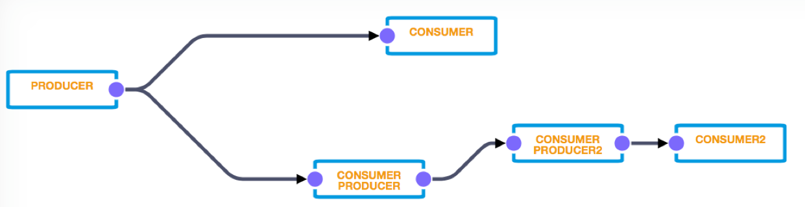
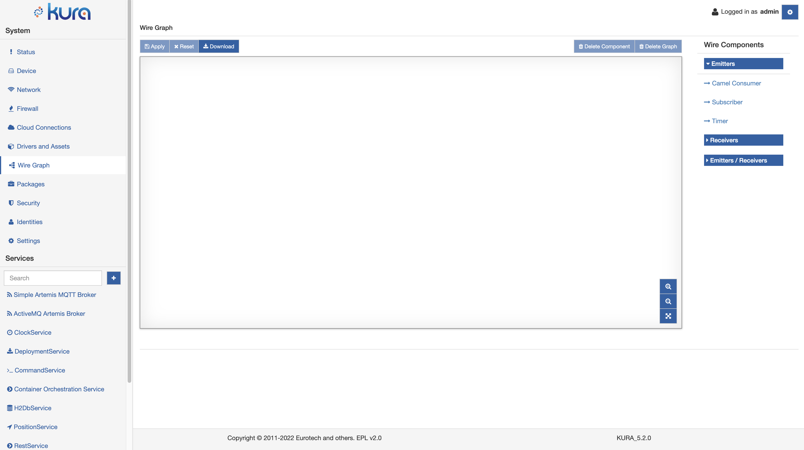

# Introduction

The Wires feature aims to simplify the development of IoT Edge Computing Applications leveraging reusable configurable components that can be wired together and which, eventually, allows configurable cooperation between these components.

In the dataflow programming model, the application logic is expressed as a directed graph (flow) where each node can have inputs, outputs, and independent processing units. There are nodes that only produce outputs and ones that only consume inputs, which usually represent the start and the end of the flow. The inner-graph nodes process the inputs and produce outputs for downstream nodes. The processing unit of a node executes independently and does not affect the execution of other nodes. Thus, the nodes are highly reusable and portable. 

In this way, the developer can easily prototype its solution without sacrificing flexibility and working at a high level of abstraction: the graph can be extended adding new nodes or drawing new connections. Furthermore, the developer can take advantage of the Eclipse Marketplace integration, being able to use open source or commercial building blocks into the final solution, by simply dragging and dropping a link to the Eclipse Marketplace in the Administrative Web UI.

## Data Model

The communication over a single graph edge (_Wire_) is message oriented, messages are called **WireEnvelope**s.
Each **WireEnvelope** contains a list of **WireRecords**.
Each **WireRecord** contains a set of key-value pairs, called properties, the property key is always a string and it is unique within the same record, the property value can have one of the following types:

* BOOLEAN
* BYTE_ARRAY
* DOUBLE
* INTEGER
* LONG
* FLOAT
* STRING

## Wire Composer

The Wire Composer is the main source of interaction with the Wires framework. It is accessible by clicking on the **Wires** button under **System**.

The Wires page is composed by a central composer, where the graph can be actually designed, a lower part that is populated when a wire component is clicked and that allows to update the component configuration and a section in the right with the available Wire Components.

### Wire Components

The following components are distributed with Kura:

- **Timer** ticks every x seconds and starts the graph;
- **Publisher** publishes every message received from a Wire (Wire Message). It is configurable in order to use a specific Cloud Service;
- **Subscriber** subscribes to a configurable topic via a specific Cloud Service. It receives a message from a Cloud Platform, wraps it as a Wire Message and sends it through the connected wires to the other components that are part of the Wire Graph;
- **DB Store** allows the storage of Wire Messages into a specific database (DB) table. It has rules for message cleanup and retention;
- **DB Filter**, allows the filtering of messages residing in a DB via a proper SQL query. The corresponding messages are sent as Wire Messages to the connected Wire Components;
- **Logger** logs the received messages;
- **Asset** ​allows the definition of Wire Channels that will be used to communicate with a field device through the associated Driver instance.

### Graph Download

In the top left part of the Wires page the **Download** button allows to download the configuration of the graph and of all the components that are part of the graph.

This snapshot can be used to replicate the same configuration across all the fleet of devices.

To upload the stored graph, the user has to access the **Settings** page and in the **Snapshots** section click the **Upload and Apply** button.

!!! warning
    The graph configuration will be actually merged with the one existing. Be careful to Delete the existing graph and apply, if you don't want to merge with the existing Wires configuration.