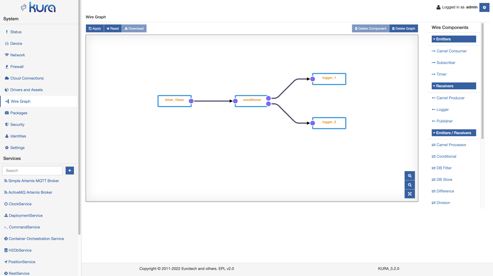

# Conditional Component

The Conditional Component is a Multiport-enabled component that implements the if-then-else logic in the Wire Composer. It is provided by default in every Kura installation.

In the image above a simple usage example of the Conditional component: a timer ticks and the envelope is received by the Conditional component. The message is then processed and can be sent downstream to the logger component (**then** port) or to a publisher (**else** port).

The choice between the two ports is performed based on a condition expressed in the Conditional component configuration.

