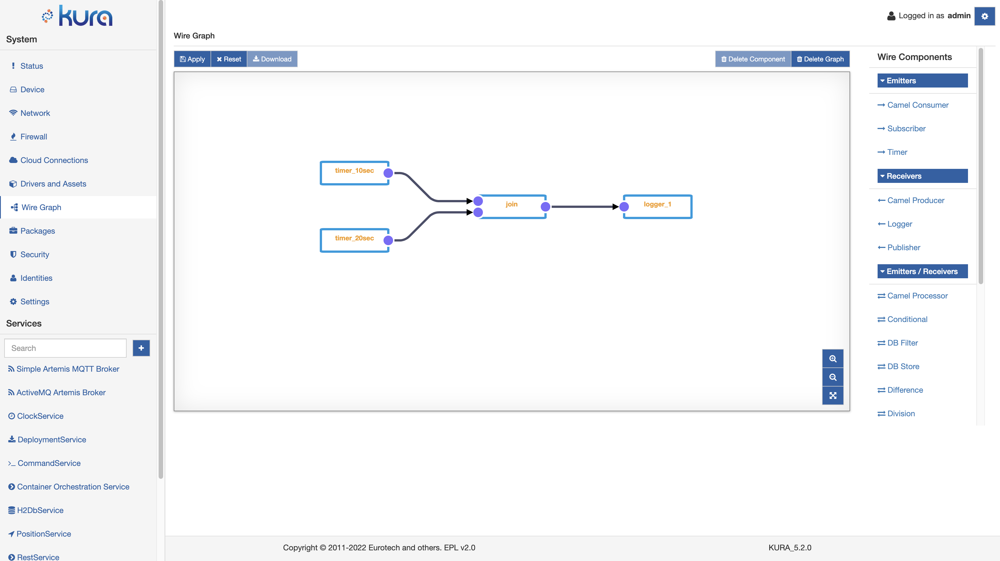
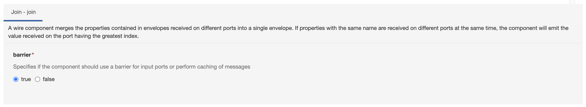

# Join Component

The Join Component is a Multiport-enabled component that merges into a single Wire Envelope the properties contained in the envelopes received in the input ports. It is provided by default in every Kura installation.

In the image above a simple usage example of the Join component: two timers simulate separate paths in the graph and the envelopes received by the Conditional component are then merged into a single Wire Envelope that is then received by the logger component.

The behaviour of the Join component is specified by the **barrier** property.

