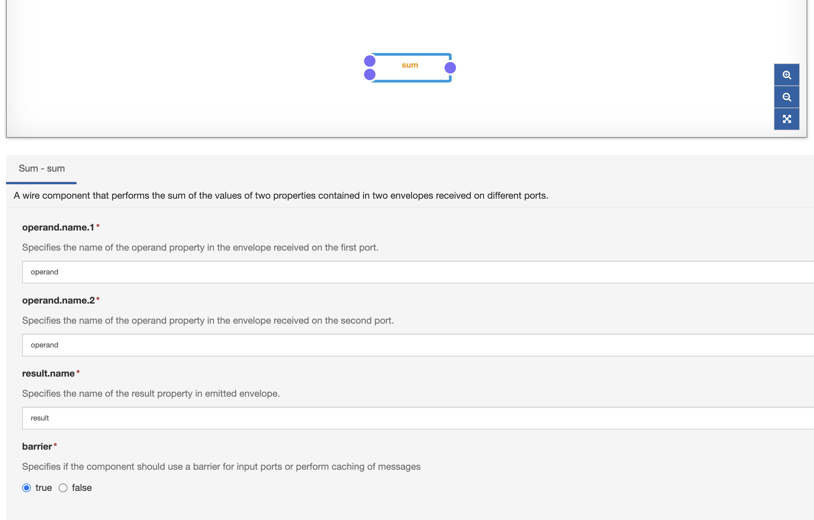
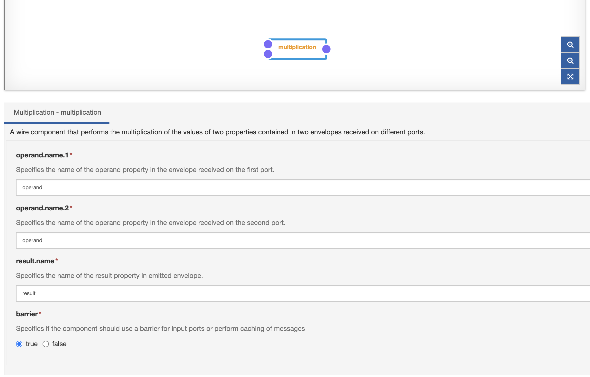
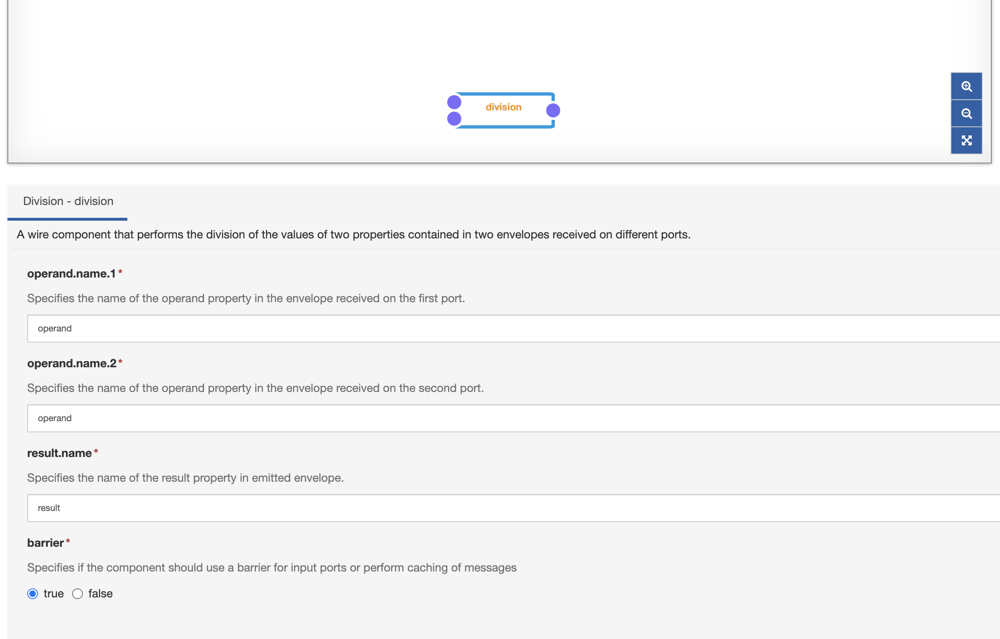

# Mathematical Components Example

Mathematical Wire components can be installed from the [Eclipse Marketplace](https://marketplace.eclipse.org/). For these examples, the [Wire Math Multiport Components DP](https://marketplace.eclipse.org/content/wire-math-multiport-components-eclipse-kura-45) will be used, but other more specific operators can be found on the marketplace (like trigonometric functions).

The following Multiport-enabled Mathematical examples are provided:

- **Sum**
- **Difference**
- **Multiplication**
- **Division**

## Sum

## Difference

## Multiplication

## Division

