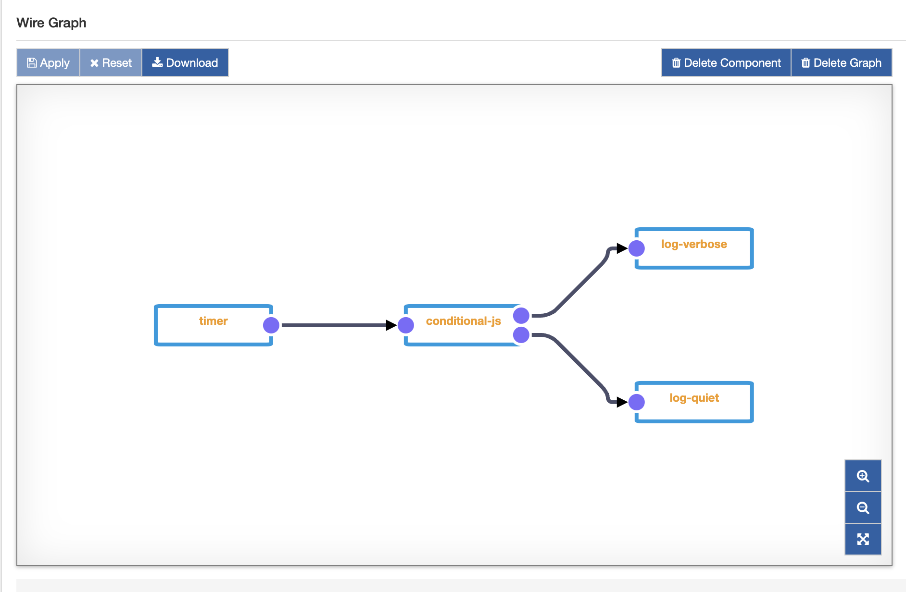
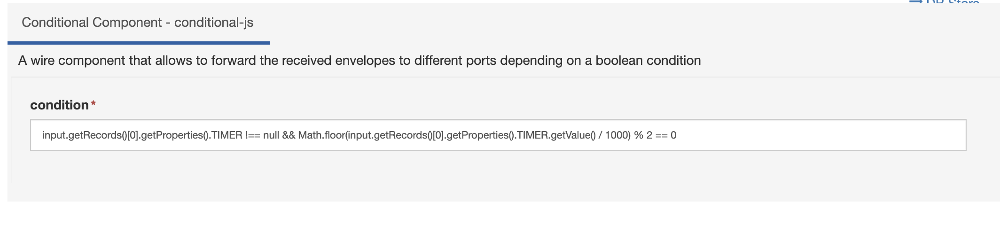

# GraalVM&trade; Conditional Component

The **Conditional Component** is a multiport-enabled component that implements the if-then-else logic in the Wire Composer.

In the image above a simple usage example of the conditional component: a timer ticks and the envelope is received by the conditional component. If the timer has an even number of seconds, then it will evaluate to `true` and forward the received envelope to the **then** port: the 'verbose' logger will receive the input.

The choice between the two ports is performed based on a condition expressed in the component configuration as in the image below.

