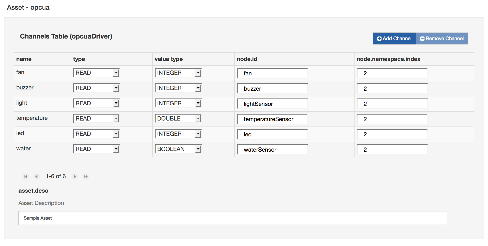
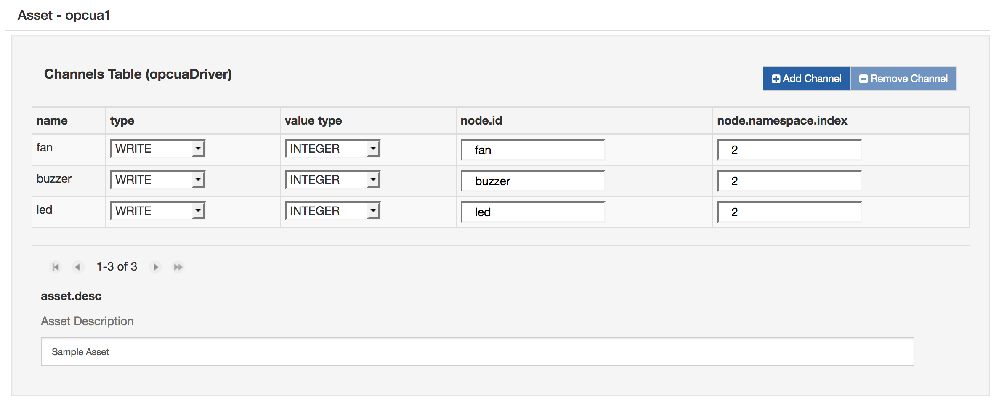
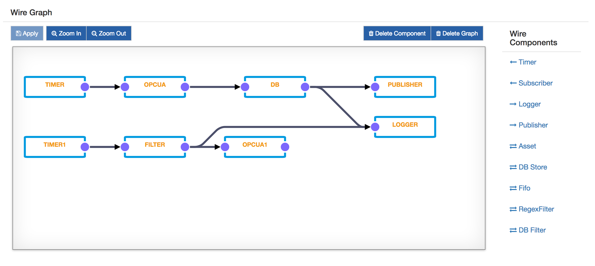

# DB Store and Filter

This tutorial will present how to use DB Store and DB Filter components in Wires using the OPC-UA simulated server already used in [OPC-UA Application](../../connect-field-devices/opcua-driver.md).

The DB Store component allows the wire graphs to interact with the database provided by Kura. It stores in a user-defined table all the envelopes received by the component. The component can be configured as follows:

- **table.name**: the name of the table to be created.
- **maximum.table.size**: the size of the table.
- **cleanup.records.keep**: the number of records in the table to keep while performing a cleanup operation.
- **DbService Target Filter** : the database instance to be used.

The DB Filter component, instead, can run a custom SQL query on the Kura database. It can be configured as follows:

- **sql.view**: SQL to be executed to build a view.
- **cache.expiration.interval**: cache validity in seconds. When the cache expires, a new read in the database will be performed.
- **DbService Target Filter** : the database instance to be used.
- **emit.empty.result** : defines if the envelope should be emitted even if the query return an empty result.

The following procedure will create a wire graph that collects data from a simulated OPC-UA Server, stores it in a table in the database, using the DB Store component, and publishes it in the cloud platform. Moreover, the DB Filter is used to read from the database and write data to the OPC-UA Server based on the values read.

## Configure OPC-UA server simulator

1. Download the [OPC-UA server simulator](https://s3.amazonaws.com/kura-resources/opcua_demo_server.dp) bundle and install it on your Kura instance. It will create a simulated OPC-UA server that exposes some sensors (light, temperature and water sensor) and some actuators (buzzer, led and fan).
2. In the Kura Administrative Web Interface, select “OPCUA Server demo” in “Services” and set **server.port** to 1234. Click the **Apply** button. This will start an OPC-UA​ server on port 1234.

## Configure Wires OPC-UA application

1. Install the OPC-UA Driver from [Eclipse Kura Marketplace](https://marketplace.eclipse.org/content/opc-ua-driver-eclipse-kura-45).
2. Use the local Kura Administrative Web Interface to create a new OPC-UA driver instance:
    - Select **Drivers and Assets**, click the **New Driver** button
    - Select **org.eclipse.kura.driver.opcua**, type in a name, and click **Apply**: a new service will show up under Services.
3. Configure the new service as follows:
    - **endpoint.ip**: localhost
    - **endpoint.port**: 1234
    - **server.name**: leave blank
    

4. Click on **Wires** under **System**
5. Add a new **Timer** component and configure the interval at which the OPC-UA server will be sampled
6. Add a new **Asset** with the previously added OPC-UA Driver
7. Configure the new OPC-UA asset, adding new Channels as shown in the following image. Make sure that all the channels are set to READ.
    

8. Add a new **DBStore** component and configure it as follows:
    - **table.name**: WR_data
    - **maximum.table.size**: 10000
    - **cleanup.records.keep**: 0
    - **DbService Target Filter** : the DB Service pid to be used
9.  Add a new **Publisher** component and configure the chosen cloud platform stack in **cloud.service.pid** option
10. Add **Logger** component
11. Add another instance of **Timer**
12. Add a new **DBFilter** component and configure it as follows. The query will get the values from the light sensor and if they are less than 200, the fan is activated.
    - **sql.view**: SELECT (CASE WHEN “light” < 200 THEN 1 ELSE 0 END) AS “led” FROM “WR_data” ORDER BY TIMESTAMP DESC LIMIT 1;
    - **cache.expiration.interval**: 0
    - **DbService Target Filter** : the DB Service pid to be used
13. Add another **Asset** with the OPC-UA Driver, configured as shown in the following image. Be sure that all the channels are set to WRITE.
    

    !!! note
        Be aware that the **sql.view** syntax can vary accordingly to the SQL dialect used by the database. For example, the MySQL dialect doesn't allow to surrond the table or columns names with double-quotes. In the H2DB, this is mandatory instead.

14. Connect the components as shown in the following image, then click on “Apply” and check the logs and the cloud platform that the data is correctly published.
    