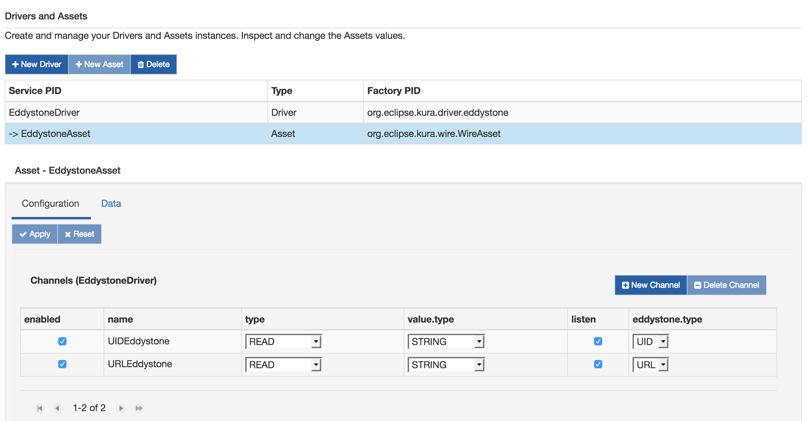
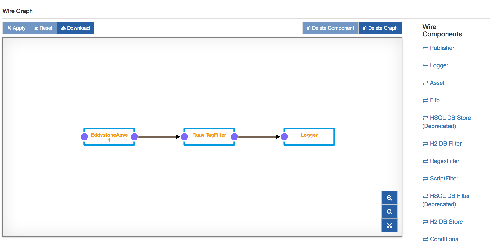

# Eddystone&trade; Driver Application with RuuviTag+

As presented in [Eddystone Driver](../../connect-field-devices/eddystone-driver.md), Kura provides a specific driver that can be used to listen for Eddystone&trade; beacons.

This tutorial will explain how to configure an Eddystone&trade; driver and put it into a Wire graph that retrieves data from a [RuuviTag+](https://ruuvi.com/ruuvitag-specs/). For further information about RuuviTag see [here](https://lab.ruuvi.com/).


## Configure Kura Wires Eddystone application

1. Install the Eddystone&trade; driver from the [Eclipse Kura Marketplace](https://marketplace.eclipse.org/content/eddystone-driver-eclipse-kura-45).

2. On the Kura Web Interface, instantiate an Eddystone&trade; Driver:
    * Under **System**, select **Drivers and Assets** and click on the **New Driver** button.
    * Select **org.eclipse.kura.driver.eddystone** as **Driver Factory**, type a name in to **Driver Name** and click **Apply**: a new driver will be instantiated and shown up under the **Drivers and Assets** tab.
    * Configure the new driver setting the bluetooth interface name (e.g. hci0).

3. From the **Drivers and Assets** tab, add a new asset bound to the Eddystone&trade; driver:
    * Click on the **New Asset** button and fill the form with the **Asset Name** and selecting the driver created in step 2. as **Driver Name**. Click **Apply** and a new asset will be listed under the Eddystone&trade; driver.

    

    * Click on the new asset and configure it, adding the channels. Each channel represents a type of frame the Driver is interested to. Please note that in the above picture two channels are created: one for the `UID` type and the second for the `URL`. In this example only the `URL` will be used.
    * Check the **listen** checkbox for both channels.
    * Click "Apply".

4. Click on **Wires** under **System**.

5. Add a new **Asset** with the previously added Eddystone asset.

6. Add a new **Javascript Filter** component. The filter will be configured to parse the `URL` frames coming from the RuuviTag+ and extract the environmental data from the on-board sensors. In the **script** window write the following code:
    
    ```javascript
    function toHexString(str) {
        var hex = '';
        for ( i = 0; i < str.length; i++ ) {
            var hexTemp = str.charCodeAt(i).toString(16)
            hex += (hexTemp.length==2?hexTemp:'0'+hexTemp);
    }
    return hex;
    };

    function decodeValues(rawSensors) {
        var rawSensorsDecoded = Base64.decode(rawSensors)
        logger.info(toHexString(rawSensorsDecoded))
        var sensorsValues = new Array();
        // Data Format Definition (4)
        var format = parseInt(rawSensorsDecoded[0].charCodeAt(0));
        if (format == 4) {
            sensorsValues.push(format)
            // Humidity
            sensorsValues.push(rawSensorsDecoded[1].charCodeAt(0) * 0.5)
            // Temperature
            sensorsValues.push(rawSensorsDecoded[2].charCodeAt(0) & 0x7f)
            // Pressure
            sensorsValues.push(parseInt(rawSensorsDecoded[4].charCodeAt(0) << 8 )+ parseInt(rawSensorsDecoded[5].charCodeAt(0) & 0xff) + 50000)
            // Random id of tag
            sensorsValues.push(rawSensorsDecoded[6].charCodeAt(0))
        }
        return sensorsValues;
    };

    load("https://gist.githubusercontent.com/jarus/948005/raw/524bea3b4e0b74c06c9cfd2a8e54429dda1918fe/base64.js")
    var record = input.records[0]
    if (record.URLEddystone != null) {
        var values = record.URLEddystone.getValue().split(";")

        if (values.length == 5 && values[1].split("#").length == 2) {
            var outRecord = newWireRecord()
            var sensorsValues = decodeValues(values[1].split("#")[1])
            if (sensorsValues.length == 5) {
                outRecord.format = newIntegerValue(sensorsValues[0])
                outRecord.humidity = newDoubleValue(sensorsValues[1])
                outRecord.temperature = newDoubleValue(sensorsValues[2])
                outRecord.pressure = newIntegerValue(sensorsValues[3])
                outRecord.id = newIntegerValue(sensorsValues[4])
            }
            outRecord.txPower = newIntegerValue(parseInt(values[2]))
            outRecord.rssi = newIntegerValue(parseInt(values[3]))
            outRecord.distance = newDoubleValue(parseFloat(values[4]))

            output.add(outRecord)
        }
    }
    ```

7. Add **Logger** component and set the **log.verbosity** to _VERBOSE_.

8. Connect the **Asset** to the **Filter** and this to the **Logger**.

9. Click on **Apply** and check on the logs that the environmental data are correctly logged.

    

    ```text
    INFO  o.e.k.w.s.f.p.ScriptFilter - 04541a00c35078
    INFO  o.e.k.i.w.l.Logger - Received WireEnvelope from org.eclipse.kura.wire.ScriptFilter-1537884418687-2
    INFO  o.e.k.i.w.l.Logger - Record List content:
    INFO  o.e.k.i.w.l.Logger -   Record content:
    INFO  o.e.k.i.w.l.Logger -     txPower : -7
    INFO  o.e.k.i.w.l.Logger -     rssi : -55
    INFO  o.e.k.i.w.l.Logger -     distance : 251.18864315095797
    INFO  o.e.k.i.w.l.Logger -     format : 4
    INFO  o.e.k.i.w.l.Logger -     temperature : 26.0
    INFO  o.e.k.i.w.l.Logger -     humidity : 42.0
    INFO  o.e.k.i.w.l.Logger -     pressure : 100000
    INFO  o.e.k.i.w.l.Logger -     id : 120
    INFO  o.e.k.i.w.l.Logger -
    INFO  o.e.k.w.s.f.p.ScriptFilter - 04401a00c35078
    INFO  o.e.k.i.w.l.Logger - Received WireEnvelope from org.eclipse.kura.wire.ScriptFilter-1537884418687-2
    INFO  o.e.k.i.w.l.Logger - Record List content:
    INFO  o.e.k.i.w.l.Logger -   Record content:
    INFO  o.e.k.i.w.l.Logger -     txPower : -7
    INFO  o.e.k.i.w.l.Logger -     rssi : -39
    INFO  o.e.k.i.w.l.Logger -     distance : 39.810717055349734
    INFO  o.e.k.i.w.l.Logger -     format : 4
    INFO  o.e.k.i.w.l.Logger -     temperature : 26.0
    INFO  o.e.k.i.w.l.Logger -     humidity : 32.0
    INFO  o.e.k.i.w.l.Logger -     pressure : 100000
    INFO  o.e.k.i.w.l.Logger -     id : 120
    INFO  o.e.k.i.w.l.Logger -
    ```