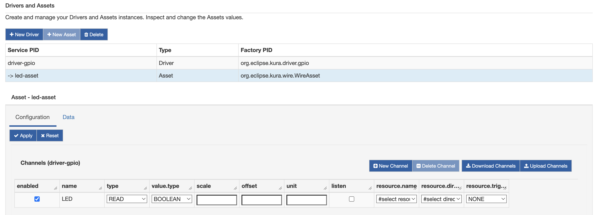
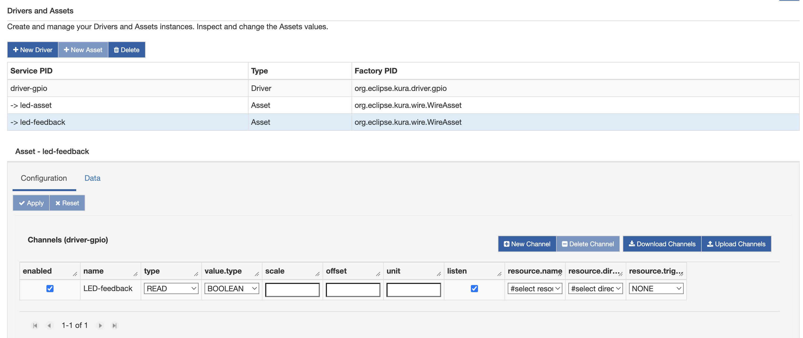
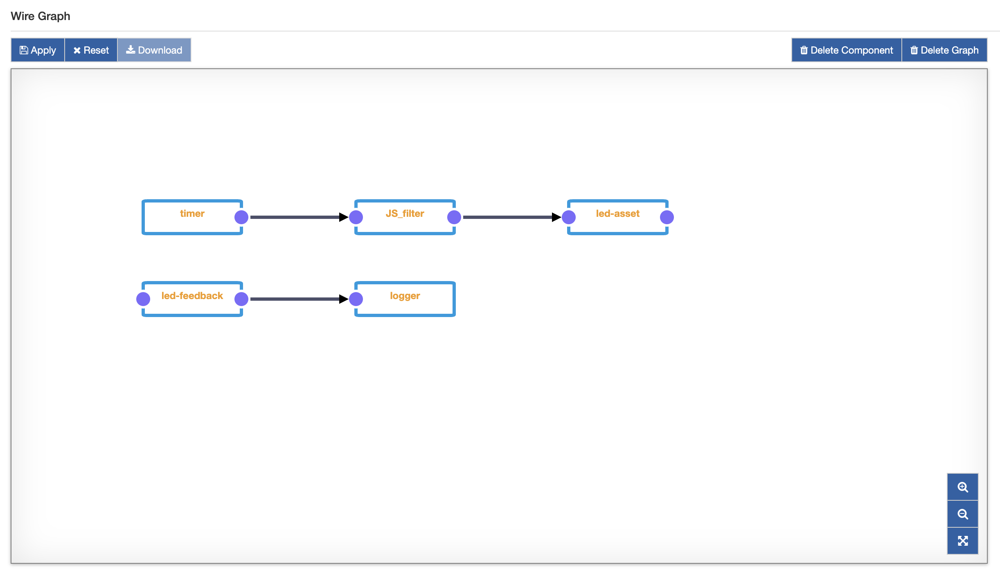

# GPIO Driver Application

In this section a simple but effective example of the GPIO Driver on Wires will be presented. This example will implement a Wire graph that toggles a digital GPIO. A listener will be attached to an input GPIO externally connected to the first one.

Setup a Raspberry Pi as shown in [GPIO Driver](link-TODO) section. Add a cable from the LED contact near the red cable to pin 37 (gpio 26) on the RaspberryPi.


## Configure Kura Wires GPIO Driver Application

1. Install the GPIO Driver from the [Eclipse Kura Marketplace](https://marketplace.eclipse.org/content/gpio-driver-eclipse-kura-45).

2. On the Kura web interface, instantiate a GPIO Driver:
    * Under "System", select "Drivers and Assets" and click on the "New Driver" button.
    * Select "org.eclipse.kura.driver.gpio" as "Driver Factory", type a name in to "Driver Name" and click "Apply": a new driver will be instantiated and shown up under the "Drivers and Assets" tab.

3. From the "Drivers and Assets" tab, add a new asset bound to the GPIO driver:
    * Click on the "New Asset" button and fill the form with the "Asset Name" and selecting the driver created in step 2. as "Driver Name". Click "Apply" and a new asset will be listed under the GPIO driver.
    * Click on the new asset and configure it, adding only one channel called **LED** as shown in the following picture:

    

    * Click "Apply".

4. As in point 3., create a new asset as shown below:

    

    * Click "Apply".

5. Click on "Wires" under "System".

6. Add a new "Timer" component and configure the interval at which the LED will be toggled.

7. Add a new "Script Filter" (it can be downloaded from the [Eclipse Marketplace](https://marketplace.eclipse.org/content/wires-script-filter-kura-45) and configure it with the following script:

    ```javascript
    // create a persistent counter
    counter = typeof(counter) === 'undefined' ? 0 : counter
    counter++

    // emit the counter value in a different WireRecord
    var counterRecord = newWireRecord()
    counterRecord.LED = newBooleanValue(counter%2==0)
    output.add(counterRecord)
    ```

8. Add the "Asset" created at point 3 and connect the "Timer" to the "Filter" and the latter to the "Asset".

9. Add the "Asset" created at point 4.

10. Add "Logger" component and set **log.verbosity** to "VERBOSE".

11. Connect the latter "Asset" to the "Logger". The resulting Wire Graph should be as below:

    

12. Click on "Apply". After a while, the led on the breadboard should start to blink at a rate defined by the "Timer" as shown below:

    

    Moreover, the kura.log file should show a long sequencce of messages reporting that the value from the input gpio is changed:

    ```text
    2018-04-09 13:08:42,990 [Thread-3289] INFO  o.e.k.i.w.l.Logger - Received WireEnvelope from org.eclipse.kura.wire.WireAsset-1523276074484-23
    2018-04-09 13:08:42,991 [Thread-3289] INFO  o.e.k.i.w.l.Logger - Record List content: 
    2018-04-09 13:08:42,992 [Thread-3289] INFO  o.e.k.i.w.l.Logger -   Record content: 
    2018-04-09 13:08:42,993 [Thread-3289] INFO  o.e.k.i.w.l.Logger -     LED_Feedback : false
    2018-04-09 13:08:42,993 [Thread-3289] INFO  o.e.k.i.w.l.Logger -     assetName : GPIOAssetFeedback
    2018-04-09 13:08:42,994 [Thread-3289] INFO  o.e.k.i.w.l.Logger -     LED_Feedback_timestamp : 1523279322990
    2018-04-09 13:08:42,994 [Thread-3289] INFO  o.e.k.i.w.l.Logger - 
    2018-04-09 13:08:44,988 [Thread-3291] INFO  o.e.k.i.w.l.Logger - Received WireEnvelope from org.eclipse.kura.wire.WireAsset-1523276074484-23
    2018-04-09 13:08:44,989 [Thread-3291] INFO  o.e.k.i.w.l.Logger - Record List content: 
    2018-04-09 13:08:44,989 [Thread-3291] INFO  o.e.k.i.w.l.Logger -   Record content: 
    2018-04-09 13:08:44,989 [Thread-3291] INFO  o.e.k.i.w.l.Logger -     LED_Feedback : true
    2018-04-09 13:08:44,989 [Thread-3291] INFO  o.e.k.i.w.l.Logger -     assetName : GPIOAssetFeedback
    2018-04-09 13:08:44,989 [Thread-3291] INFO  o.e.k.i.w.l.Logger -     LED_Feedback_timestamp : 1523279324988
    ```