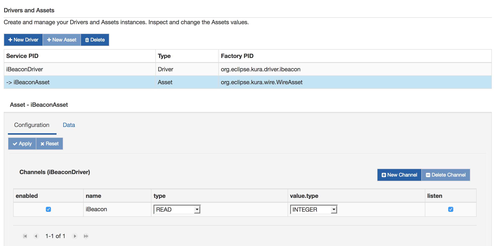
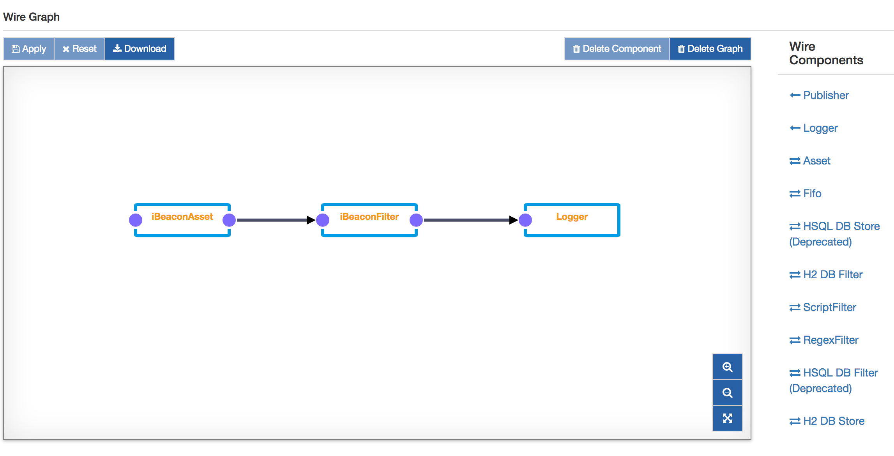

# iBeacon&trade; Driver Application

As presented in the [iBeacon&trade; Driver](../../connect-field-devices/ibeacon-driver.md), Kura provides a specific driver that can be used to listen for iBeacons packets. The driver is available only for gateways that support the new Kura BLE APIs.

This tutorial will explain how to configure a Wire graph that get iBeacon&trade; data and show them to a logger.

## Configure the Wires iBeacon&trade; Application

1. Install the iBeacon driver from the [Eclipse Kura Marketplace](https://marketplace.eclipse.org/content/ibeacon-driver-eclipse-kura-45).

2. On the Web Interface, instantiate the iBeacon Driver:
    * Under "System", select "Drivers and Assets" and click on the "New Driver" button.
    * Select "org.eclipse.kura.driver.ibeacon" as "Driver Factory", type a name in to "Driver Name" and click "Apply": a new driver will be instantiated and shown up under the "Drivers and Assets" tab.
    * Configure the new driver setting the bluetooth interface name (e.g. hci0).

3. From the "Drivers and Assets" tab, add a new asset binded to the iBeacon driver:
    * Click on the "New Asset" button and fill the form with the "Asset Name" and selecting the driver created in step 2. as "Driver Name". Click "Apply" and a new asset will be listed under the iBeacon driver.

    * Click on the new asset and configure it, adding a single channel that represents a listener for iBeacon&trade; advertising packets. Check the **listen** checkbox for the channel.
    * Click "Apply".

    

4. Click on "Wires" under "System".

5. Add a new "Asset" with the previously added iBeacon asset.

6. Add a new "Javascript Filter" component. The filter will be configured to parse the iBeacon packets and extract relevant data from it. In the **script** window write the following code:

    ```javascript
    var record = input.records[0]
    if (record.ibeacon != null) {
        var values = record.ibeacon.getValue().split(";")

        if (values.length == 6) {
            var outRecord = newWireRecord()
            outRecord.uuid = newStringValue(values[0])  
            outRecord.txPower = newIntegerValue(parseInt(values[1]))
            outRecord.rssi = newIntegerValue(parseInt(values[2]))
            outRecord.major = newIntegerValue(parseInt(values[3]))
            outRecord.minor = newIntegerValue(parseInt(values[4]))
            outRecord.distance = newDoubleValue(parseFloat(values[5]))

            output.add(outRecord)
        }
    }
    ```

7. Add "Logger" component and set the **log.verbosity** to VERBOSE
8. Connect the "Asset" to the "Filter" and this to the "Logger".
9. Click on "Apply".

    

    Using this graph, every iBeacon packet will be detected and reported to the log, as shown below. To simulate an iBeacon device, it is possible to use another gateway with the [iBeacon advertiser example](https://github.com/eclipse/kura/tree/develop/kura/examples/org.eclipse.kura.example.ibeacon.advertiser).

    ```text
    INFO  o.e.k.i.w.l.Logger - Received WireEnvelope from org.eclipse.kura.wire.WireAsset-1537886139797-15
    INFO  o.e.k.i.w.l.Logger - Record List content:
    INFO  o.e.k.i.w.l.Logger -   Record content:
    INFO  o.e.k.i.w.l.Logger -     assetName : iBeaconAsset
    INFO  o.e.k.i.w.l.Logger -     iBeacon : aaaaaaaa-bbbb-cccc-dddd-eeeeeeeeeeee;0;-38;0;0;79.43282347242814
    INFO  o.e.k.i.w.l.Logger -     iBeacon_timestamp : 1537886424085
    INFO  o.e.k.i.w.l.Logger -
    INFO  o.e.k.i.w.l.Logger - Received WireEnvelope from org.eclipse.kura.wire.WireAsset-1537886139797-15
    INFO  o.e.k.i.w.l.Logger - Record List content:
    INFO  o.e.k.i.w.l.Logger -   Record content:
    INFO  o.e.k.i.w.l.Logger -     assetName : iBeaconAsset
    INFO  o.e.k.i.w.l.Logger -     iBeacon : aaaaaaaa-bbbb-cccc-dddd-eeeeeeeeeeee;0;-42;0;0;125.89254117941674
    INFO  o.e.k.i.w.l.Logger -     iBeacon_timestamp : 1537886425086
    INFO  o.e.k.i.w.l.Logger -
    ```