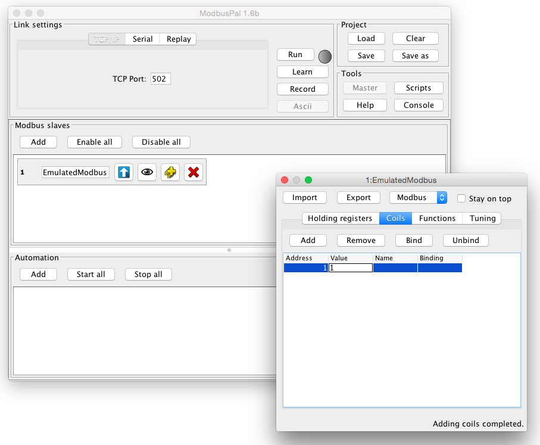
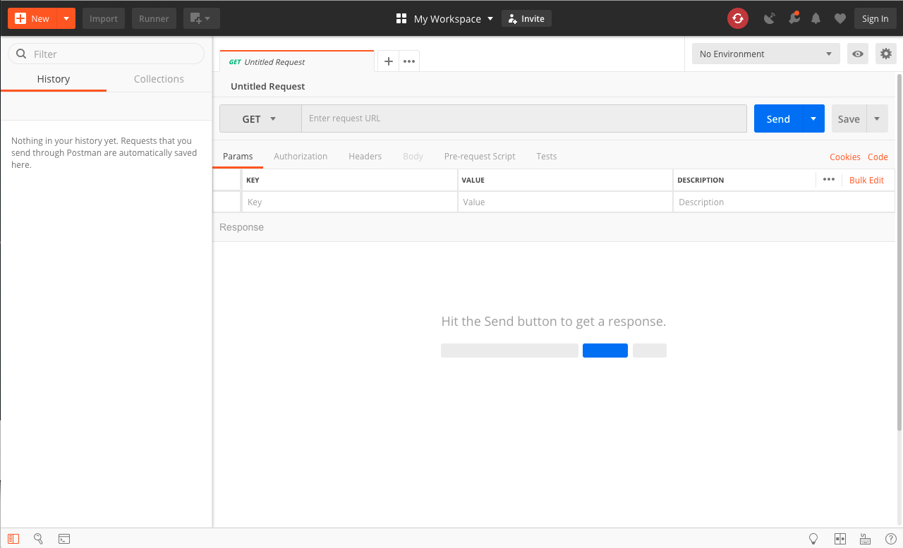
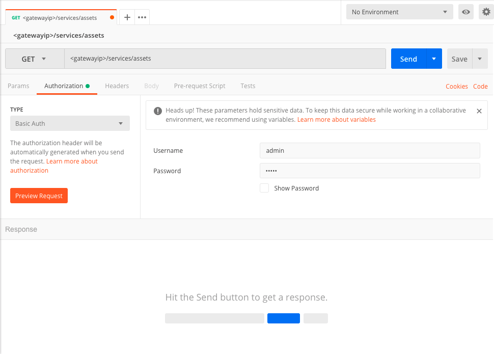
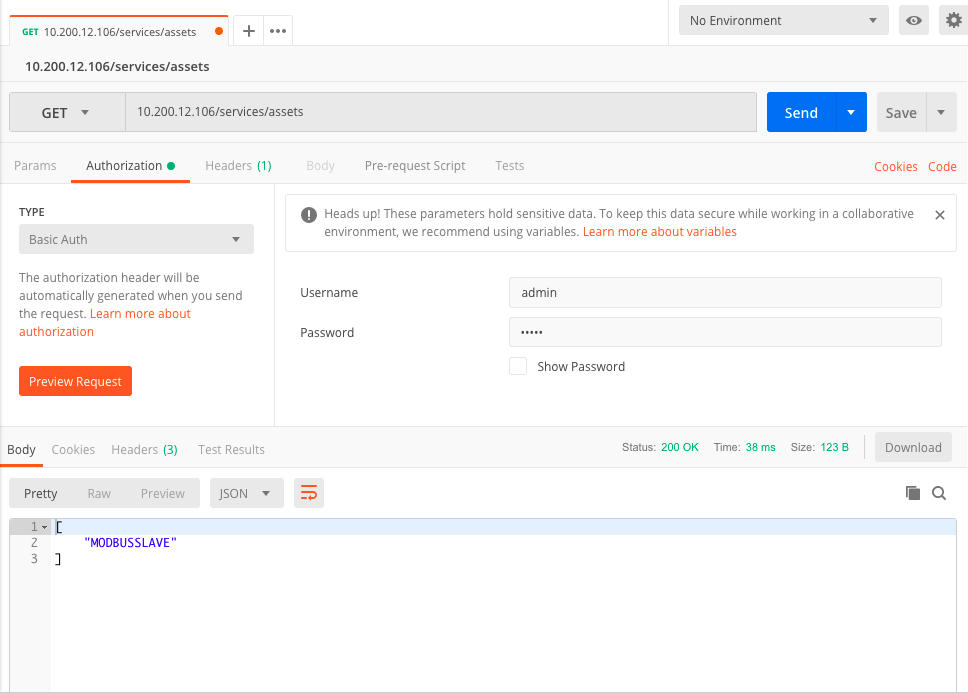
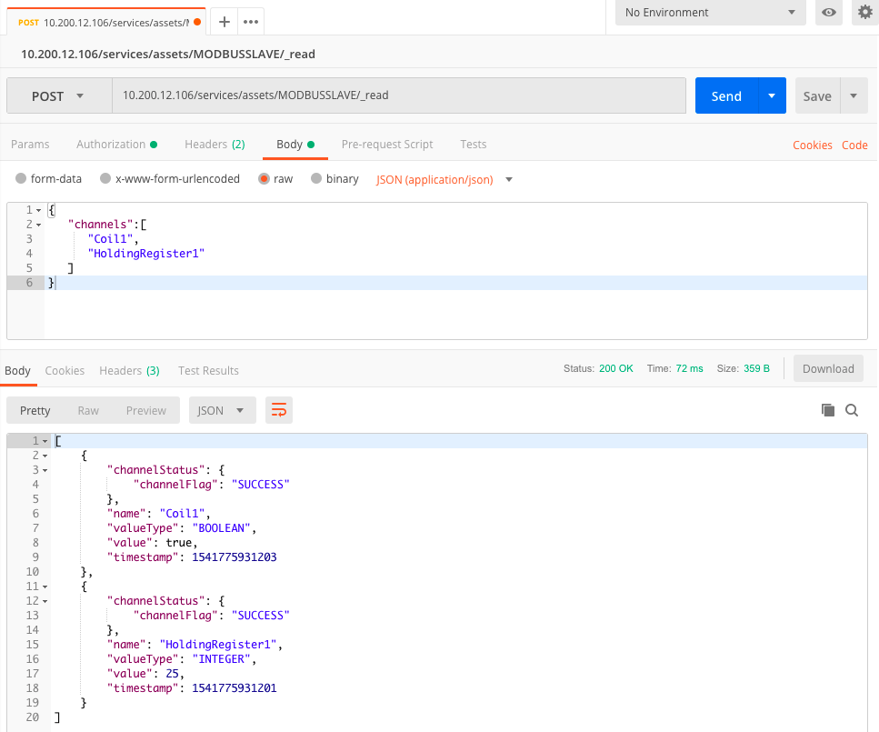

# Modbus Application

This tutorial will show how to collect data from a Modbus device and publish it on a cloud platform using Wires. The Modbus device will be emulated using a software simulator, like [ModbusPal](http://modbuspal.sourceforge.net/).

The Modbus Wire Component can be installed from the Eclipse Marketplace at [this link](https://marketplace.eclipse.org/content/modbus-protocol-implementation-eclipse-kura-45).

## Configure Modbus device

1. Download [ModbusPal](http://modbuspal.sourceforge.net/) on a computer that will act as a Modbus slave.
2. Open ModbusPal application as root and click on the “Add” button under the “Modbus Slaves” tab to create a Modbus slave device. Select an address (i.e. 1) and put a name into the “Slave name” form.
3. Click on the button with the eye to edit the slave device. Once the window is opened, add a coil with address 1 and set a value (0 or 1).
4. Close the editor and on the main window, click on the “TCP/IP” button under the “Link Settings” tab. Set the “TCP port” to 502. Be sure that the selected TCP port is opened and reachable on the system.
5. Click on “Run” button to start the device.
    

## Configure Wires Modbus application

1. Install the Modbus driver from [Eclipse Kura Marketplace](https://marketplace.eclipse.org/content/modbus-protocol-implementation-eclipse-kura-45).
2. In the Kura Administrative Web Interface, create a new driver instance:
    - Under **Drivers and Assets**, click the **New Driver** button
    - Select **org.eclipse.kura.driver.modbus**, type in a name, and click **Apply**: a new service will show up in the **Drivers and Assets** table.
3. Configure the new service as follows:
    - **access.type**: TCP
    - **modbus.tcp-udp.ip**: IP address of the system where ModbusPal is running
    - **modbus.tcp-udp.port**: 502
4. Click on **Wires** in **System**
5. Add a new **Timer** component and configure the interval at which the Modbus slave will be sampled
6. Add a new **Asset** with the previously added Modbus driver
7. Configure the new Modbus asset, adding a new Channel with the following configuration:
    - **name**: a custom cool name
    - **type**: READ_WRITE
    - **value type**: BOOLEAN
    - **unit.id**: the Modbus slave address configured in ModbusPal (i.e. 1)
    - **primary.table**: COILS
    - **memory.address**: the Modbus coil address configured in ModbusPal (i.e. 1)
8. Add a new **Publisher** component and configure the chosen cloud platform stack in **cloud.service.pid** option
9. Add a **Logger** component
10. Connect the **Timer** to the **Asset**, and the **Asset** to the **Publisher** and **Logger**.
11. Click on **Apply** and check the logs and cloud platform that the data is correctly published.
    

## Interact with the Asset using REST APIs

Using an application like [Postman](https://www.getpostman.com), the user can interact with the Assets defined in the system.

!!! tip
    Have a look to the [Rest Service](../../core-services/rest-service.md) page to learn more about REST APIs in Kura and how to use them.

Assets REST APIs are available in the context path `/services/assets`. In Postman, the user needs to define a new GET request specifying `<gatewayip>/services/assets` to get the list of assets available for the target gateway.

In order to correctly perform the REST call, the user may need to specify `Basic Authentication` and a proper `Username` and `Password`.

Once specified the desired asset in the request URL, the user may be able to get the list of Channels configured in the Asset and read all the data from those channels.

Using a `POST`, the user can also read specific channels that can be defined in the request Body.

