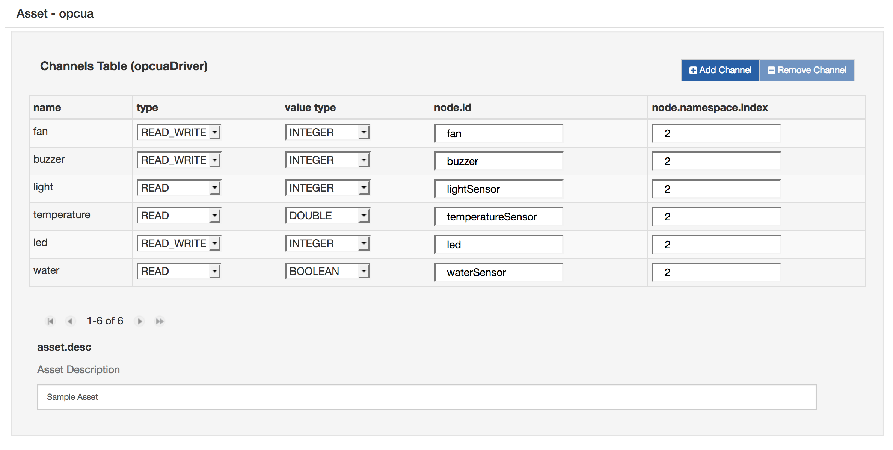
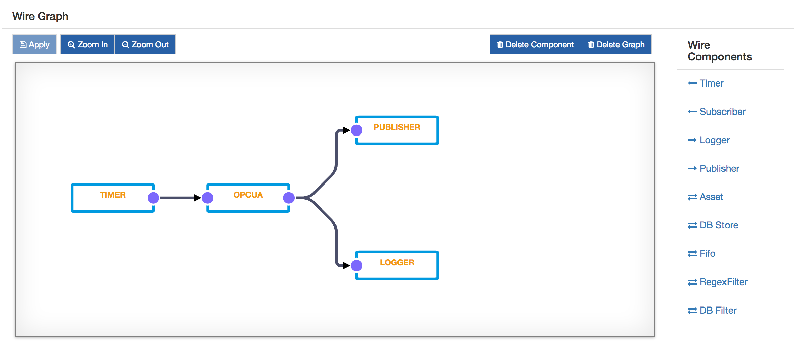

# OPC-UA Application

This tutorial will describe how to collect data from an OPC-UA device and publish them on a cloud platform using Wires. The OPC-UA server device will be emulated using a bundle running on Kura.

## Configure OPC-UA server simulator

1. Download the [OPC-UA server simulator](https://s3.amazonaws.com/kura-resources/opcua_demo_server.dp) bundle and install it on Kura. It will create a simulated OPC-UA server that exposes some sensors (light, temperature and water sensor) and some actuators (buzzer, led and fan).
2. On the Kura web interface, select **OPCUA Server demo** in **Services** and set **server.port** to 1234. Click the **Apply** button. This will start an OPC-UA server on port 1234.

## Configure Wires OPC-UA application

1. Install the OPC-UA driver from [Eclipse Kura Marketplace](https://marketplace.eclipse.org/content/opc-ua-driver-eclipse-kura-45).
2. Use the local Kura Administrative Web Interface to create a new OPC-UA driver instance:
    - Select **Drivers and Assets**, click the **New Driver** button
    - Select **org.eclipse.kura.driver.opcua**, type in a name, and click **Apply**: a new service will show up under Services.
3. Configure the new service as follows:
    - **endpoint.ip**: localhost
    - **endpoint.port**: 1234
    - **server.name**: leave blank
4. Click on **Wires** under **System**
5. Add a new **Timer** component and configure the interval at which the OPC-UA server will be sampled
6. Add a new **Asset** with the previously added OPC-UA driver
7. Configure the new OPC-UA asset, adding new Channels as shown in the following image.
    
8. Add a new **Publisher** component and configure the chosen cloud platform stack in **cloud.service.pid** option
9. Add a **Logger** component
10. Connect the **Timer** to the **Asset**, and the **Asset** to the **Publisher** and **Logger** as shown in the image below.
11. Click on **Apply** and check the logs and the cloud platform in order to verify that the data is correctly published.
    