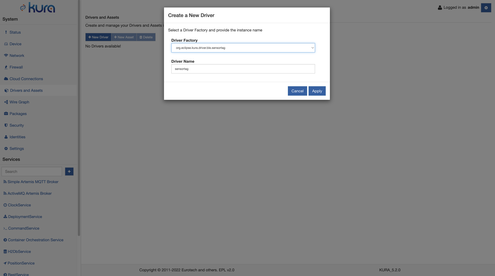
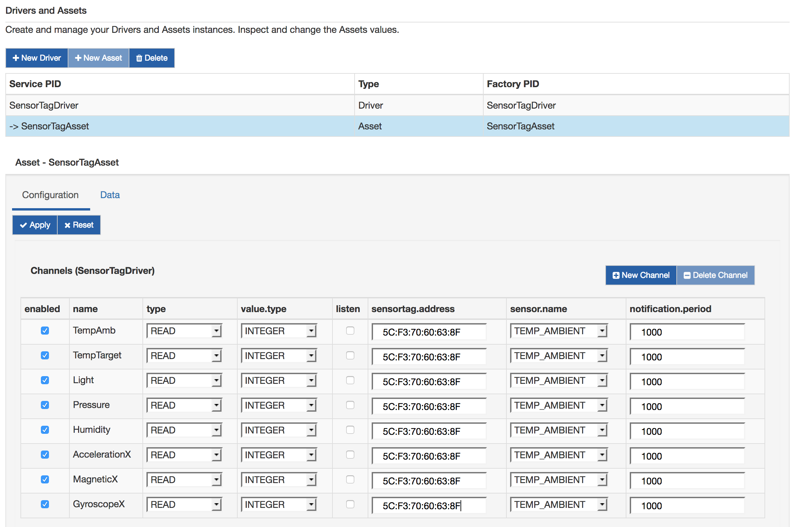
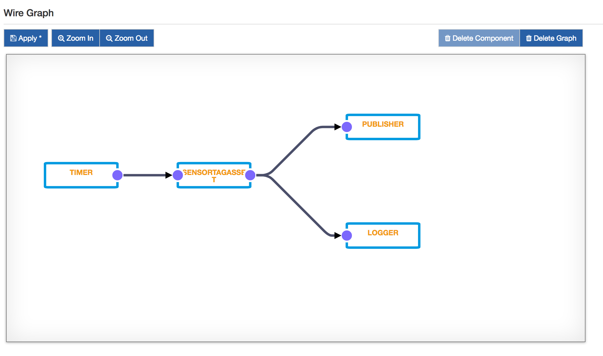

# TI SensorTag Application

As presented in the [Ti SensorTag Driver](../../connect-field-devices/sensortag-driver.md), Kura provides a specific driver that can be used to interact with Texas Instruments SensorTag devices.

This tutorial will explain how to configure a Wire graph that connects with a SensorTag, reads sensor values and publishes data to a cloud platform.

!!! warning
    The SensorTag driver can be used only with TI SensorTags with firmware version >1.20. If your device has an older firmware, please update it.

## Configure the TI SensorTag Application

1. Install the TI SensorTag driver from the [Eclipse Kura Marketplace](https://marketplace.eclipse.org/content/ti-sensortag-driver-eclipse-kura-45)

2. On the Kura Administrative Web Interface, instantiate a SensorTag Driver:
    - Under **System**, select **Drivers and Assets** and click on the **New Driver** button.
    - Select `org.eclipse.kura.driver.ble.sensortag` as **Driver Factory**, type a name in **Driver Name** and click the  **Apply** button: a new driver will be instantiated and listed in the page.
    - Select the newly created Driver instance and configure the Bluetooth interface name (i.e. hci0).
    
    

3. In the **Drivers and Assets** tab add a new asset and associate it to the SensorTag driver:
   - Click on the **New Asset** button and fill the form with the **Asset Name**, selecting the driver created at point 2. Click **Apply** and a new asset will be listed.
   - Click on the new asset and configure it, adding the channels. Each channel represents a single sensor on the SensorTag and it can be chosen from the **sensor.name** menu. Fill the **sensortag.address** with the DB address of the SensorTag you want to connect to. The **value.type** should be set to double, but also the other choices are possible.
   - Click **Apply**.

4. Apply the following configuration for the Asset instance:
    
    

5. Create a Wire Graph as in the following picture.
    
    

    Please note that the driver supports also unsolicited inputs, setting up a notification for the given channel. In this case, it is sufficient to check the **listen** option for the chosen channel. The Timer is not needed because the SensorTag will automatically emit the values every **notification.period** milliseconds.